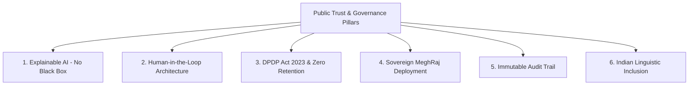

# 💼 Business Model, Citizen Economics & Trust Framework
## Commercial Feasibility & Government Adoption Strategy for PRAGATI02

---

## 📌 Executive Summary

DocSure / Pramaan is designed not only as a technical solution, but as a **financially viable, scalable, and policy-compliant product**. 

Yeh document 3 sabse ahem sawalon ka jawab deta hai:
1. **Hum paise kaise kamayenge? (B2G & B2B Monetization)**
2. **Normal Citizen / Student ke liye cost kaise niklegi? (Unit Economics & B2B2C Micro-transactions)**
3. **Sarkar aur enterprises hum par bharosa kyu karenge? (Trust, Privacy & Governance)**

---

## 💰 PART 1: Business Model & Revenue Streams

Government aur enterprise tech mein ads kaam nahi karte. Humara business model **4 solid revenue streams** par structured hai:

### 1. Pay-Per-Bundle Verification (B2G API / Volume SaaS)
* **Target:** High-volume government portals (NSP, UP Scholarship, SSC, State e-District, PM-Kisan).
* **Pricing:** **₹2 se ₹4 per document bundle** (3–4 documents per application).
* **Volume Potential:** 
  * National Scholarship Portal (NSP) par har saal ~1.5 Crore applications aati hain.
  * Agar hum sirf **1 state ya 1 major scheme** capture karte hain (e.g., 50 Lakh applications):
    $$\text{Revenue} = 50,00,000 \times ₹3 = \mathbf{₹1.50 \text{ Crore/year}}$$

### 2. Annual Enterprise License & On-Premise MeghRaj Deployment (B2G License)
* **Target:** Central/State IT Departments, NIC, UIDAI, ya State Data Centers (SDC) jo cloud API ke bajay dedicated infrastructure pasand karte hain.
* **Pricing:**
  * **Platform License Fee:** ₹25 Lakh se ₹1 Crore per department/year.
  * **Annual Maintenance Contract (AMC):** 18%–20% annually for model updates, new regional languages, and system maintenance.

### 3. System Integrators (SI) OEM Partnership (The Tender Route)
* **Reality:** Large government digital projects (Passport Seva, GST, Income Tax, e-Courts) are awarded to tier-1 System Integrators like **TCS, Infosys, Wipro, L&T Infotech**.
* **Model:** Hum in SIs ke sath **"AI Technology Partner / OEM"** ban kar bid karte hain. Wo bid jeet te hain, humara engine core scrutiny module ke roop mein unke suite mein embed hota hai, aur humein guaranteed software licensing revenue milta hai.

### 4. FinTech, Banking & Private Sector (B2B SaaS)
* **Target:** Banks, NBFCs, Digital Lending Apps (Mudra loans, MSME credit, Personal loans).
* **Pricing:** **₹10 se ₹15 per bundle**.
* **Value Prop:** False address/name auto-rejection kam karna aur digitally manipulated bank statements/ITR ko pakadna.

---

## 👥 PART 2: Citizen Pre-Screening & B2C Unit Economics

> **Key Question:** *"Agar hum aam citizen/student ko form submit karne se pehle documents check karne ka option dete hain, toh uski compute cost kahan se niklegi?"*

### 🔬 1. The True Cost of 1 Pre-Check (Unit Economics)
Bohot logo ko lagta hai AI processing bohot mehengi hoti hai. Par humare hybrid architecture mein:
* **Local OCR (Tesseract) + Local Face Models (OpenCV YuNet/SFace) + Python Rule Engine:** Chalta hai local server CPU par — **Cost = ₹0**.
* **Cloud Extraction (Lightweight LLM jaise GPT-4o-mini / Llama-3-70b):** 3 documents ke ~3,000 tokens process karne ka actual cloud cost aata hai:
  $$\mathbf{₹0.40 \text{ se } ₹0.70 \text{ (40 se 70 Paise per check)}}$$
* Matlab 1 citizen bundle ka raw compute cost **₹1 se bhi kam** hai!

---

### 💵 2. How We Monetize Normal Users (5 Concrete Channels)

#### Channel A: CSC / Jan Seva Kendra / Cyber Cafe Operator Model (The Real India)
* **Ground Reality:** India mein 80%+ gaon aur qasbon ke log form khud nahi bharte; wo **CSC / Cyber Cafe** jaate hain aur ₹50–₹100 form filling charges dete hain.
* **Flow:**
  * Hum CSC operators ko ek **"DocSure Pre-Check Portal"** dete hain.
  * Operator customer se bolta hai: *"Bhaiya ₹10 extra lagenge, AI se scan karke check kar dete hain taaki form reject na ho aur tehsil ke chakkar na kaatne padein."*
  * Citizen khushi-khushi ₹10 deta hai (kyunki ₹10 dekar ₹500 ka affidavit aur saal bach raha hai).
  * **Split:** ₹3 CSC operator ka commission, **₹7 humara direct revenue** (Net Profit: ~₹6.30 per check!).

#### Channel B: ₹9 Micro-UPI Payment ("Pre-Submission Safety Check")
* **Psychology:** Jab student ₹800–₹1,500 ki exam fees (UPSC, NEET, GATE) bhar raha hota hai, toh uske darr hota hai: *"Kahin form reject na ho jaye!"*
* **Model:**
  * **1st Check FREE** (Citizen trust aur onboarding ke liye).
  * **Subsequent Checks / Detailed Audit Report:** **₹9 ya ₹19 via instant UPI QR Code**.
  * Minimal price point hone ki wajah se conversion rate 40%+ rehta hai.

#### Channel C: Government-Subsidized Pre-Check (Sarkar Humein Pay Karegi)
* **Why Government will pay:** Jab 1 लाख defective forms submit hote hain, toh har defective form ko dobara process karne, citizen ko notice bhejne aur babuon ki salary mein **sarkar ka ₹50 se ₹100 per file ka administrative kharcha** hota hai.
* **The Pitch:** Hum sarkari portal ko bolte hain: *"Aap humein **₹2 per applicant** do. Hum citizen ke submit dabane se pehle hi use bata denge ki bhai documents match theek karo."*
* Sarkar ₹2 khushi se pay karegi kyunki isse unka ₹50+ ka backend verification load bach raha hai.

#### Channel D: Coaching Institutes & Colleges Bulk Subscription
* Allen, PhysicsWallah, Aakash, aur private universities apne students ke form rejection rokne ke liye **Bulk Verification Passes** leti hain (e.g. ₹10,000 for 2,000 student pre-checks).

#### Channel E: Affiliate / Solution Marketplace
* Agar AI ne bataya: *"Father's name mein mismatch hai, legal affidavit lagega."*
* Hum screen par solution button dete hain: 👉 **"Make Online e-Affidavit via Partner Portal (₹149)"**.
* LegalTech / e-Stamp platforms se **₹30–₹50 per affidavit referral fee** kamayi jaati hai.

---

## 🛡️ PART 3: Why Government & Platforms Will Trust Us

Sarkar aur enterprises tabhi kisi tool ko apnate hain jab wo **Surakshit (Secure), Kanooni (Legal), aur Pakshpaat-mukt (Unbiased)** ho.

### 1. Explainable AI — Court-Proof Decisions (No "Black Box")
* **Problem:** Koi bhi sarkari afsar citizen ka form yeh bol kar reject nahi kar sakta ki *"AI ne bola isliye reject kiya"*. Court turant order cancel kar deti hai.
* **Humara Solution:** Humara system kabhi generic probability score par faisla nahi deta. Har finding ke peeche **Named Rule & Physical Bounding-Box Proof** hota hai:
  * *"Rule Fired: Name sound matches under Indian phonetic equivalence (Harmless)"*
  * *"Rule Fired: DOB differs by 15 years between Aadhaar (Page 1, Box [y,x]) and Marksheet (Page 1, Box [y,x])"*

### 2. Human-in-the-Loop (AI is a Copilot, Not the Judge)
* Final decision kabhi AI automate nahi karta.
* Decision hamesha **Authorized Government Officer** leta hai via Reviewer Screen (Confirm Conflict / Dismiss).
* Officer ki accountability aur job intact rehti hai; AI sirf unka **15-minute ka kaam 10 second** mein karta hai.

### 3. DPDP Act 2023 Compliance & Data Privacy
* **No Model Training on Citizen PII:** Citizen documents ko public ya proprietary models ko train karne ke liye use nahi kiya jaata.
* **Auto Aadhaar Masking:** Codebase mein Aadhaar ke pehle 8 digits ko auto-mask karne ka algorithm pehle se implemented hai ([`id_number_masking.py`](file:///d:/agnitiaa/backend/app/services/id_number_masking.py)).
* **Ephemeral Processing:** Verification complete hone ke baad documents ko securely purge kiya ja sakta hai.

### 4. Sovereign & Air-Gapped Deployment on MeghRaj
* Government data Bharat ke bahar kisi foreign server par nahi jaata.
* Poora system **NIC MeghRaj (MeitY-Empaneled Cloud)** ya State Data Centers (SDC) par on-premise dockerized setup mein deploy ho sakta hai.
* Local OCR (Tesseract) aur Local Face Verification (OpenCV) bina kisi bahari internet connection ke air-gapped environment mein run hote hain.

### 5. RTI-Ready & Legal Audit Trail
* Har ek check, officer ka action, timestamp, reviewer ID aur review note PostgreSQL ke immutable audit log mein record hota hai.
* Kisi bhi RTI ya court enquiry ke liye system **1-click mein Official Forensic Audit Report PDF** generate kar deta hai.

### 6. Linguistic Inclusion (Zero Discrimination)
* Western models Indian naming traditions (e.g. `Mohd`, `Devi`, `Kumar`, cross-script Hindi) ko errors samajh lete hain.
* Humara Indian Linguistic Engine Bharat ke aam, garib aur minority citizens ko galat rejections se bacha kar **social justice aur fair governance** ensure karta hai.

---

## 📊 Summary Unit Economics Table

| Parameter | Values |
| :--- | :--- |
| **Compute Cost per Pre-Check** | **₹0.40 – ₹0.70 (Average ₹0.50)** |
| **CSC / Cyber Cafe Retail Price** | **₹10.00** |
| **CSC Operator Margin** | **₹3.00** |
| **Net Platform Revenue per Check** | **₹6.50 – ₹7.00** |
| **Gross Margin** | **90%+** |
| **Government Portal B2G Price** | **₹2.00 – ₹4.00 per bundle** |
| **Sarkari Cost Saved per Rejected File** | **₹50.00 – ₹100.00 in administrative scrutiny** |

---

## 🎯 60-Second Master Pitch for Jury & Investors

> *"Sir, humara business model hybrid aur highly profitable hai:*  
> *1. **B2G Scale:** Bharat ki croron sarkari applications ke liye ₹2 se ₹4 per bundle ka API verification model.*  
> *2. **Citizen Pre-Check:** Bharat ke 5 Lakh+ CSCs (Jan Seva Kendras) ke zariye ₹10 ka micro-transaction model — jahan humara cost sirf 50 paise hai aur net profit margin 90% se zyada hai.*  
> *Aur sarkar hum par isliye trust karegi kyunki hum **Black-Box AI nahi, balki Court-Proof Copilot** hain:*  
> *Data DPDP Act 2023 compliant rehta hai, NIC MeghRaj par air-gapped chal sakta hai, aur har ek rejection ke peeche exact physical bounding-box proof aur legal rule hota hai jahan final authority hamesha sarkari officer ke haath mein rehti hai."*
