# FDDT Company User Manual
## Fraud Document Detection Tool — Guide for Submitting & Reviewing Organizations

Welcome to the **Fraud Document Detection Tool (FDDT)**. This manual provides a complete, step-by-step operational guide for client organizations using FDDT to authenticate supporting documents, detect digital tampering and alterations, and streamline the review process for invoices, reimbursements, quotations, and official records.

---

## Table of Contents
1. [System Overview & Architecture](#1-system-overview--architecture)
2. [Company User Roles & Permissions](#2-company-user-roles--permissions)
3. [Signing In & Navigation](#3-signing-in--navigation)
4. [User (Submitter) Guide](#4-user-submitter-guide)
   - [Submitting a Single Case](#submitting-a-single-case)
   - [Submitting Cases in Bulk (Zip Upload)](#submitting-cases-in-bulk-zip-upload)
   - [Tracking Submissions (My Cases)](#tracking-submissions-my-cases)
   - [Understanding the Submitter Case View](#understanding-the-submitter-case-view)
5. [Reviewer L1 (Analyst) Guide](#5-reviewer-l1-analyst-guide)
   - [Operational Reviewer Dashboard](#operational-reviewer-dashboard)
   - [Managing the Review Queue](#managing-the-review-queue)
   - [Full Case Analysis & Risk Breakdown](#full-case-analysis--risk-breakdown)
   - [Forensic & Automated Document Checks](#forensic--automated-document-checks)
   - [Interactive PDF Visual Overlays](#interactive-pdf-visual-overlays)
   - [Review Decisions (Approve, Reject, Escalate)](#review-decisions-approve-reject-escalate)
   - [Exporting Case Forensic Reports](#exporting-case-forensic-reports)
6. [Reviewer L2 (Senior Reviewer / Supervisor) Guide](#6-reviewer-l2-senior-reviewer--supervisor-guide)
   - [Managing Escalated Cases](#managing-escalated-cases)
   - [Company Issuer Registry](#company-issuer-registry)
   - [Company Risk Rules & Thresholds](#company-risk-rules--thresholds)
7. [Getting Help & Administrative Requests](#7-getting-help--administrative-requests)

---

## 1. System Overview & Architecture

The **Fraud Document Detection Tool (FDDT)** is an enterprise document verification platform. When third-party supporting documents (such as vendor invoices, school fee receipts, procurement quotations, or travel receipts) are submitted, the automated verification engine performs:

1. **Intake Validation**: Checks file format (PDF), verifies integrity, ensures the file is not password-protected, and validates file size limits.
2. **Text Extraction & Normalization**: Automatically reads all printed text (including multi-lingual content such as Arabic and English) and structures key fields (dates, amounts, invoice numbers, vendor names).
3. **Forensic Analysis**: Scans for copy-move cloning, digital alteration artifacts (Error Level Analysis), text deleted or rewritten in converted scans (ghost text), retyped text in a different font or a second copy of the font, suspicious PDF metadata histories (including documents built as web pages), and visual inconsistencies.
4. **Consistency & Verification**: Validates calculations, compares cross-document values within the case, checks the vendor against your company's known **Issuer Registry**, and performs signature/stamp detection.
5. **Explainable Risk Scoring**: Aggregates findings into a transparent risk score (0–100) mapped to risk tiers (**Low**, **Medium**, **High**) with clear explanations.

> **Tenant Data Privacy**: Your organization operates in an isolated workspace. Users within your company only ever see cases, documents, and settings belonging to your company.

---

## 2. Company User Roles & Permissions

Within your company, three distinct user roles exist to enforce separation of duties:

| Role | Primary Responsibility | Available Screens & Capabilities |
| :--- | :--- | :--- |
| **User** *(Submitter)* | Document Intake & Tracking | • **New Case**: Submit individual cases with PDF files and optional signature references.<br>• **Bulk Upload**: Upload a zip file containing multiple case folders.<br>• **My Cases**: Track status (*Under review*, *Cleared*, *Action required*) of own submissions.<br>• **Case Detail (Submitter View)**: View uploaded documents and extracted fields without risk scoring details. |
| **Reviewer L1** *(Analyst)* | Initial Verification & Risk Triage | • *All User capabilities*, plus:<br>• **Dashboard**: High-level case volume and risk distribution metrics.<br>• **Review Queue**: Filter cases by risk tier, document category, and status.<br>• **Full Case Detail**: View risk scores (0–100), triggered fraud reasons, and automated forensic checks.<br>• **Visual Overlay Viewer**: Inspect bounding box anomalies directly on document pages.<br>• **Decision Actions**: Approve, Reject, or Escalate cases.<br>• **Export Report**: Download full forensic audit reports. |
| **Reviewer L2** *(Senior Reviewer)* | Final Adjudication & Company Governance | • *All Reviewer L1 capabilities*, plus:<br>• **Escalated Cases Resolution**: Final approve/reject authority on complex cases escalated by L1 analysts.<br>• **Issuer Registry**: Add, edit, verify, or deactivate trusted vendors and issuers for your company.<br>• **Company Risk Rules**: Customize fraud rule weights and adjust Low/Medium/High risk tier score thresholds. |

---

## 3. Signing In & Navigation

Access the platform URL provided by your organization using your business email address and password.

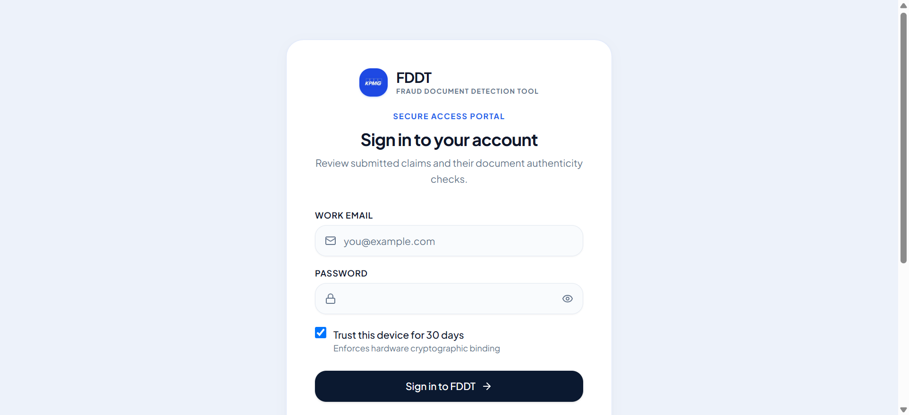

1. Enter your corporate email address and assigned password.
2. Click **Sign in**.
3. Upon successful sign-in, the top navigation bar displays your organization name, user role badge, and relevant navigation links based on your permissions.

> *Note: If you have forgotten your password or require a new user account, please email your administrator for this.*

**Changing your password.** Once signed in, click the **key icon** in the top navigation bar (or **Change password** in the mobile menu), enter your current password and the new one twice (at least 8 characters). Your current password is required — a forgotten password can only be reset by your administrator.

---

## 4. User (Submitter) Guide

### Submitting a Single Case

To submit documents for verification:

1. Click **New Case** (or **New upload**) in the top navigation bar.
2. Select the **Case Type** that matches your submission:
   - *School / educational document*
   - *Vendor invoice*
   - *Commercial invoice*
   - *Procurement documentation*
   - *Quotation*
   - *Travel / accommodation reimbursement*
   - *Other*

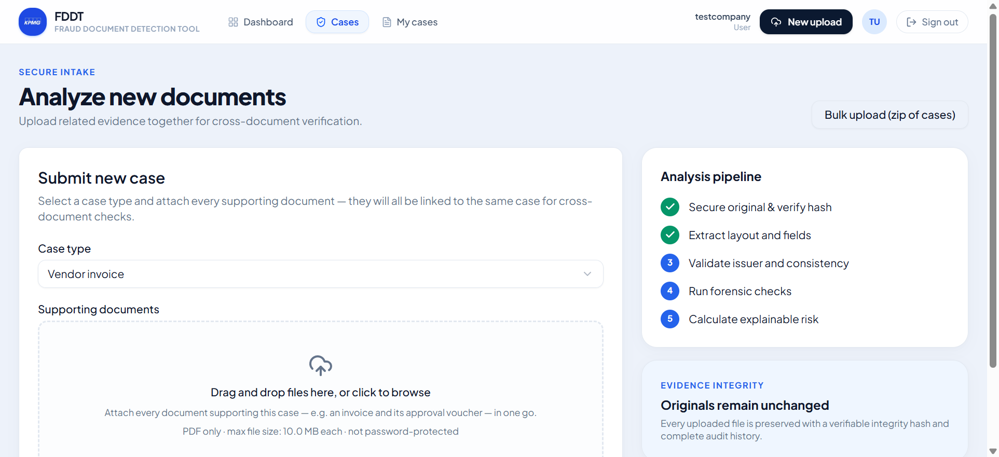

3. **Attach PDF Files**:
   - Drag and drop your PDF documents into the upload zone or click **Browse files**.
   - **File Requirements**: Files must be valid PDF documents within your company's maximum file size limit (standard limit is 10 MB per document). Password-protected PDFs are rejected immediately for security.
4. **Optional Reference Signature**:
   - If your document contains an authorized signature or stamp that should be compared against other documents in the case, you can define a reference signature box.
5. Click **Submit Case**. The documents will begin automated processing immediately.

---

### Submitting Cases in Bulk (Zip Upload)

When managing high volumes of invoices or expense claims, use the **Bulk Upload** feature:

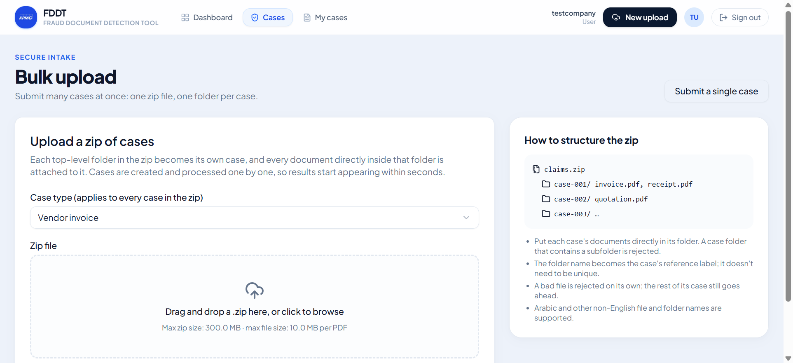

1. Navigate to **New Case** and select **Bulk upload (zip of cases)**.
2. Prepare a standard `.zip` file on your computer structured with **one folder per case**:
   ```text
   batch_october.zip
   ├── CASE_INV_1001/
   │   ├── invoice_1001.pdf
   │   └── purchase_order.pdf
   ├── CASE_INV_1002/
   │   └── invoice_1002.pdf
   └── CASE_INV_1003/
       ├── tuition_receipt.pdf
       └── student_id.pdf
   ```
3. Select the default **Case Type** for the batch.
4. Drop the `.zip` archive into the intake area.
5. The system automatically extracts each folder, verifies the PDF files, and creates individual cases with automated progress indicators (**Queued → Processing → Complete**).

---

### Tracking Submissions (My Cases)

Submitters can track all their submitted cases under **My Cases**:

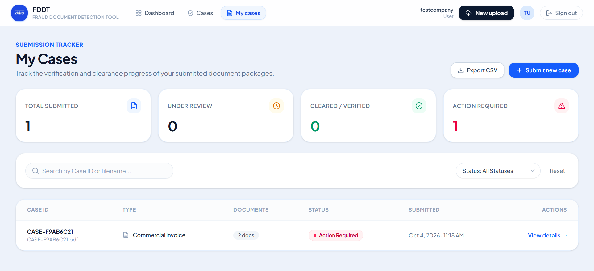

- **Search**: Search by case reference number or document name.
- **Filters**:
  - **All**: All cases submitted by your user account.
  - **Under review**: Cases currently being analyzed by the automated pipeline or queued for reviewer triage.
  - **Cleared**: Cases approved by the reviewing team.
  - **Action required**: Cases rejected with feedback notes from the reviewer.

---

### Understanding the Submitter Case View

When a submitter opens one of their cases, a clean, submitter-tailored view is presented:

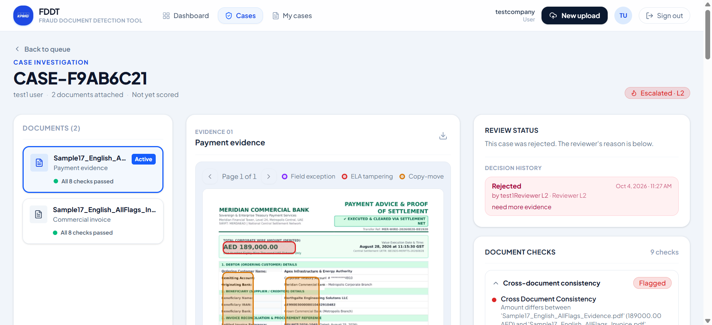

- **Document Overview**: Lists all uploaded files, page counts, file sizes, and processing statuses.
- **Extracted Information**: Displays values recognized by the OCR engine (such as invoice number, total amount, currency, and date).
- **Activity Timeline**: Displays a chronological event log showing when the case was submitted, when files were processed, and final decisions.

> **Security & Fraud Prevention Design**: Submitter accounts do **not** display numerical risk scores, triggered fraud check rules, or forensic detection algorithms. This prevents malicious actors from probing or attempting to bypass verification thresholds.

---

## 5. Reviewer L1 (Analyst) Guide

Reviewer L1 analysts assess automated findings, inspect flagged anomalies, and make informed operational decisions.

### Operational Reviewer Dashboard

The **Dashboard** provides real-time visibility into your company's verification queue:

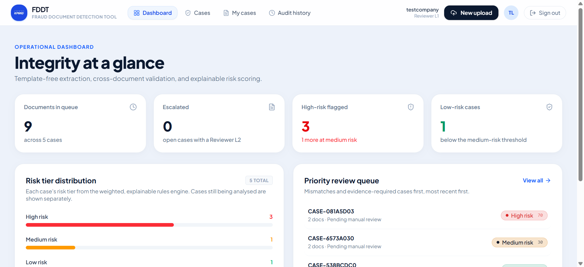

- **Key Metrics**: Total active cases, cases requiring immediate review, cleared cases, and flagged cases.
- **Risk Distribution**: High, Medium, and Low risk breakdowns across recent submissions.
- **Review Workload**: Cases sorted by submission date and SLA urgency.

---

### Managing the Review Queue

Click **Cases** in the navigation bar to access the full **Review Queue**:

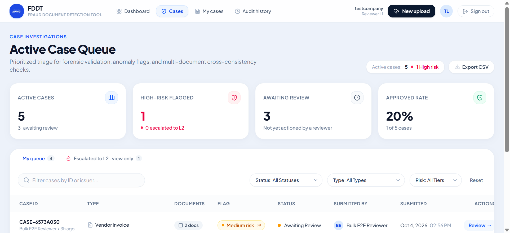

- **Risk Tier Badges**:
  - <span style="color:#e11d48; font-weight:bold;">HIGH RISK</span> (Score 70–100): Critical anomalies detected (e.g., severe metadata tampering, copy-move duplication, unrecognized issuer).
  - <span style="color:#d97706; font-weight:bold;">MEDIUM RISK</span> (Score 30–69): Discrepancies or warnings (e.g., date mismatches, mathematical errors, missing expected fields).
  - <span style="color:#059669; font-weight:bold;">LOW RISK</span> (Score 0–29): Clear document with verified issuer and consistent fields.
- **Filters & Search**: Filter by Risk Tier, Case Type, Review Status, or keyword.

---

### Full Case Analysis & Risk Breakdown

Opening any case from the queue reveals the complete **Case Detail** analysis:

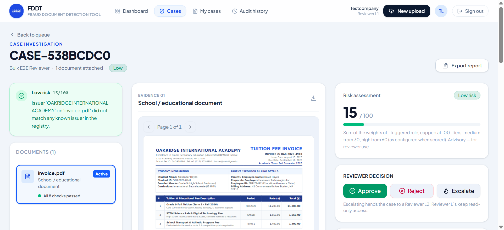

1. **Risk Score Header**:
   - Prominently displays the composite Risk Score (0–100) and assigned Tier.
   - Shows case metadata: submitter email, case category, submission timestamp.
2. **Triggered Risk Reasons**:
   - Clear, explainable list of factors that contributed points to the score.
   - Example: *"Issuer not found in verified registry (+25 pts)"*, *"PDF modified in image editor after creation (+20 pts)"*.

---

### Forensic & Automated Document Checks

Scroll down on the Case Detail page to inspect the comprehensive **Checks & Forensics Panel**:

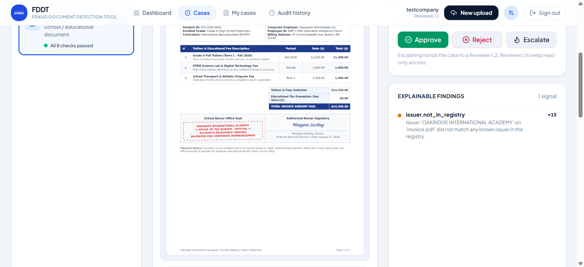

Every uploaded document undergoes an exhaustive battery of independent tests:

| Check Name | What It Inspects |
| :--- | :--- |
| **Issuer Verification** | Cross-references extracted vendor name, tax ID, and address against your company's trusted Issuer Registry. |
| **Field Validation** | Verifies arithmetic totals (subtotal + tax = total), valid date formats, future dates, and required fields. |
| **Cross-Document Check** | Validates consistency between multiple documents in the same case (e.g., matching invoice amount with purchase order). |
| **Metadata Forensics** | Inspects PDF creation software, modification history, suspicious editing tools, and timestamp inconsistencies. |
| **Copy-Move Forgery** | Detects cloned regions (content copied and pasted from one part of the document to another). |
| **Error Level Analysis (ELA)** | Analyzes compression resave artifacts to identify spliced text or altered numbers. |
| **Duplicate Detection** | Computes cryptographic and perceptual hashes to detect duplicate submissions across historical cases. |
| **Signature / Stamp Detection** | Detects signature regions and compares them against reference samples for consistency. |

---

### Interactive PDF Visual Overlays

To visually inspect anomalies:
- Open the document preview within the Case Detail view.
- Color-coded bounding boxes highlight exact regions of concern:
  - **Red Box**: Tampering or Error Level Analysis anomaly.
  - **Orange Box**: Copy-move duplication source and target.
  - **Purple Box**: Arithmetic or field validation mismatch.
  - **Fuchsia Box**: Text set in a different font (or a second copy of the font) — likely typed in later.
  - **Teal Box**: Deleted or shortened text — the faint trace of erased text in a converted scan.
  - **Blue Box**: Detected signature or official stamp.

---

### Review Decisions (Approve, Reject, Escalate)

In the top-right header of the Case Detail screen, three decision actions are available:

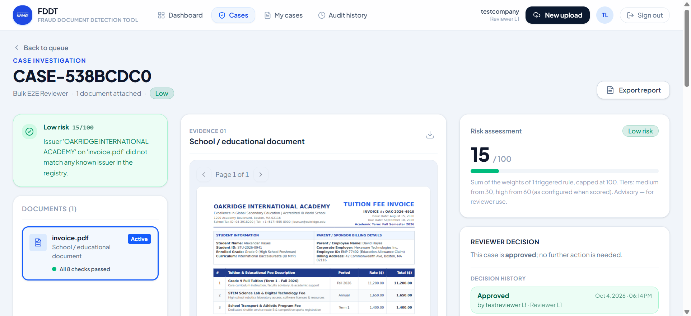

1. **Approve**:
   - Use when all checks pass or minor flags have been verified as legitimate.
   - Enter optional approval notes and confirm. The case status updates to **Approved**.
2. **Reject**:
   - Use when fraudulent alteration or non-compliance is identified.
   - Select a mandatory **Rejection Reason** category and provide notes detailing the decision.
3. **Escalate**:
   - Use when a case is complex, high-value, or requires supervisor adjudication.
   - Adds an escalation note and routes the case directly to the **Reviewer L2** queue.

---

### Exporting Case Forensic Reports

Click **Export report** at any time on the Case Detail page to generate an official, courtroom-ready **PDF Forensic Report**:
- Includes complete executive summary, breakdown of all automated checks, risk scoring explanation, audit trail, SHA-256 cryptographic document hashes, and high-resolution visual evidence pages with highlighted anomaly boxes.

---

## 6. Reviewer L2 (Senior Reviewer / Supervisor) Guide

Reviewer L2 users have all analyst privileges plus senior decision authority and configuration control over their company's risk parameters.

### Managing Escalated Cases

Cases escalated by L1 analysts appear in the review queue with an **Escalated** status badge.
- Reviewer L2 users conduct deep reviews of these cases.
- Only Reviewer L2 users have the authority to grant final **Approval** or execute final **Rejection** on escalated files.

---

### Company Issuer Registry

Under **Settings › Issuer Registry**, Reviewer L2 supervisors manage the company's verified vendors, schools, and partners:

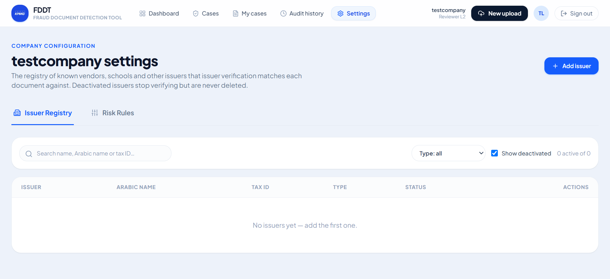

1. **Viewing Registry**: Lists all active and inactive registered issuers.
2. **Adding an Issuer**:
   - Click **Add Issuer**.
   - Enter Organization Name, Tax ID / Business Registration Number, official address, and known email domains.
   - Save the record. Incoming documents matching these details will pass Issuer Verification automatically.
3. **Deactivating / Reactivating**:
   - Deactivate obsolete vendors or reactivate previously deactivated entities with a single click.

---

### Company Risk Rules & Thresholds

Under **Settings › Risk Rules**, Reviewer L2 supervisors customize how risk scores are calculated for their organization:

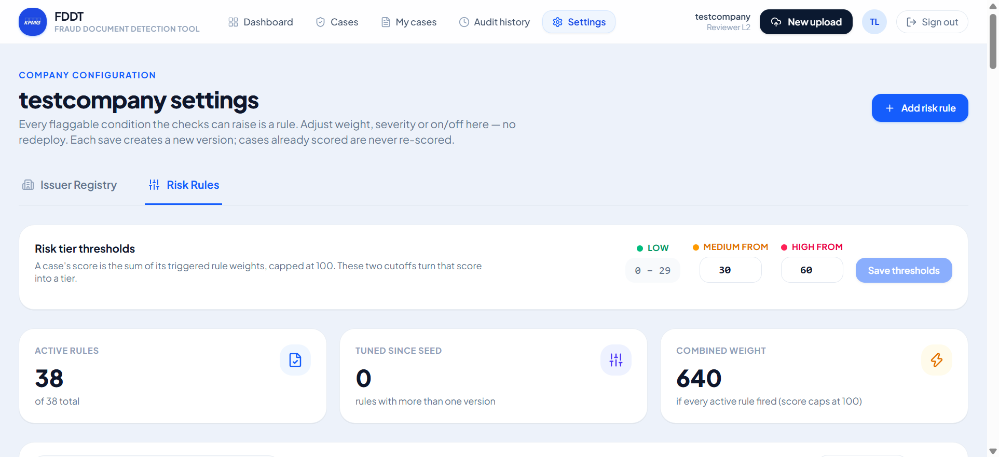

1. **Adjusting Risk Rules**:
   - Toggle individual fraud detection checks on or off based on your business requirements.
   - Adjust point weights for specific findings (e.g., increasing penalty points for metadata anomalies).
2. **Configuring Risk Thresholds**:
   - Customize score boundaries for **Low**, **Medium**, and **High** risk classifications to match your company's risk tolerance.

---

## 7. Getting Help & Administrative Requests

To maintain company security and data integrity, certain platform-level configurations are managed centrally.

> **Need assistance?**
> - To create new user accounts or adjust user roles
> - To reset an account password
> - To request an increase in maximum document upload size limits
> - To update your company profile or contact details
>
> **Please contact or email your administrator at `admin@example.com` (or your company's designated IT administrator) for this.**
