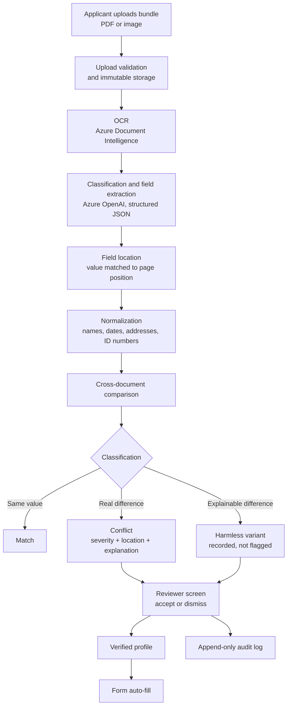

# AI-Based Document Contradiction Detector — Project Document

**Problem statement:** PRAGATI02 — AI-Based Document Contradiction Detector for Public Systems
**Base platform:** FDDT (Fraud Document Detection Tool), this repository
**Document status:** The design written before development, kept as it was.
The backend of everything marked "Planned" below has since been built. For
what exists now, read [CONTRADICTION_DETECTOR_REPORT.md](CONTRADICTION_DETECTOR_REPORT.md)
and [DEVELOPMENT_PHASES.md](DEVELOPMENT_PHASES.md); where they differ from
this document, they are right.
**Date:** 9 October 2026

---

## 1. Summary

An applicant submits several documents for one application: an identity card, an address proof, an income certificate. The same person's name, date of birth or address is often written differently across them. Today a clerk compares the documents by hand. Two things go wrong: applications are rejected over harmless spelling differences, and real contradictions are missed.

This project builds a tool that reads every document in an applicant's bundle, compares the key details across documents, ignores harmless variants, flags real conflicts with a severity and the exact place on the page, and explains each one in plain language. A reviewer accepts or dismisses each finding.

The tool is built by extending the existing FDDT platform rather than starting from scratch. FDDT already provides OCR, field extraction, field location on the page, a reviewer workflow, multi-tenancy and an audit log.

Throughout this document every feature is marked **Existing** (already in the repository) or **Planned** (to be built).

---

## 2. Problem

| Problem | Example | Effect |
| --- | --- | --- |
| Harmless differences cause rejection | "Mohd. Asif" on one document, "Mohammad Asif" on another | A genuine applicant is rejected or delayed |
| Real contradictions are missed | Birth year 1982 on one document, 1997 on another | An ineligible or fraudulent application passes |
| Manual checking is slow | A clerk reads 3 to 5 documents per application | Long queues, inconsistent decisions |
| Decisions are not explained | The applicant is told only "rejected" | The applicant does not know which document to correct |

---

## 3. Objectives

1. Read PDFs and images with OCR and extract key details.
2. Compare details across the documents of one applicant, allowing for spelling, initials and transliteration differences.
3. Flag true conflicts with a severity level and the exact source location.
4. Explain each conflict in language an ordinary user understands.
5. Give the reviewer a screen to accept or dismiss each finding.
6. Support Indian-language documents (bonus requirement).
7. Use synthetic documents only. No real person's documents are used at any stage.

---

## 4. Users and Roles

The system is multi-tenant. A tenant is any organisation that verifies people's documents: a government office or a private company verifying new hires.

| Role | Who | What they do | Status |
| --- | --- | --- | --- |
| Applicant (`user`) | A citizen or a job candidate | Uploads document bundles, sees findings in plain language | Existing role, new screens planned |
| Family head | An applicant who manages a family | Adds family members, uploads and manages documents for all of them | Planned |
| Reviewer L1 | Clerk or HR analyst | Reviews bundles, accepts or dismisses each finding | Existing role, per-finding review planned |
| Reviewer L2 | Supervisor | Handles escalated bundles, manages the organisation's settings | Existing |
| Platform admin | Operator of the platform | Creates organisations and users | Existing |

---

## 5. Solution Overview

### Technology

| Layer | Technology | Status |
| --- | --- | --- |
| API | FastAPI (Python) | Existing |
| Database | PostgreSQL with Row-Level Security, PgBouncer | Existing |
| Background processing | Celery + Redis | Existing |
| File storage | Azure Blob Storage, hash-verified | Existing |
| OCR | Azure Document Intelligence | Existing |
| Extraction | Azure OpenAI with strict JSON-schema output | Existing; identity schema planned |
| Fuzzy matching | rapidfuzz | Existing; identity comparison planned |
| Frontend | React + TypeScript (Vite), Tailwind, shadcn/ui | Existing; new screens planned |

---

## 6. How It Works, Step by Step

1. **Upload.** The applicant (or family head) creates a bundle for one person and uploads the documents. Each file is validated before storage: type, size, not corrupted, not password-protected. *Existing for PDF. Image upload (JPG, PNG, TIFF) is planned; the current validator accepts PDF only.*
2. **OCR.** Azure Document Intelligence reads each page and returns text with word positions. *Existing.*
3. **Classification and extraction.** One Azure OpenAI call decides the document type and returns the fields as structured JSON, each with a confidence value. *Existing for invoice-type documents. The identity field set is planned.*
4. **Field location.** Each extracted value is matched back to its position on the page and stored as a bounding box. *Existing.*
5. **Normalization.** Values are converted to a comparable form (Section 7.3). *Dates existing; names, addresses and ID numbers planned.*
6. **Comparison.** Every pair of documents in the bundle is compared field by field. *Existing for amount, date and issuer; identity fields planned.*
7. **Classification of each difference.** Match, harmless variant, or conflict, with a stated reason. *Planned.*
8. **Severity.** Each conflict receives a severity level (Section 7.5). *Severity levels existing; the identity matrix and a "critical" level are planned.*
9. **Review.** The reviewer sees both documents side by side with the conflicting values highlighted, and accepts or dismisses each finding. *Highlighting existing; per-finding accept/dismiss planned.*
10. **Audit.** Every automated result and every human decision is written to an append-only log. *Existing.*

---

## 7. Features in Detail

### 7.1 Document intake — PDF and images (Planned)

The validator currently accepts PDF only, because FDDT's forensic checks work on PDFs. It will be extended to accept JPG, PNG and TIFF. Forensic checks are skipped for identity bundles; they are not part of this problem statement.

### 7.2 Document types and extracted fields (Planned)

Document types to add: identity card, tax identity card, voter identity card, driving licence, income certificate, address proof, caste or domicile certificate; and for hiring: marksheet, degree certificate, experience letter, payslip.

Fields extracted from every document, where present:

| Field | Notes |
| --- | --- |
| Full name | Original script and a Latin transliteration |
| Parent or spouse name | Used for family-level checks |
| Date of birth | Returned in one standard format |
| Gender | |
| Address | Full text plus the postal code separately |
| ID number | Masked numbers are compared on visible digits only |
| Annual income | Number plus currency |
| Issuing authority and issue date | |

Each field carries its value, a confidence value, and its position on the page.

### 7.3 Normalization (Planned, except dates)

| Field | Normalization |
| --- | --- |
| Name | Lower-case; remove honorifics (Shri, Smt, Mr, Dr); remove punctuation; treat word order as unimportant |
| Date | All formats and numeral systems converted to one date format (Existing) |
| Address | Expand abbreviations (Rd → Road); separate the postal code; compare as a set of words |
| ID number | Remove spaces and separators; compare exactly |
| Income | Plain number |

### 7.4 Harmless variant or real conflict (Planned)

A similarity score alone is not enough. "Rahul Verma" and "Rohit Verma" score high but are different people. A difference is therefore treated as harmless **only when it can be explained by a recognised reason**. The reason is stored and shown.

| Reason | Example | Result |
| --- | --- | --- |
| Spelling variant of the same sound | Sunita Choudhary / Suneeta Chowdhary | Harmless |
| Initials | A. P. Sharma / Ajay Prakash Sharma | Harmless |
| Abbreviation | Mohd. Asif / Mohammad Asif | Harmless |
| Transliteration | रमेश कुमार / Ramesh Kumar | Harmless |
| Honorific or word order | Shri Ramesh Kumar / Kumar Ramesh | Harmless |
| Address formatting | MG Rd, Indore / M.G. Road, Indore | Harmless |
| No recognised reason | Rahul Verma / Sanjay Singh | Conflict |

Clear cases are decided by rules. Only uncertain cases are sent to the language model for a judgement, which must return its reasoning. This keeps cost low and keeps every decision explainable.

### 7.5 Severity (Planned)

The thresholds below are the starting proposal and will be tuned on the synthetic bundles.

| Situation | Severity |
| --- | --- |
| Harmless variant | Info (recorded, not flagged) |
| Address differs only in formatting beyond the harmless rules | Low |
| Date of birth differs by a single digit in day or month | Medium |
| City or postal code differs | Medium |
| Gender differs | High |
| Birth year differs | High |
| ID number differs | High |
| Income differs substantially | Critical |
| Name belongs to a different person | Critical |

The existing levels are info, low, medium and high. "Critical" is added.

### 7.6 Exact source location (Existing, to be extended)

Every finding stores, for both sides: the document, the page, the bounding box and the value as printed. The reviewer screen draws the highlight on both documents. The highlighting mechanism exists for cross-document mismatches today; it will carry the new identity fields.

### 7.7 Reviewer screen (Planned)

- List of findings for the bundle, most severe first.
- Both documents side by side with the conflicting values highlighted.
- The explanation of the finding and, for harmless variants, the reason it was ignored.
- **Accept** (the conflict is real) or **Dismiss** (not a real conflict), with an optional note.
- Each decision records who decided and when, and is written to the audit log.

The existing bundle-level approve, reject and escalate actions remain.

### 7.8 Plain-language messages (Planned)

Current messages are written for forensic reviewers and are too technical for applicants. Every finding will be written from a fixed template, one per finding type, so that the same problem is always described the same way.

Rules:

1. One plain sentence first. Technical detail is shown below it, to reviewers only.
2. Every message states what was found, why it matters, and what to do next.
3. Documents are named by type ("Income certificate"), not by file name.
4. Severity is shown in plain words: "Must be corrected", "Please check", "No problem".
5. Messages are available in Hindi and English.

| Current style | New style |
| --- | --- |
| "Date differs between 'a.pdf' ('1990-03-12') and 'b.pdf' ('1998-03-12')." | "Your date of birth is different on two documents: 12 March 1990 on the identity card and 12 March 1998 on the income certificate. Please upload the correct document or have the wrong one corrected." |
| (not shown today) | "The name is spelled slightly differently (Mohd. Asif / Mohammad Asif). This is the same name. No problem." |

### 7.9 Indian-language support (Planned)

At extraction, names and addresses are returned in the original script together with a Latin transliteration. Comparison runs on the transliteration, so a Hindi document and an English document can be compared directly. OCR support for each script must be verified on synthetic samples before it is claimed.

### 7.10 Family management (Planned)

- A family has one head and any number of members (spouse, son, daughter, parent).
- Only the head manages the family: adds members, uploads their documents, sees their findings. Members do not have separate logins in this version.
- Each bundle belongs to one member.
- **Family-level checks:** the parent name on a child's document matches the head's or spouse's name; family members share the same address; a child's date of birth is later than the parents'.

### 7.11 Verified profile and form auto-fill (Planned)

- **Verified profile.** For each person, one final value per field. The value is the one the documents agree on, or the one the reviewer selected when resolving a conflict. Each value records which document it came from.
- **Form templates.** A small set of synthetic application forms. Each form field is mapped to a profile field.
- **Auto-fill.** The applicant selects a form and a family member; the form opens pre-filled. A field with an unresolved conflict is left empty with a warning.

### 7.12 Organisation by subdomain (Planned)

Each organisation is reached at its own subdomain (for example `indore.<domain>`). The subdomain selects the organisation, and login is limited to that organisation's users. Data isolation continues to be enforced by the existing mechanism: an organisation identifier on every table plus PostgreSQL Row-Level Security. Separate database schemas per organisation are not used.

### 7.13 Use in corporate hiring (Planned)

The same engine verifies a candidate's documents during hiring: name and date of birth across identity card, marksheets and degree; employment dates across experience letters. Only the document types differ.

### 7.14 Audit trail (Existing)

Every automated check and every human action is appended to the audit log and never changed. A per-bundle report can be exported as PDF.

---

## 8. Data Model Changes (Planned)

| Table | Change |
| --- | --- |
| `cross_document_findings` | Add: classification (match / harmless / conflict), reason, both values, both locations (document, page, bounding box), review status, reviewer, review time, review note |
| Severity enum | Add `critical` |
| `families` (new) | Organisation, head user |
| `family_members` (new) | Family, name, relation, date of birth |
| `cases` | Link to a family member |
| `person_profiles` (new) | Family member, field, final value, source document |
| `form_templates` (new) | Form name, field-to-profile mapping |
| `companies` | Add subdomain |

Every new table is tenant-scoped and receives Row-Level Security policies in its migration, as the existing tables do.

---

## 9. API Changes (Planned)

Endpoint names are proposals.

| Endpoint | Purpose |
| --- | --- |
| `PATCH /cases/{id}/findings/{finding_id}` | Accept or dismiss a finding |
| `GET/POST /families`, `/families/{id}/members` | Family management (head only) |
| `GET /members/{id}/profile` | Verified profile |
| `GET /forms`, `GET /forms/{id}/prefill?member=` | Form list and pre-filled form |
| Existing upload endpoints | Accept images |
| Existing login | Resolve the organisation from the subdomain |

---

## 10. Screens (Planned unless marked)

| Screen | For | Status |
| --- | --- | --- |
| Login | All | Existing |
| My family | Family head | Planned |
| New bundle and upload | Applicant | Existing, to be adapted |
| Bundle result in plain language | Applicant | Planned |
| Review queue | Reviewer | Existing |
| Finding review, side by side | Reviewer | Planned on top of the existing viewer |
| Forms and auto-fill | Applicant | Planned |
| Organisation settings, platform admin | Reviewer L2, admin | Existing |

---

## 11. Synthetic Data (Planned)

A script generates fictional people and their documents. No real documents are used.

| Bundle type | Purpose in the demo |
| --- | --- |
| Clean | All documents agree; nothing is flagged |
| Harmless variants only | Spelling, initials, abbreviations, address formatting; nothing is flagged, and the reasons are shown |
| Real conflicts | Different birth year, different name, different address, income mismatch, gender mismatch |
| Minor date typo | Shows graded severity |
| Hindi and mixed script | Shows transliteration matching |
| Image format | Shows image intake |
| Family | Shows family-level checks |

---

## 12. Reused and New

| Capability | Status |
| --- | --- |
| OCR, field extraction framework, field location | Existing |
| Pairwise comparison framework, fuzzy matching, date normalization | Existing |
| Side-by-side highlights, reviewer queue, escalation | Existing |
| Multi-tenancy, roles, audit log, report export | Existing |
| Image intake | Planned |
| Identity and hiring document types, identity field schema | Planned |
| Name, address and ID normalization; reasoned harmless/conflict decision | Planned |
| Identity severity matrix with "critical" | Planned |
| Per-finding accept/dismiss | Planned |
| Plain-language messages in Hindi and English | Planned |
| Family management and family-level checks | Planned |
| Verified profile and form auto-fill | Planned |
| Subdomain per organisation | Planned |
| Synthetic bundle generator | Planned |

FDDT's forensic checks, risk scoring and signature checks stay in the repository but are not used for identity bundles.

---

## 13. Build Order

| Priority | Work | Required by the problem statement |
| --- | --- | --- |
| 1 | Image intake, document types, identity extraction schema | Yes |
| 2 | Synthetic bundle generator | Yes |
| 3 | Comparison engine: normalization, reasoned classification, severity | Yes |
| 4 | Finding model, accept/dismiss, reviewer screen | Yes |
| 5 | Plain-language messages, Hindi and English | Yes (explanation; language is bonus) |
| 6 | Family management and family-level checks | No |
| 7 | Verified profile and form auto-fill | No |
| 8 | Subdomain per organisation | No |
| 9 | Architecture diagram, short report, demo script | Yes |

If time runs short, items 6, 7 and 8 are dropped first.

---

## 14. Possible Later Additions

- Tell the applicant which document to correct: when two documents agree and a third differs, the third is the likely error.
- Application readiness indicator: whether the bundle is ready to submit.
- Missing-document checklist per form.
- Validity alerts for documents that expire, such as income certificates.
- Fillable PDF output for auto-filled forms.
- Separate logins for family members.
- Email or SMS notification of findings.

---

## 15. Limitations and Assumptions

- OCR and extraction depend on Azure Document Intelligence and Azure OpenAI. The pipeline does not run without valid keys.
- Processing is asynchronous. A bundle is not processed instantly; the screen shows live progress.
- Handwritten text is not reliably read.
- Field positions come from text matching and are approximate. A field that cannot be matched has no highlight.
- Severity thresholds are initial proposals, to be tuned on synthetic bundles.
- The tool assists the reviewer. It does not approve or reject on its own.
- Only synthetic documents are used.

---

## 16. Deliverables

| Deliverable | Covered by |
| --- | --- |
| Detector working on synthetic document bundles | Sections 6, 7.1–7.6, 11 |
| Demo of conflicts found and harmless variants ignored | Sections 7.4, 7.5, 11 |
| Reviewer screen | Section 7.7 |
| Architecture diagram | Section 5 |
| Code repository | This repository |
| Short report | This document |
