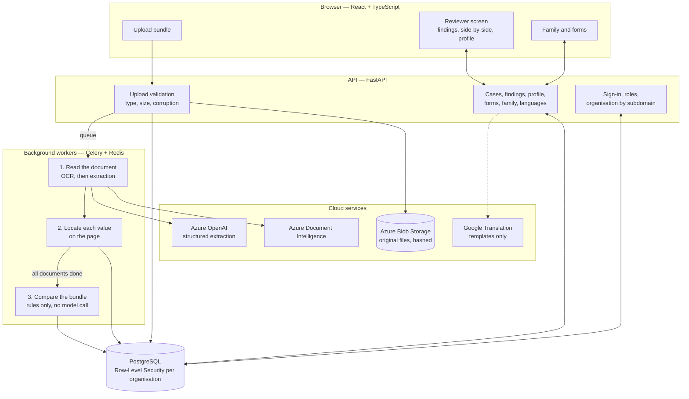

# AI-Based Document Contradiction Detector — Report

**Problem statement:** PRAGATI02 — AI-Based Document Contradiction Detector for Public Systems
**Date:** 9 October 2026
**Code:** this repository (`backend/`, `frontend/`, `sample-documents/identity-bundles/`)

---

## 1. What it does

A person applying for a certificate, a scheme or a job submits several
documents: an identity card, an address proof, an income certificate. The tool
reads every document in the bundle, compares the person's details across them,
and reports each difference as one of two things:

- **Harmless variant.** The documents mean the same thing: "Mohd. Asif" and
  "Mohammad Asif", "A. P. Sharma" and "Ajay Prakash Sharma", a Hindi card and
  an English one. Recorded, shown as ignored, never raised as a problem.
- **Conflict.** The documents disagree: a birth year 15 years apart, a
  different person's name, an income eight times higher. Flagged with a
  severity, the exact place on each page, and a sentence saying what differs,
  why it matters and what to do.

A reviewer accepts or dismisses each finding. Every decision is logged.

On the 16 synthetic bundles in this repository (42 documents) the detector
flags 11 conflicts and ignores 24 harmless differences, exactly as the ground
truth written for those bundles states (Section 5).

---

## 2. Requirements and where they are met

| Requirement | Status | Where |
| --- | --- | --- |
| Read PDFs and images with OCR | Built | Upload accepts PDF, JPG, PNG, TIFF; Azure Document Intelligence reads them |
| Pull out key details | Built | Name, parent/spouse name, date of birth, gender, address, ID number, annual income, issuer, issue date |
| Match across documents, allowing spelling and transliteration differences | Built | `backend/app/services/identity_comparison.py` |
| Detect true conflicts with severity | Built | Five levels: info, low, medium, high, critical |
| Exact source location | Built | Each value's box on its page is stored and returned with the finding |
| Explain each conflict | Built | One fixed template per reason: what differs, why, what to do |
| Reviewer accepts or dismisses each finding | Built | `PATCH /cases/{id}/findings/{finding_id}`, audit-logged |
| Indian-language support (bonus) | Built | Hindi documents compared through a Latin reading; messages in Hindi built in, 11 more languages through Google Translation |
| Synthetic documents only | Met | A generator writes every test document; all are marked "SPECIMEN" |
| Reviewer screen | Built | React screens: findings panel, side-by-side view, verified profile |
| Architecture diagram, repository, short report | This document |

Built beyond the statement: a verified profile per person, forms pre-filled
from it, family management with checks across family members, and one site
per organisation by subdomain.

---

## 3. Architecture

**One document, step by step**

1. **Upload.** The file is checked (type by its own bytes, size, not corrupted,
   not password-protected), stored unchanged with its SHA-256, and queued.
2. **OCR.** Azure Document Intelligence returns the text and every word's
   position.
3. **Extraction.** One Azure OpenAI call with a strict JSON schema returns the
   document type and the person's details. Names and addresses come back as
   printed and in Latin letters. Dates and amounts are normalized.
4. **Location.** Each value is matched back to its words on the page and stored
   as a box.
5. **Comparison.** When every document of the bundle has finished, the bundle is
   compared (Section 4).
6. **Review.** The reviewer sees the findings, opens both documents side by side
   with the values highlighted, and accepts or dismisses each one.

**Stack:** FastAPI, PostgreSQL with Row-Level Security, Celery and Redis,
Azure Blob Storage, Azure Document Intelligence, Azure OpenAI, React with
TypeScript. No model is trained or hosted.

The tool is built on an existing multi-tenant document-review platform in this
repository (FDDT). OCR, the extraction framework, value location, the review
workflow, the audit log and tenant isolation were reused; everything specific
to a person's bundle was added.

---

## 4. How a difference is judged

The language model only reads documents. The comparison is rules, so the same
bundle always gives the same findings and each finding has a stated reason.

**A similarity score alone never makes a difference harmless.** "Rahul Verma"
and "Rohit Verma" look alike and are two people. A difference is harmless only
when a recognised reason explains it:

| Reason | Example |
| --- | --- |
| Spelling of the same sound | Sunita Choudhary / Suneeta Chowdhary; Lakshmi / Laxmi |
| Initials | A. P. Sharma / Ajay Prakash Sharma |
| Customary short form | Mohd. / Md / Mohammad |
| Another script | रमेश कुमार शर्मा / Ramesh Kumar Sharma |
| Title or word order | Shri Sharma Ajay Prakash / Ajay Prakash Sharma |
| Middle name left out | Nikhil Joshi / Nikhil Madhav Joshi |
| Address written differently | 45 M.G. Rd, Ujjain, MP / 45 Mahatma Gandhi Road, Ujjain, Madhya Pradesh |

Everything else is a conflict:

| Difference | Severity |
| --- | --- |
| A different name (Rahul / Rohit, Mahesh / Mukesh, Seema / Reema) | Critical |
| One letter differs (Verma / Varma, Kiran / Karan) | Medium: a person decides |
| Only part of the name on one document | Low |
| Birth year differs | High |
| Day or month differs by one digit | Medium |
| Day and month swapped | Low |
| Gender differs | High |
| Income differs: under 1.25 times / under 2 times / 2 times or more | Medium / High / Critical |
| Locality, city or postal code differs | Medium |
| House number differs | Low |
| Two cards of one kind with different numbers | High |

Name parts are compared by sound with rules written for Indian names (ee/i,
oo/u, ou/ow/au, sh/s, th/t, w/v and similar). Vowels are not dropped, because
that would merge different names such as Rina and Rani.

**Message.** Each finding has three lines, from a fixed template per reason:

> Date of birth does not match: 12 March 1982 on the identity card and 12 March 1997 on the voter identity card.
> The years are 15 years apart.
> Check which document is correct and have the other one corrected.

In Hindi the same finding reads:

> जन्म तिथि में अंतर है: पहचान पत्र पर 12 March 1982 और मतदाता पहचान पत्र पर 12 March 1997।
> वर्षों में 15 साल का अंतर है।
> देखें कि कौन-सा दस्तावेज़ सही है और दूसरे को ठीक करवाएँ।

Only the templates are translated. A person's name, date or address is filled
in on the server and is never sent to a translation service.

**After review.** A finding is `open`, `conflict_confirmed` or `no_issue`.
From the settled details the tool builds a **verified profile** (one value per
detail, with its source document). A detail still in conflict has no value;
when most documents agree, the odd one is named as the document to correct.
Forms are pre-filled from the profile, and a disputed detail is left empty.

---

## 5. Results

All figures below come from running the code in this repository.

**Synthetic bundles** (`sample-documents/identity-bundles/`, written by
`backend/scripts/generate_identity_bundles.py`): 16 bundles, 42 documents in
PDF, JPG, PNG and TIFF, one of them in Hindi.

| Bundle | Documents | Conflicts flagged | Harmless ignored | Worst severity |
| --- | --- | --- | --- | --- |
| B01 clean | 3 | 0 | 0 | |
| B02 spelling variants | 3 | 0 | 4 | |
| B03 initials and word order | 3 | 0 | 5 | |
| B04 name abbreviation | 3 | 0 | 5 | |
| B05 Hindi against English | 3 | 0 | 5 | |
| B06 date of birth one day apart | 2 | 1 | 0 | Medium |
| B07 birth year 15 years apart | 3 | 1 | 0 | High |
| B08 another person's document | 2 | 2 | 0 | Critical |
| B09 similar but different name | 2 | 1 | 0 | Critical |
| B10 income eight times higher | 3 | 1 | 0 | Critical |
| B11 gender and postal code | 2 | 2 | 0 | High |
| B12 image formats | 3 | 0 | 0 | |
| H01 hiring candidate | 4 | 2 | 5 | High |
| F01 family: head, spouse, child | 6 | 1 | 0 | Critical |
| **Total** | **42** | **11** | **24** | |

Every bundle gives exactly the findings its ground truth lists: none missed,
none extra (35 of 35). Reproduce with `python -m scripts.demo_identity_bundles`
from `backend/`.

**What this figure does and does not show.** The ground truth and the rules
were written by the same author, so agreement between them is a consistency
check, not an independent accuracy measurement. Two things reduce that risk:
more than 40 further name and address cases outside the bundles are tested
separately, and writing them exposed and fixed two real errors (Agrawal /
Agarwal judged as different people; an address in another city judged as
formatting). The comparison was run on the correct reading of each document,
not on live OCR output (Section 6).

**Automated tests.** 1,034 backend tests pass. One pre-existing test, unrelated
to this work, fails because it needs cloud storage settings. About 210 of the
tests cover the work described here.

---

## 6. Limitations and what has not been verified

- **Not yet run against the cloud services.** OCR and extraction need Azure
  keys, which were not available during development. Upload, extraction and
  the pipeline are tested with stand-ins for those services. How well the
  extraction prompt reads real scans is unmeasured.
- **Clean documents.** The synthetic documents are computer-generated and
  sharp. Photographed, skewed or handwritten documents will be harder.
  Handwriting is not reliably read.
- **Hindi depends on the transliteration** the extraction step returns. The
  comparison tolerates small differences in it; a poor transliteration can
  still produce a false conflict.
- **Rules have a ceiling.** "Kiran" and "Karan" differ by one vowel and are
  different names; the tool flags this as medium for a person to decide rather
  than guessing. No language model gives a second opinion on such cases.
- **Google Translation** was exercised against a stand-in. The Hindi messages
  are hand-written and do not depend on it.
- **Database.** The six new migrations and the Row-Level Security policies for
  the two new tables were not applied to a running PostgreSQL here.
- **Frontend.** The screens were built separately and are not covered by the
  backend tests.
- **Not built.** Approval is not blocked while findings are open; dates inside
  messages stay in English form; a filled form is not saved or exported as
  PDF; the exported case report does not list these findings.

---

## 7. Running it

| To see | Command (from `backend/`) | Needs |
| --- | --- | --- |
| The detector on all bundles | `python -m scripts.demo_identity_bundles` | Python only |
| One bundle in detail, in Hindi | `python -m scripts.demo_identity_bundles B07 --lang hi` | Python only |
| Profile and a pre-filled form | `python -m scripts.demo_identity_bundles H01 --form employee_joining_form` | Python only |
| Family checks | `python -m scripts.demo_identity_bundles F01` | Python only |
| Regenerate the documents | `python -m scripts.generate_identity_bundles` | Python; a Devanagari font for the Hindi bundle |
| The tests | `pytest` | Python only |
| The full application | see [DEMO_SCRIPT.md](DEMO_SCRIPT.md) | Docker, Azure keys |

Further detail: [DEVELOPMENT_PHASES.md](DEVELOPMENT_PHASES.md) (what each phase
built, with the API contract) and [CONTRADICTION_DETECTOR_PLAN.md](CONTRADICTION_DETECTOR_PLAN.md)
(the design written before development).
