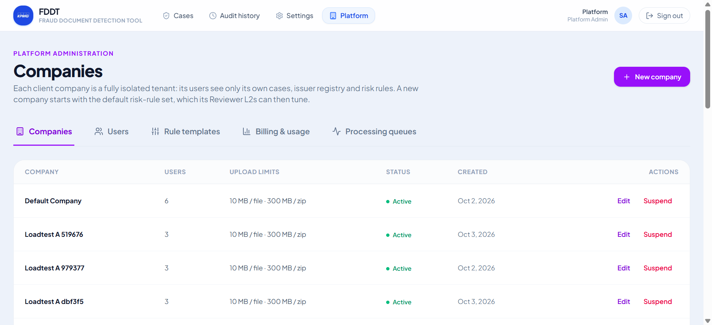
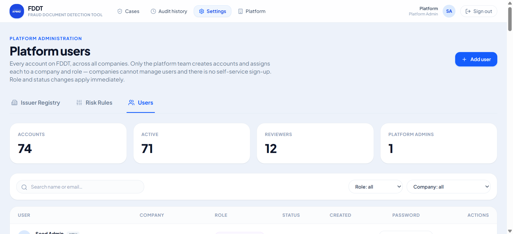
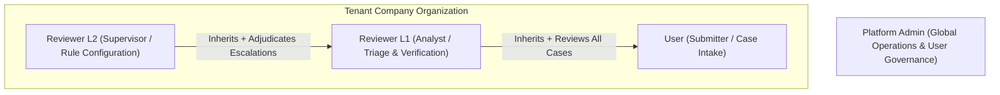
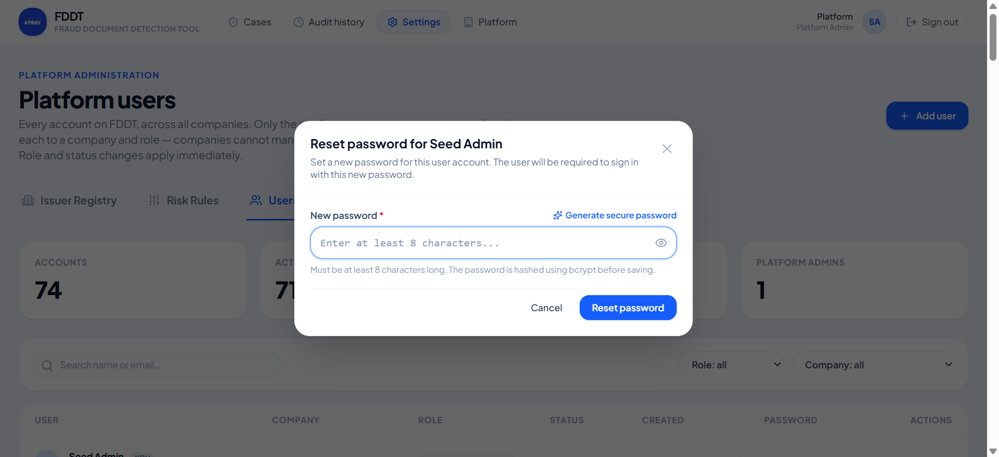
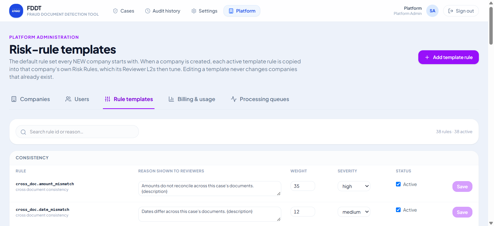
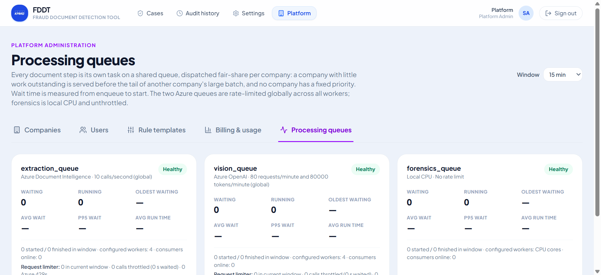
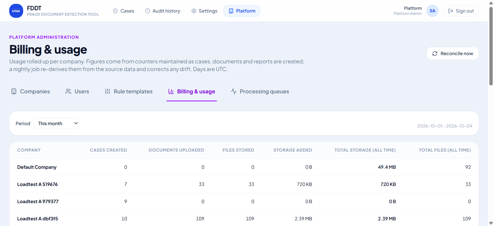
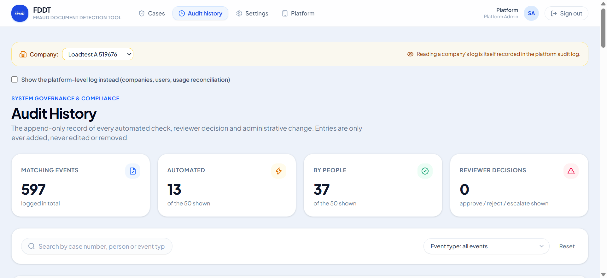

# FDDT Platform Administrator Manual
## Fraud Document Detection Tool — Comprehensive System Administration & Governance Guide

This manual provides an exhaustive operational reference for **Platform Administrators** operating the **Fraud Document Detection Tool (FDDT)**. Platform Administrators manage multi-tenant companies, user accounts, system-wide risk rule templates, processing worker queues, resource usage, and audit compliance across the entire platform.

---

## Table of Contents
1. [Platform Architecture & Security Posture](#1-platform-architecture--security-posture)
2. [Platform Administrator Role & Scope](#2-platform-administrator-role--scope)
3. [Company & Tenant Management](#3-company--tenant-management)
   - [Viewing Companies & Statuses](#viewing-companies--statuses)
   - [Creating a New Client Company](#creating-a-new-client-company)
   - [Configuring Company Upload & Storage Limits](#configuring-company-upload--storage-limits)
   - [Suspending & Reactivating Companies](#suspending--reactivating-companies)
4. [User Account & Identity Management](#4-user-account--identity-management)
   - [Comprehensive Role Breakdown (All 4 User Types)](#comprehensive-role-breakdown-all-4-user-types)
   - [User Directory & Filtering](#user-directory--filtering)
   - [Creating New User Accounts](#creating-new-user-accounts)
   - [Modifying Roles & Company Assignments](#modifying-roles--company-assignments)
   - [Account Deactivation & Lockout](#account-deactivation--lockout)
   - [Platform Admin Password Reset System](#platform-admin-password-reset-system)
5. [Global Risk Rule Templates](#5-global-risk-rule-templates)
6. [Worker Queues & Processing Engine Monitor](#6-worker-queues--processing-engine-monitor)
   - [The Three Specialized Queues](#the-three-specialized-queues)
   - [Fair-Share Scheduling Algorithm](#fair-share-scheduling-algorithm)
   - [Queue Health & Alert Thresholds](#queue-health--alert-thresholds)
7. [System Usage & Resource Analytics](#7-system-usage--resource-analytics)
8. [System Audit History & Governance](#8-system-audit-history--governance)
   - [Immutable Audit Trail](#immutable-audit-trail)
   - [Audited Platform Support Access](#audited-platform-support-access)
   - [Event Types & Audited Operations](#event-types--audited-operations)

---

## 1. Platform Architecture & Security Posture

The **Fraud Document Detection Tool (FDDT)** is engineered as a multi-tenant enterprise system. Several client organizations operate concurrently on a single deployment while maintaining complete isolation:

- **Two-Layer Tenant Isolation**:
  1. *Application-Layer Filtering*: Every database query executed in tenant context automatically filters on `company_id`.
  2. *PostgreSQL Row-Level Security (RLS)*: Database policies strictly enforce that connections under the `fddt_app` role cannot view or modify data outside the tenant session's `app.current_company_id`.
- **Platform Separation**: Platform administrators belong to **no company** (`company_id IS NULL`). They operate from an administrative plane (`fddt_platform`), granting global administrative privileges while ensuring tenant separation remains impenetrable.

---

## 2. Platform Administrator Role & Scope

Platform Administrators hold system-wide authority over the platform infrastructure and user access:

| Capability | Platform Admin Authority | Tenant Users Authority |
| :--- | :--- | :--- |
| **Tenant Provisioning** | **Full**: Create, configure, suspend, and reactivate client companies. | None. |
| **User Administration** | **Full**: Create, update, deactivate, and reset passwords for any account across all roles. | None. |
| **Risk Rule Templates** | **Full**: Maintain master baseline rule templates applied to new companies. | Can only tune company-specific rules (Reviewer L2). |
| **Queue & Worker Monitoring** | **Full**: Real-time visibility into extraction, vision, and forensics Celery queues. | None. |
| **Resource & Billing Analytics** | **Full**: Cross-tenant tracking of pages processed, AI tokens, and storage quotas. | None. |
| **Support Access to Cases** | **Audited Read-Only**: Can inspect cases across companies for technical support; all views are logged. | Confined strictly to company's own cases. |
| **Case Adjudication** | **Deliberately Restricted**: Cannot approve, reject, escalate, or upload cases. | Performed exclusively by company reviewers. |

---

## 3. Company & Tenant Management

Navigate to **Platform › Companies** (`/platform/companies`) to administer tenant organizations.

### Viewing Companies & Statuses
The Companies dashboard displays all onboarded client organizations:
- **Company Name & Identifier**: Unique business name and system UUID.
- **Status**:
  - `Active` (Green): Normal operations enabled.
  - `Suspended` (Red): All company users are immediately blocked from logging in or uploading.
- **Created Date**: Timestamp of tenant onboarding.
- **Active Limits**: Configured maximum file size and zip upload constraints.

### Creating a New Client Company
1. Click **+ Add Company** in the top-right corner.
2. In the modal, provide:
   - **Company Name**: Official legal or operational entity name.
   - **Max File Size (MB)**: Maximum size per uploaded PDF (defaults to 10 MB).
   - **Max Zip Size (MB)**: Maximum batch zip upload size (defaults to 300 MB).
3. Click **Create Company**.
   - The platform creates the tenant record, initializes company storage containers, and automatically seeds the default baseline Risk Rules from the master template.

### Configuring Company Upload & Storage Limits
To customize file intake thresholds for high-volume or enterprise tenants:
1. Click the **Edit** action button next to the target company.
2. Adjust `max_file_size_mb` or `max_zip_size_mb`.
3. Save changes. The updated limits take effect immediately without requiring worker or server restarts.

### Suspending & Reactivating Companies
If a client contract expires or a security breach is suspected:
- Click **Suspend**.
- The change is instantaneous: active JWT sessions for that company become invalid on their next API request, and all user logins are blocked.
- Click **Reactivate** at any time to restore full platform access.

---

## 4. User Account & Identity Management

Navigate to **Platform › Users** (`/settings/users`) to view and manage user credentials and permissions across all organizations.

### Comprehensive Role Breakdown (All 4 User Types)

FDDT defines four distinct roles across the platform:

1. **`user` (Submitter)**:
   - **Belongs to**: A specific company (`company_id NOT NULL`).
   - **Permissions**: Submits new cases (single or bulk zip), tracks personal submissions under *My Cases*, and inspects submitted documents.
   - **Security Restriction**: Never sees risk scores (0–100), risk tiers, or triggered fraud detection rules.
2. **`reviewer_l1` (Analyst)**:
   - **Belongs to**: A specific company (`company_id NOT NULL`).
   - **Permissions**: Full access to the company review queue, operational dashboard, risk scoring breakdown, automated check details, visual overlays, and decision actions (Approve, Reject, Escalate to L2). Can export forensic PDF audit reports.
3. **`reviewer_l2` (Senior Reviewer / Company Supervisor)**:
   - **Belongs to**: A specific company (`company_id NOT NULL`).
   - **Permissions**: All Reviewer L1 privileges, plus final decision authority on cases escalated to L2. Manages the company's **Issuer Registry** (trusted vendors) and **Risk Rules** (tuning weights and tier threshold boundaries).
4. **`platform_admin` (System Administrator)**:
   - **Belongs to**: Outside all companies (`company_id IS NULL`).
   - **Permissions**: System-wide governance, company provisioning, user management, password resets, queue monitoring, usage tracking, and system audit history.
   - **Deliberate Boundary**: Cannot act as a reviewer (cannot approve, reject, or upload cases) to maintain strict separation of duties.

---

### User Directory & Filtering
The user table lists all accounts across the platform:
- **Email**: User login address.
- **Company**: Associated client company (or *Platform* for administrators).
- **Role**: Current assigned role badge.
- **Status**: Active (Green) or Inactive (Gray).
- **Password**: Dedicated reset action column.

---

### Creating New User Accounts
1. Click **+ Add User** on the Users management screen.
2. Complete the form:
   - **Email**: Valid corporate email.
   - **Password**: Temporary initial password (minimum 8 characters).
   - **Role**: Select `user`, `reviewer_l1`, `reviewer_l2`, or `platform_admin`.
   - **Company**: Select the client company (required for company roles; omitted for Platform Admins).
3. Click **Create User**. The account is created immediately and is ready for login.

---

### Modifying Roles & Company Assignments
- You can change an existing user's role (e.g., promoting a `reviewer_l1` to `reviewer_l2`) directly via the dropdown in the user table.
- Role and company changes take effect **immediately** on the user's next API call (tokens verify the database record in real time).

---

### Account Deactivation & Lockout
- Toggle the **Active** switch on any user row to deactivate the account.
- Deactivation instantly revokes access: existing bearer tokens are rejected with `401 Unauthorized`, and future sign-in attempts fail until reactivated.

---

### Platform Admin Password Reset System

Only Platform Administrators have the authority to reset account passwords. Users who still know their password change it themselves (key icon in the top bar → current password + new password, `POST /auth/me/password`, audited as `user_password_changed`); a reset is only needed when a password is forgotten.

#### Step-by-Step Password Reset Workflow:
1. Locate the target user in the Users table.
2. In the **Password** column, click the **`[ 🔑 Reset password ]`** pill button.
3. The **Reset Password Modal** opens, displaying the target user's email and role.
4. **Choose a Password Method**:
   - *Manual Entry*: Type a new secure password (minimum 8 characters, maximum 128 characters). Click the **Eye Icon** to show or hide the password.
   - *One-Click Generator*: Click **Generate secure password**. The system uses a cryptographically secure random value generator to create a high-entropy password (e.g., `k9$Qm2#pL8!vR4wZ`).
5. **Copy to Clipboard**: Click **Copy** to copy the generated credentials to your clipboard with immediate visual confirmation ("Copied!").
6. Click **Reset Password**.
7. **Security & Audit Actions**:
   - The password is encrypted with bcrypt (`hash_password`) before being saved to the database.
   - The action is recorded in the permanent audit trail under the `user_password_reset` event.
   - Provide the new credentials to the user through your organization's approved secure communication channel.

---

## 5. Global Risk Rule Templates

Navigate to **Platform › Rule Templates** (`/platform/rule-templates`) to manage baseline risk scoring parameters.

- **Purpose**: Defines the master library of fraud checks, default severities, and baseline weights.
- When a new company tenant is provisioned, its company-specific risk rule set is automatically cloned from this template.
- Adjusting global rule templates standardizes detection policies across all future client onboardings.

---

## 6. Worker Queues & Processing Engine Monitor

Navigate to **Platform › Queues** (`/platform/queues`) to monitor the health and throughput of background processing workers.

### The Three Specialized Queues

Document processing is divided into three asynchronous Celery queues:

1. **`extraction_queue`** (Azure Document Intelligence):
   - Handles optical character recognition (OCR), layout parsing, and tabular text extraction.
   - Rate-limited and metered to prevent external service throttling.
2. **`vision_queue`** (Azure OpenAI Vision):
   - Executes multi-modal visual analysis, signature detection, stamp localization, and visual inconsistency checks.
   - Calibrated against strict token reservations.
3. **`forensics_queue`** (Local CPU Worker Pool):
   - Computes local algorithmic checks: Error Level Analysis (ELA), copy-move forgery detection, PDF metadata forensics, and cryptographic hash comparisons.
   - Operates fully on local CPU cores without external API dependencies.

---

### Fair-Share Scheduling Algorithm

FDDT implements a **Fair-Share Dispatching Mechanism** (`app/tasks/fairshare.py`):
- Rather than standard FIFO (First-In, First-Out) queuing which could allow a single high-volume client submitting thousands of documents to starve smaller clients, jobs are dispatched based on each company's outstanding task count.
- Companies with lower active backlog receive priority dispatching, ensuring balanced throughput across all tenants.

---

### Queue Health & Alert Thresholds

- **Active & Reserved Tasks**: Displays current worker workload.
- **Oldest Waiting Task Alert**: If the oldest task in any queue exceeds `QUEUE_ALERT_OLDEST_WAITING_SECONDS` (default: 300 seconds), a visual warning badge and system log alert are triggered, signaling the need to scale worker replicas.

---

## 7. System Usage & Resource Analytics

Navigate to **Platform › Usage** (`/platform/usage`) to review resource consumption and tenant billing metrics.

- **Total Documents Processed**: Cumulative PDF intake across all tenants.
- **OCR Pages Extracted**: Exact page count submitted to Document Intelligence.
- **AI Vision Token Consumption**: Aggregated prompt and completion tokens consumed per tenant.
- **Storage Utilization**: Storage footprint per company in Azure Blob Storage.
- **Tenant Billing Reconciliation**: Exportable monthly usage metrics for customer invoicing.

---

## 8. System Audit History & Governance

Navigate to **Audit History** (`/audit-history`) to inspect the centralized governance log.

### Immutable Audit Trail
FDDT maintains an **append-only** audit log in the database. Audit rows cannot be modified or deleted by any user or administrator.

### Audited Platform Support Access
When a Platform Administrator inspects a tenant company's cases or documents for technical support, the system automatically records a `platform_support_view` event. This guarantees complete transparency and regulatory compliance for enterprise clients.

### Event Types & Audited Operations

| Event Type | Category | Description |
| :--- | :--- | :--- |
| `user_password_reset` | Security & Admin | Platform admin executed a credential reset for a user account. |
| `user_password_changed` | Security & Admin | A user changed their own password (with their current password). |
| `user_created` / `user_updated` | User Admin | New user account created or role/status modified. |
| `company_created` / `company_updated` | Tenant Admin | New company provisioned or limits adjusted. |
| `case_created` / `case_submitted` | Case Lifecycle | Submitter uploaded a new case and supporting documents. |
| `case_approved` / `case_rejected` | Review Decision | Reviewer completed adjudication with notes and reasoning. |
| `case_escalated` | Review Decision | Reviewer L1 escalated a case to the L2 supervisor tier. |
| `document_processing_completed` | Pipeline | OCR extraction, classification, and field parsing succeeded. |
| `tampering_checks_completed` | Pipeline | ELA, copy-move detection and the ghost-content check completed. |
| `risk_assessment_completed` | Pipeline | Composite risk score calculated and tier assigned. |
