# PPT Diagrams — AI Document Contradiction Detector (PRAGATI02)

How to use: paste any block into https://mermaid.live , then Actions -> PNG/SVG -> insert in PPT.
(Or in PowerPoint: Insert -> Pictures.) All data shown is synthetic.

---

## 1. System Architecture (High Level)

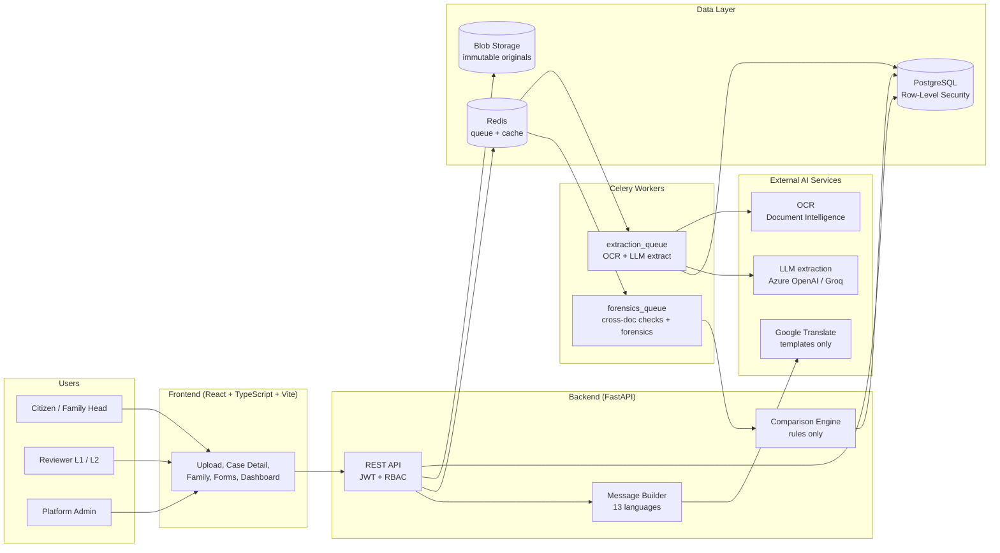

---

## 2. End-to-End Flow (Main Flowchart)

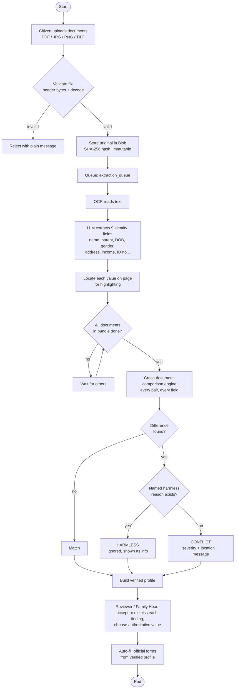

---

## 3. Comparison Engine Decision Logic (the key slide for judges)

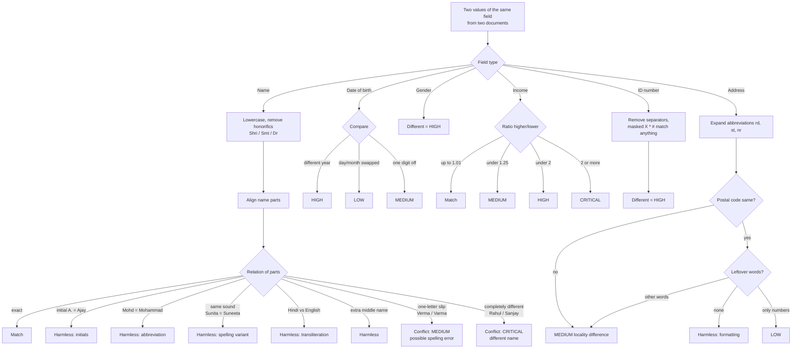

---

## 4. Harmless vs Real Conflict (simple slide for non-technical audience)

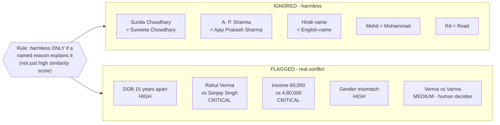

---

## 5. Sequence Diagram (what happens on upload)

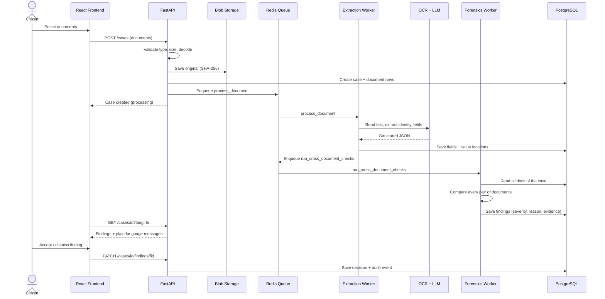

---

## 6. Severity Levels

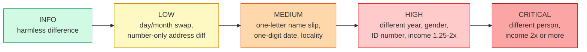

---

## 7. Data Model (ER Diagram)

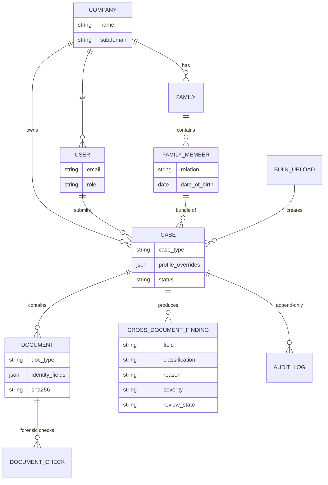

---

## 8. Multi-Tenancy and Roles (Security Slide)

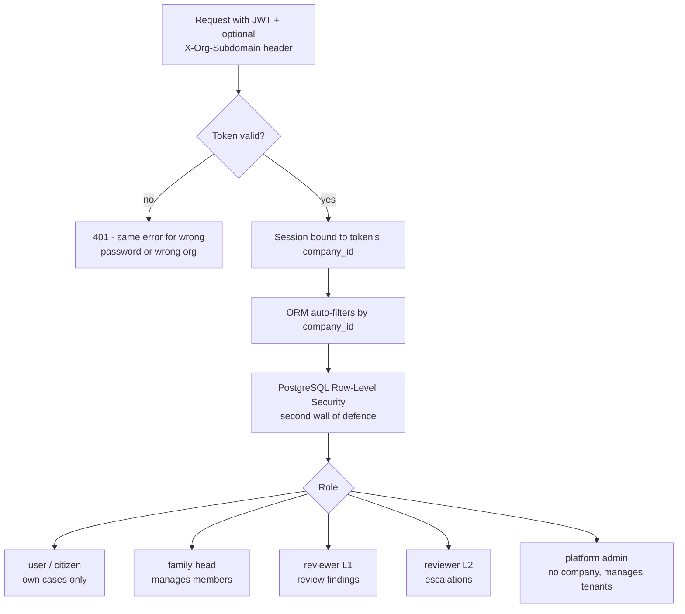

---

## 9. Verification Modes (Bulk Upload)

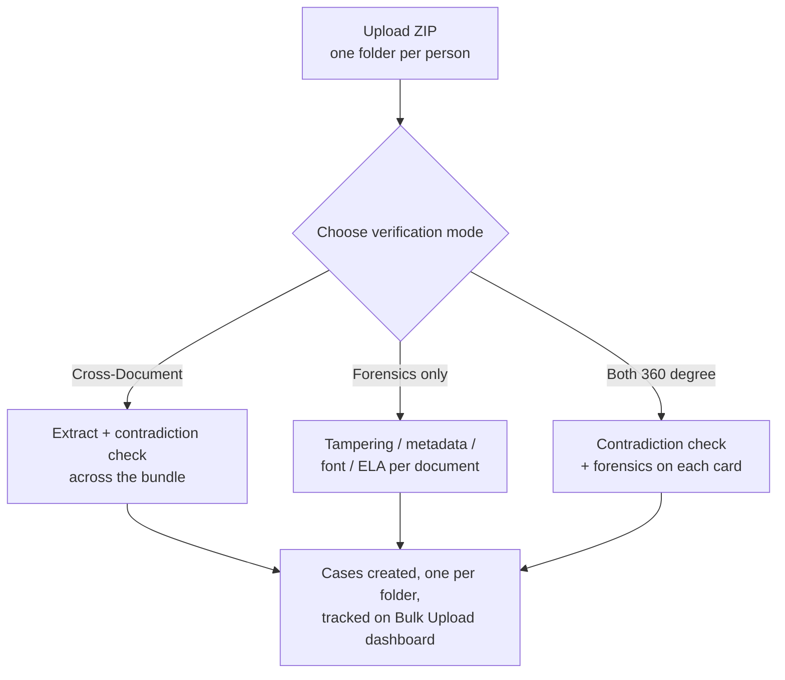

---

## 10. Multilingual Message Pipeline

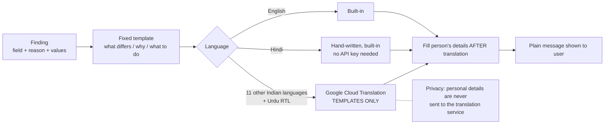

---

## 11. Family Verification Flow

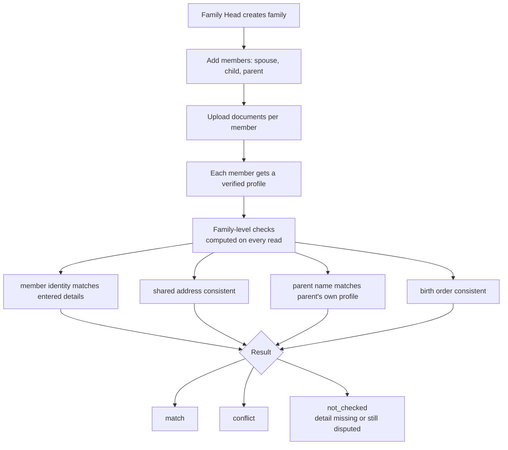

---

## 12. Verified Profile and Form Auto-fill

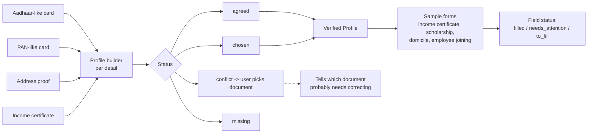

---

## 13. Technology Stack

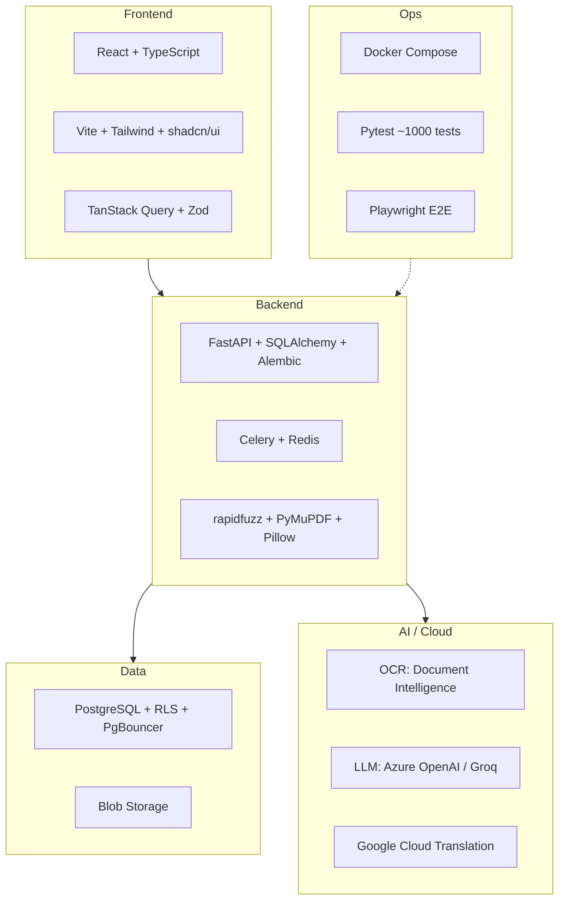

---

## 14. Project Timeline / Phases

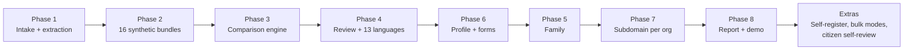

---

## Suggested PPT slide order

1. Problem statement (PRAGATI02) - text
2. Solution overview - Diagram 4
3. Architecture - Diagram 1 (or 13 for the tech stack)
4. How it works - Diagram 2
5. Core innovation - Diagram 3 + Diagram 6
6. Upload sequence - Diagram 5
7. Reviewer + multilingual - Diagram 10
8. Family + forms - Diagrams 11 and 12
9. Security and multi-tenancy - Diagram 8 (and 7 if technical judges)
10. Bulk upload - Diagram 9
11. Demo results: 16 bundles, 42 documents, 11 conflicts flagged, 24 harmless ignored (a consistency check, not an accuracy claim)
12. Roadmap - Diagram 14 and the not-yet-built list

Honest note for slides: the 35/35 result is a consistency check against ground truth written by the same author, not an accuracy measurement.
