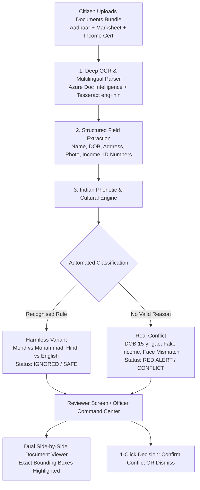

# 🇮🇳 Real-World Problem Analysis & AI Solution
## Problem Statement: PRAGATI02 — AI-Based Document Contradiction Detector for Public Systems

---

## 📌 Executive Summary

Aaj ke digital daur mein lagbhag sabhi sarkari aur private applications (Scholarship, Jobs, Passports, Welfare Schemes, Loans) **online portals** ke zariye bhari jaati hain. 

Aam taur par log sochte hain:  
> *"Jab sab online form mein bhar hi diya, toh portal par hi validation kyu nahi ho jaati? Manual checking ki zarurat hi kyu padti hai?"*

### ⚠️ The Blind Spot of Modern Portals (Asli Kami Kahan Hai?)
* **Online Form kya check karta hai:** Input text boxes — naam khali toh nahi hai, mobile 10 digit ka hai ya nahi, Aadhaar 12 digit ka hai ya nahi.
* **Online Form kya NAHI check kar sakta:** **Uploaded Scanned Documents (PDF / Images) ke ANDAR ka sach!**
* Portal par form toh submit ho jaata hai, lekin uske baad wo file jaati hai **Back-office Scrutiny / Verification Desk** par (jaise District Nodal Officer, Verification Babu, ya Document Verification Desk).
* Wahan sarkari clerk ko baithkar **Aadhaar, 10th Marksheet, Income Certificate, Caste Certificate** ke scanned PDFs ek-ek karke kholne padte hain aur haath se line-by-line milane padte hain.

### Yahan aati hain 2 bohot badi samasyaayein:
1. **False Rejection & Citizen Harassment:**  
   `Mohd. Asif` vs `Mohammad Asif`, `A. P. Sharma` vs `Ajay Prakash Sharma`, ya `Verma` vs `Varma` jaisi harmless spelling ya Indian abbreviations par innocent citizen ki application reject ho jaati hai ya mahino latak jaati hai.
2. **Missed Fraud & Scams:**  
   Din bhar mein 200–300 PDFs dekh kar thaka hua clerk Date of Birth mein 10 saal ka farak, photoshop se badli hui income, ya doosre ki photo ko miss kar deta hai — aur croron ka sarkari paisa ya quota fraud mein chala jaata hai.

---

## 🏛️ Real-Life Indian Platforms & Ground Incidents

### 1. NSP (National Scholarship Portal) & State Portals (UP Scholarship, MahaDBT)
* **Kahan use hota hai:** Karodo students pre-matric aur post-matric scholarship ke liye apply karte hain.
* **Uploaded Documents:** 10th Marksheet, Aadhaar, Tehsildar Income Certificate, College Fee Receipt.
* **Ground Reality:**
  * **Innocent Student:** Marksheet mein father's name hai `Ram Prakash` aur Income Certificate mein `Shri Ram Prakash Sharma`. District Nodal Officer (DNO) ne status daal diya: *"Defective: Father name mismatch"*. Student ki fees atak gayi aur use tehsil/college ke chakkar kaatne pade.
  * **Asli Fraud:** 2023 mein **CBI ne Jharkhand aur Assam mein 100+ Crore ka NSP Scam** pakda, jahan rich applicants ne fake scanned income certificates upload karke croron ki scholarship nikaal li aur physical scrutiny mein clerk use pakad hi nahi paaya.

---

### 2. Passport Seva Portal (PSP - Ministry of External Affairs)
* **Kahan use hota hai:** Har saal ~1.5 Crore Bharatiye passport ke liye apply karte hain.
* **Uploaded Documents:** Aadhaar, 10th Certificate, Electricity/Water bill, PAN.
* **Ground Reality:**
  * Citizen online form bhar kar PSK (Passport Seva Kendra) counter par jaata hai.
  * Officer dekhta hai: *"Aadhaar mein 'Choudhary' hai aur Marksheet mein 'Chowdhury'. Match nahi ho raha!"*
  * File hold par daal di jaati hai. Citizen ko First Class Magistrate se **₹500 ka Affidavit** aur **Gazette Notification** banwaane bheja jaata hai — mahino ka delay.

---

### 3. Sarkari Recruitment Boards (SSC CGL/CHSL, Railway RRB, State PSCs)
* **Kahan use hota hai:** Document Verification (DV) Round. Lakho candidates written exam clear karke final stage par aate hain.
* **Uploaded Documents:** Graduation Degree, 10th Marksheet, Category Certificate (OBC/EWS), Identity Proof.
* **Ground Reality:**
  * High Courts aur Supreme Court mein hazaro writ petitions pending hain jahan candidate written exam pass tha par DV desk par clerk ne reject kar diya kyunki maa ke naam mein *"Devi"* laga/hata hua tha.
  * Dusri taraf, **Puja Khedkar (IAS) case**: Multiple documents mein Disability, Category aur Parent credentials mein contradictory details the, jo manual verification mein pass ho gaye the.

---

### 4. State e-District Portals (UP e-District, Bihar RTPS, MP Lok Seva)
* **Kahan use hota hai:** EWS, Caste, Domicile (Niwas), aur Income Certificates ke liye.
* **Uploaded Documents:** Ration Card, Parivar Register nakal, Swaghosana patra, Electricity bill.
* **Ground Reality:**
  * Gaon ke garib ka form reject ho jaata hai kyunki Ration Card Hindi mein hai aur Aadhaar English mein.
  * Wahi dusri taraf middlemen (dalal) digitally edited certificates pass karwa lete hain.

---

### 5. Digital Lending & MSME (Mudra Loans, PM SVANidhi)
* **Kahan use hota hai:** Chhote vyapariyon ko collateral-free business loan dene ke liye.
* **Uploaded Documents:** Aadhaar, PAN, Bank Statement PDF, Electricity Bill.
* **Ground Reality:**
  * Traditional auto-rules string mismatch par loan reject kar dete hain: `"Flat 402, Shanti Apt"` vs `"402 Shanti Apartments"`.
  * Dusri taraf, chor log ITR/Bank statement PDF mein font badal kar loan pass karwa lete hain.

---

## 🛠️ How Our System Solves This (End-to-End Workflow)

Humara system in sabhi portals ke liye **"AI Scrutiny Copilot"** ki tarah kaam karta hai.

---

### 🧠 The Secret Sauce: Indian Phonetics & Cultural Rules

Hum sirf generic text similarity (Levenshtein distance) use nahi karte, kyunki **"Rahul Verma" aur "Rohit Verma" 82% similar hain, par do bilkul alag insaan hain!**

Isliye humara comparison engine **Named Deterministic Rules** par chalta hai:

1. **Indian Sound Rules (Phonetic Folding):**
   * `sh` ↔ `s`, `v` ↔ `w`, `ee` ↔ `i`, `oo` ↔ `u`, `dh` ↔ `d`, `th` ↔ `t`, `ph` ↔ `f`, `kh` ↔ `k`.
2. **Customary Indian Abbreviations:**
   * `Mohd` / `Md` = `Mohammad`
   * `Kr` = `Kumar`
   * `Pd` = `Prasad`
3. **Initials & Word Order:**
   * `A. P. Sharma` ↔ `Ajay Prakash Sharma`
4. **Minor Pen-Slips & Transliteration:**
   * `Verma` vs `Varma` (vowel slip)
   * `Agrawal` vs `Agarwal` (neighbor swap)
   * Devanagari Hindi (`अमित शर्मा`) ↔ English Latin (`Amit Sharma`)
5. **Biometric Face Verification:**
   * OpenCV YuNet + SFace se documents par lagi photos ko local biometric comparison se check karta hai.

---

## ⚖️ Real Comparison: Aaj ki Duniya vs. Humara System

| Parameter | Aaj ki Ground Reality | Humare System ke Baad |
| :--- | :--- | :--- |
| **Spelling Mismatch (`Mohd` vs `Mohammad`)** | Application reject ya ₹500 ka court affidavit. | AI automatically recognise karke **Harmless Variant (Safe)** manta hai. |
| **Hindi vs English Documents** | Babu bolta hai "Language alag hai, match nahi ho raha". | AI cross-script Devanagari ↔ Latin transliteration match karta hai. |
| **Altered DOB / Fake Income Scam** | 200–300 files ke beech clerk se **chhoot jaata hai**. | AI **100% pakad kar High/Critical Alert** generate karta hai. |
| **Reviewer Screen Experience** | Officer ko 3 alag-alag tabs mein PDFs scroll karke dhoondna padta hai. | **Side-by-Side Dual Viewer** mein exact page par **red highlighted box** dikhta hai. |
| **Scrutiny Time per File** | **15 se 25 Minute** | **5 se 10 Second** |
| **Audit Trail** | Kis babu ne kya dekh kar pass kiya, koi record nahi. | Har accept/dismiss decision reviewer name, timestamp aur note ke sath log hota hai. |

---

## 🎯 30-Second Elevator Pitch for Mentors & Judges

> *"Sir, India mein online form text validate kar leta hai, par uploaded scanned PDFs aur photos ke andar ka sach check karne ke liye lakho sarkari babu manually documents match kar rahe hain.*  
> *Is manual process mein do cheezein hoti hain: pehli, 'Mohd' aur 'Mohammad' jaisi choti harmless spelling par genuine student ka form reject ho jata hai; doosri, DOB mein 10 saal ka farak ya fake income ka scam clerk se miss ho jata hai.*  
> ***Humne ek AI-Based Contradiction Detector banaya hai*** *jo Indian linguistic context se harmless variations ko ignore karta hai, aur real frauds ko exact page location aur severity ke sath reviewer screen par side-by-side highlight karke dikha deta hai."*
