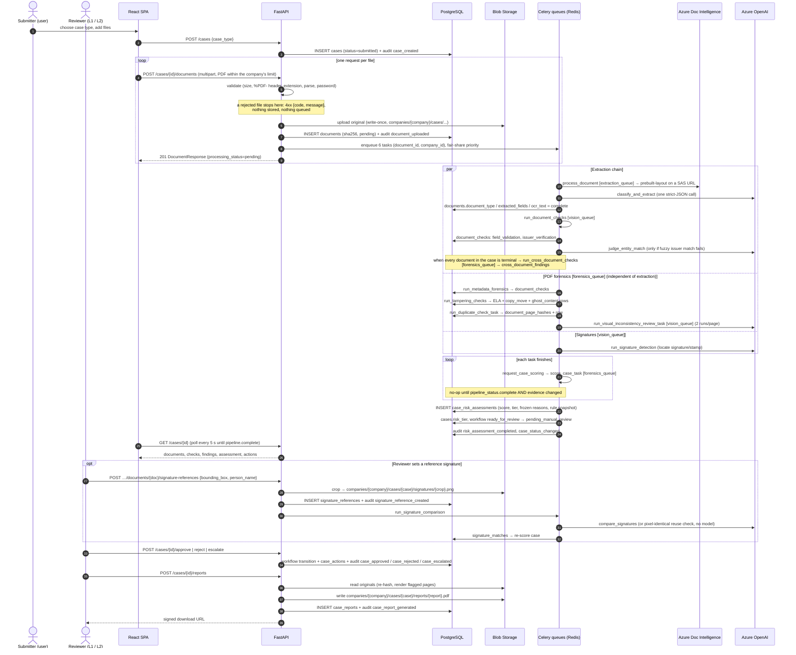

# End-to-end data flow

This walks one case from upload to exported report. Names in `monospace` are real Celery task names,
functions, audit `event_type`s or table names; every one can be found by grepping the code.

## Sequence

Every request runs bound to the caller's company and every task to the document's company, so each
arrow that touches the database is confined to one company by the application filter **and** by
PostgreSQL Row-Level Security ([multi-tenancy.md](../multi-tenancy.md)). Azure calls from any worker go
through the global rate limiter ([processing-queues.md](../processing-queues.md)).

## Step by step

### 1. Case creation
`POST /cases` creates a `cases` row with `status=submitted`, `assigned_tier=l1`, and a case number
`CASE-` + the first 8 hex characters of the case UUID (unique without a counter table), stamped with
the submitter's `company_id`. Audit event `case_created`; the company's `cases_created` usage counter is
incremented in the same transaction.

### 2. Upload (one file per request)
The frontend (`NewCasePage`) calls the upload endpoint once per file with an XHR so it can show
progress (and refuses non-PDF, empty and over-limit files before sending; the limit is the company's own, from `GET /auth/me/upload-limits`). The endpoint first
**validates** the file (PDF only by its header bytes, within the company's per-file limit, not corrupted, not
password-protected) and rejects a bad one with a specific `{code, message}` before anything is stored or
queued. A valid file is hashed (SHA-256), stored in Blob Storage, its `documents` row inserted,
`document_uploaded` written and the company's usage counters bumped; then **six tasks** are enqueued
(each carrying the company, each with a fair-share priority) and the endpoint returns. See
[01-upload-intake](../pipeline/01-upload-intake.md).

### 3. Extraction chain (`process_document` → `run_document_checks`)
`process_document` marks the document `processing`, gets a 30-minute SAS URL, runs Azure Layout OCR,
then one Azure OpenAI call that classifies the document and extracts fields. It stores
`document_type`, `ocr_text` and `extracted_fields` (each field with a normalized value, confidence
and — best effort — a bounding box) and marks the document `complete` (or `failed` with
`processing_error`). On success it enqueues `run_document_checks`, which writes two
`document_checks` rows: `field_validation` and `issuer_verification`. See
[02](../pipeline/02-extraction-normalization.md), [03](../pipeline/03-field-validation.md),
[05](../pipeline/05-issuer-verification.md).

### 4. Cross-document check (case level)
After each `run_document_checks` — and also after a failed extraction — the task checks whether
**every** document in the case has reached `complete` or `failed`; if so it enqueues
`run_cross_document_checks`, which compares amount/date/issuer pairwise across completed documents and
writes `cross_document_findings` (deleting and recomputing any previous rows for the case). Needs at
least two completed documents. See [04](../pipeline/04-cross-document-consistency.md).

### 5. Forensics (in parallel)
Independently of extraction, four tasks read only the file: `run_metadata_forensics`,
`run_tampering_checks` (renders once, runs ELA and copy-move, plus the ghost-content check on scans
converted to editable text) and `run_duplicate_check_task` on the
CPU-bound `forensics_queue`, and `run_visual_inconsistency_review_task` on `vision_queue`; plus
`run_signature_detection` (`vision_queue`). Uploads are PDF-only, so every document gets all of them
(documents stored before that rule may be images; the forensic tasks skip those silently).
Duplicate page matches are judged on the extracted fields once both documents have them
(resubmission vs. same template — `refine_duplicate_check`, run by document checks after extraction).
See [06](../pipeline/06-metadata-forensics.md), [07](../pipeline/07-ela-copy-move.md),
[07a](../pipeline/07a-ghost-content.md),
[08](../pipeline/08-visual-review-ai-generation.md), [09](../pipeline/09-signature-verification.md),
[10](../pipeline/10-duplicate-detection.md).

### 6. Scoring
Every task ends by calling `request_case_scoring(case_id)`. `score_case` does nothing until
`pipeline_status(case).complete` — extraction terminal for every document, `field_validation` and
`issuer_verification` for every completed document, and the five forensic checks for every PDF, plus a
cross-document check newer than the newest upload. It then evaluates every current rule, and — unless
the evidence fingerprint equals the latest assessment's — inserts a new `case_risk_assessments` row,
sets `cases.risk_tier`, and on the first assessment moves the case to `pending_manual_review`
(`case_status_changed`). See [11](../pipeline/11-risk-scoring-engine.md).

### 7. Reviewer decision
The case detail page polls until the assessment exists, then unlocks the decision panel.
`POST /cases/{id}/approve` requires a finished pipeline and — above low risk — a justification of at
least 10 characters; `reject` requires a reason; `escalate` (reason required) moves `assigned_tier` to `l2`, after which only a `reviewer_l2` of the company may act on it (an L1 keeps read access). Platform admins can never act on a case. Each
writes a `case_actions` row **and** an `audit_log` row via the workflow event subscriber. Decided cases
(approved/rejected/closed) reject further decisions with 409.

### 8. Report export
`POST /cases/{id}/reports` synchronously builds the nine-section PDF, stores it under
`companies/{company}/cases/{case}/reports/`, and inserts a `case_reports` row (with the PDF's SHA-256);
the company's `files_stored` / `storage_bytes` counters go up. See
[reports/forensic-report.md](../reports/forensic-report.md).

## Task names

The names in the diagram are the Python functions. The worker registers each under a Celery name
(`@celery_app.task(name=...)`); three differ from the function name, which matters when reading worker
logs or calling `celery_app.send_task`. The queue comes from `TASK_QUEUES` in `tasks/celery_app.py`
(anything unlisted goes to `forensics_queue`, which always has workers):

| Python function | Registered Celery name | Queue | Module |
|---|---|---|---|
| `process_document` | `process_document` | `extraction_queue` | `tasks/document_processing.py` |
| `run_document_checks` | `run_document_checks` | `vision_queue` | `tasks/document_checks.py` |
| `run_cross_document_checks` | `run_cross_document_checks` | `forensics_queue` | `tasks/document_checks.py` |
| `run_metadata_forensics` | `run_metadata_forensics` | `forensics_queue` | `tasks/metadata_forensics_task.py` |
| `run_tampering_checks` | `run_tampering_checks` | `forensics_queue` | `tasks/tampering_checks_task.py` |
| `run_duplicate_check_task` | **`run_duplicate_check`** | `forensics_queue` | `tasks/duplicate_check_task.py` |
| `run_visual_inconsistency_review_task` | **`run_visual_inconsistency_review`** | `vision_queue` | `tasks/visual_inconsistency_task.py` |
| `run_signature_detection` | `run_signature_detection` | `vision_queue` | `tasks/signature_detection_task.py` |
| `run_signature_comparison` | `run_signature_comparison` | `vision_queue` | `tasks/signature_comparison_task.py` |
| `score_case_task` | **`score_case`** | `forensics_queue` | `tasks/risk_scoring_task.py` |
| `reconcile_usage_stats` | `reconcile_usage_stats` (beat, nightly) | `forensics_queue` | `tasks/usage_tasks.py` |
| `log_queue_metrics` | `log_queue_metrics` (beat, every minute) | `forensics_queue` | `tasks/usage_tasks.py` |

## Timing and idempotency notes

- **Everything is at-least-once** (`task_acks_late`: a task whose worker crashed is redelivered). Each
  task is safe to repeat: check results are upserted (one `document_checks` row per (document, check),
  one page hash per (document, page), one signature match per (reference, document, scope), all backed by
  unique constraints); `run_cross_document_checks` deletes then recomputes; `score_case` skips when the
  evidence fingerprint is unchanged (one assessment per fingerprint is a unique constraint).
- **`signature_stamp_detection` is deliberately not in the "required checks" list**, because it postdates
  older cases (which would otherwise never score). Its completion still re-triggers scoring.
- **Signature comparison is not part of the pipeline.** It runs only after a reviewer creates a
  reference. It re-scores the case when it finishes, so a case can be re-assessed after the reviewer
  has already seen a score.
- **The audit trail is the source of truth for "what happened when".** Distinct event types seen in a
  working install: `case_created`, `document_uploaded`, `document_processing_completed/failed`,
  `document_checks_completed`, `cross_document_check_completed`, `metadata_forensics_completed`,
  `tampering_checks_completed`, `duplicate_check_completed`, `visual_inconsistency_review_completed`,
  `signature_stamp_detection_completed`, `signature_reference_created`,
  `signature_comparison_completed`, `risk_assessment_completed`, `case_status_changed`,
  `case_approved`, `case_rejected`, `case_escalated`, `case_report_generated`, the settings events
  `issuer_created/updated/deactivated/reactivated`, `risk_rule_created/updated`,
  `risk_thresholds_updated`, `user_created/updated` (written into the **user's company's** log, actor
  shown to the company as "Platform team"; a platform admin account's own creation is platform-level),
  and the platform-level events (`company_id` NULL, visible only to platform admins)
  `company_created/updated`, `risk_rule_template_created/updated`, `usage_stats_reconciled` and
  `platform_admin_access`. A failed forensic task writes `<check>_failed`
  (e.g. `tampering_checks_failed`). A rejected upload writes no event.
  The three decision events carry `actor_role` (the actor's role at the time, e.g. `reviewer_l1`);
  `case_escalated` also carries `from_tier` / `to_tier` (`l1` → `l2`) and the required `reason`.
