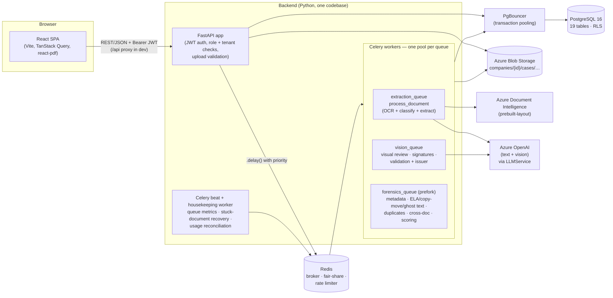

# Architecture overview

FDDT (Fraud Document Detection Tool) authenticates third-party documents — vendor invoices,
school documents, quotations, travel claims and the payment evidence that supports them —
*before* a payment or approval is made. A user submits a **case** containing one or more
PDF documents. The system extracts their data, runs a battery of automated checks, turns the
results into an explainable risk score, and hands the case to a human reviewer (L1, escalating to L2
when needed) who approves, rejects or escalates it. Every step is written to an append-only audit log.

Several client **companies** share one deployment; each company's users see only that company's data,
enforced twice — in the application and by PostgreSQL Row-Level Security
([multi-tenancy.md](../multi-tenancy.md)).

## System diagram

Everything intelligent is a managed cloud API or a classical library. **No model is trained or
hosted** (a design rule of the platform).

## Tech stack

| Layer | Technology | Used for |
|---|---|---|
| API | FastAPI 0.121, Pydantic 2, Uvicorn | REST endpoints, validation, OpenAPI |
| Auth | PyJWT (HS256), bcrypt | Email/password login, 8 h bearer tokens carrying `role`, `company_id`, `is_platform_admin` |
| Database | PostgreSQL 16, SQLAlchemy 2, Alembic, psycopg2 | Persistence, migrations (14), Row-Level Security per company |
| Connection pooling | PgBouncer (transaction mode) | Multiplexes API + worker connections onto ≤ 60 server connections |
| Queue | Celery 5.4 + Redis 7 | Three queues (extraction / vision / forensics), fair-share priorities, beat jobs |
| Rate limiting | Redis sliding windows (`services/rate_limiter.py`, `services/login_throttle.py`) | Global caps on Azure calls across every worker; sign-in throttling per email address and per IP |
| File store | Azure Blob Storage (`azure-storage-blob`) | Immutable originals, signature crops, report PDFs (company-prefixed paths) |
| OCR | Azure Document Intelligence `prebuilt-layout` | Text, tables, key-values and word geometry |
| LLM | Azure OpenAI (chat completions, strict JSON-schema output) | Classification, field extraction, issuer semantic match, visual review, signature detect/compare |
| PDF forensics | pikepdf, PyMuPDF | Upload validation, metadata, xref/incremental-update analysis, page rendering, report PDF |
| Image forensics | OpenCV (headless), Pillow, NumPy | ELA, copy-move (BRISK), ghost text (traces of erased text in converted scans), signature crop/pixel comparison |
| Duplicates | imagehash (pHash) | Near-duplicate page detection (within a company) |
| Fuzzy match | rapidfuzz | Issuer registry lookup, signer-name comparison |
| Workflow | `transitions` | Case state machine |
| Frontend | React 19, TypeScript 6, Vite 8, React Router 7 | SPA, route-level code splitting |
| UI kit | Tailwind CSS 4, Radix primitives, shadcn-style `ui/` components, lucide-react | Styling and base components |
| Data | TanStack Query 5 | Server state, polling |
| Forms | React Hook Form + Zod | Form state and validation |
| PDF view | react-pdf (pdf.js) | Live viewer with overlays, signature-region drawing |

## Key architectural decisions

### 1. Modular monolith
One FastAPI app and the Celery workers share one codebase (`backend/app/`), one database and one
settings object. Modules are separated by responsibility — `api/` (HTTP), `services/` (logic, mostly
pure functions), `tasks/` (Celery wrappers that own DB sessions and audit events), `models/`,
`schemas/`, `db/` (sessions and tenancy) — not by deployable unit. The same image runs as API, as each
worker pool and as beat, differing only in the start command. The convention that makes this work:
**services contain the algorithm and are testable without a database or network; tasks wrap them with
I/O.** For example `services/forensics/ela.py` `run_ela_check(pages)` is pure;
`tasks/tampering_checks_task.py` downloads the file, renders it, calls the pure function and stores the
result.

### 2. Azure OpenAI behind an `LLMService` abstraction
Classification, field extraction, issuer semantic matching, visual review and signature analysis all use
Azure OpenAI. `services/llm_service.py` defines the `LLMService` interface and one implementation,
`AzureOpenAILLMService`. Callers depend only on the interface, so switching to another LLM provider means
adding one implementation class, not rewriting call sites. The same pattern guards `StorageService`
(Azure Blob) and `OCRService` (Document Intelligence). All LLM calls request **strict JSON-schema output**
(`response_format: json_schema`, `strict: true`), so every response is validated by a Pydantic model
(`DocumentAnalysis`, `PageVisualAnalysis`, `SignatureComparisonResult`, …). Vision calls require a
vision-capable deployment (`gpt-4o`, `gpt-4.1`, `gpt-4.1-mini`, …) and raise `LLMConfigurationError`
otherwise.

### 3. Three queues, fair-share, globally rate-limited
Uploads return immediately. The upload endpoint validates the file, commits the document row and enqueues
**one task per document per step** — six of them. Each task goes to the queue of the service it depends
on: `extraction_queue` (Document Intelligence), `vision_queue` (Azure OpenAI) or `forensics_queue` (local
CPU, prefork). Each queue has its own worker pool, so they scale independently. Dispatch is **fair-share
per company**: a task's priority comes from how much work its company already has outstanding, so one
company's 100-document batch can't starve another company's single upload. Azure calls pass through a
**Redis-backed global rate limiter** (requests and tokens per minute, calibrated against real usage)
shared by every worker. Tasks commit before every slow step (no transaction is held across a download,
an Azure call or CPU work), and check results are written **idempotently** (one row per document +
check), so a redelivered task overwrites rather than duplicates. The browser polls `GET /cases/{id}`
(every 5 s while the pipeline is incomplete). Details: [processing-queues.md](../processing-queues.md).

### 3b. Event-driven case workflow
State changes go through `services/workflow_service.py`, which drives a `transitions` state machine
and **emits** `WorkflowEvent`s (`case_status_changed`, `case_approved`, `case_rejected`,
`case_escalated`) to subscribers instead of calling side effects directly. The only subscriber today
writes the audit log. A future external case-management integration would be one more
`subscribe()` call plus the already-present nullable `cases.external_ref_id` column — no change to the
state machine.

### 4. Immutable, validated originals
Only PDFs are accepted, and every upload is validated **before** it is stored: within the company's own size limit (per-company, set by a
platform admin; 10 MB by default), not empty,
a PDF by its header bytes, not corrupted, not password-protected
([pipeline/01-upload-intake.md](../pipeline/01-upload-intake.md#upload-validation)). A valid file is
written to Blob Storage exactly once, at
`companies/{company_id}/cases/{case_id}/documents/{document_id}_{sha256}{ext}`, with `overwrite=False`;
`StorageService` exposes no update or delete. Its SHA-256 is stored on `documents.file_hash` so integrity
can be re-verified later — the PDF report does exactly that and prints the result. Nothing downstream
mutates the original: forensics render pages **in memory**; the signature crop and the report are *new*
blobs (`…/signatures/…`, `…/reports/…`). The private container means the API never hands out the raw blob
URL; it mints short-lived SAS URLs (15 minutes by default, 30 for OCR), and refuses to sign a path under
another company's prefix.

### 5. One normalized bounding-box convention
Every located thing — ELA/copy-move regions, visual-review findings, extracted-field positions,
signature/stamp regions, signature references — is stored as
`{"page": 1-based int, "x", "y", "width", "height"}` where the four numbers are **fractions (0–1) of the
page's width/height, origin top-left**. It is resolution-independent, so the same box works on a
200-DPI server render, a browser canvas, and the report. The frontend draws boxes live over the real
PDF (`PdfOverlayViewer`) and never saves an annotated image; only the exported report burns findings
into *its own* rendered pages.

### 6. A transparent rules engine, not a model
Risk scoring is a weighted rules engine (`services/risk_scoring_service.py`). Each rule is a row in the
company's `risk_rules` describing *what to match* in already-stored check results; there is no per-rule
Python. Rules are **immutable and versioned** — editing inserts `version + 1` — and every scoring run
(`case_risk_assessments`) freezes the rendered reason text, the exact rule versions and the
thresholds it used, so retuning never changes a historical score. New companies start from the platform
rule template (`risk_rule_templates`). See
[pipeline/11-risk-scoring-engine.md](../pipeline/11-risk-scoring-engine.md).

### 7. Template-free extraction
One generic pipeline handles every document type: Azure Layout OCR → a single Azure OpenAI call that
both classifies the document and extracts core fields plus arbitrary additional fields as
`{name, value}` pairs. No per-type extractors exist, so new document types need no engineering.

### 8. Two-layer tenant isolation
Every tenant-owned table carries `company_id`. The application binds each request's (and each task's)
database session to one company and filters every ORM query automatically; independently, PostgreSQL
Row-Level Security refuses any row of another company even to SQL with no filter at all. No database
role has BYPASSRLS; the platform path sees all rows through an explicit `platform_all` policy. A
cross-company id is a 404. See [multi-tenancy.md](../multi-tenancy.md).

### 9. Explainability over accuracy claims
Weak signals are labelled as such everywhere in code and UI: ELA is a "signal, not a verdict";
signature/stamp detection is presence-and-placement only; signature comparison uses advisory
wording ("visually consistent with reference on file", never "verified"); the visual review's AI
question is "experimental". Weights reflect that.

## Scope of the current build

What each capability area does today, and what is intentionally outside the current scope.

| # | Area | Implementation | Where |
|---|---|---|---|
| 1 | Classification & extraction | Azure OpenAI via `LLMService`, one combined call per document | `services/llm_service.py` |
| 2 | Signature/stamp detection | Azure OpenAI vision model locates signature and stamp regions (presence/placement only) | `services/signature_detection_service.py` |
| 3 | AI-generated-content assessment | One question inside the visual-review vision call; experimental, one signal among several. There is no separate content-detection service | `services/visual_inconsistency_service.py` |
| 4 | Metadata forensics | pikepdf + PyMuPDF read the PDF's own object model | `services/forensics/metadata_forensics.py` |
| 5 | Accepted file types | **PDF only**, within the company's per-file limit (10 MB by default), validated at upload (type by header bytes, corruption, password). Every forensic check is PDF-based | `services/upload_validation.py` |
| 5a | Bulk upload | One zip (within the company's zip limit, 300 MB by default) with one folder per case. Ingested in the background case by case, each document validated like a single upload and queued as soon as its case exists. Partial success, live per-case summary | `services/bulk_upload_service.py` |
| 5b | Upload limits | Per company (`companies.max_file_size_mb` / `max_zip_size_mb`), changed only by a platform admin, audited old → new, effective on the next upload; one source for every upload path | `services/upload_limits.py` |
| 6 | Error Level Analysis | Runs only on pages containing an embedded raster image; born-digital text pages return `not_applicable` | `services/forensics/ela.py` |
| 7 | Case workflow | Statuses in use: `submitted`, `pending_manual_review`, `approved`, `rejected`. Every scored case goes to the reviewer queue; nothing auto-approves. Escalation moves the case to the L2 reviewer tier (`assigned_tier`), not a status | `services/workflow_service.py` |
| 8 | Low-confidence fields | The per-field `uncertain` flag is stored and displayed to the reviewer; it does not change routing, because every case reaches manual review | `services/llm_service.py` |
| 9 | Multi-tenancy | Companies, `company_id` everywhere, application filter + PostgreSQL RLS, platform admin with audited read-only support access | `db/tenancy.py`, `api/tenant_access.py` |
| 10 | Billing & usage | Per-company counters (cases, documents, files, storage) with nightly reconciliation; platform-admin dashboard | `services/usage_service.py` |
| 11 | Processing queues | Three queues, fair-share per company, global Azure rate limiter, queue monitor, JSON queue metrics + `queue_alert` log line | `tasks/celery_app.py`, `tasks/fairshare.py` |
| 12 | Notifications | Not part of the current scope (no notifications table, no email sending) | — |
| 13 | SLA tracking | Not part of the current scope (no deadline column, no overdue checks) | — |
| 14 | Organisation-wide MIS reporting | Not part of the current scope. The *per-case* forensic report is fully built | `services/case_report_service.py` |
| 15 | Frontend libraries | Tables are hand-built per page; no charting library is used | `frontend/package.json` |
| 16 | Signature verification | Detection + reviewer-created references + in-case vision comparison + a classical pixel-identical-reuse check. Cross-case library comparison is not built (the `is_library` flag only stores data) | `services/signature_*` |
| 17 | Evidence export | Per-case PDF report with file hashes and annotated renders; no bundle of the original files | `services/case_report_service.py` |
| 18 | Arabic values | Extracted Arabic field values render with the default text direction on the case detail page; Arabic issuer names render right-to-left in the Issuer Registry settings page | `frontend/src/pages/` |
| 19 | Document labels | `school_document, vendor_invoice, commercial_invoice, procurement_documentation, quotation, travel_invoice, payment_evidence, other`. Note the **case** type is `travel_reimbursement` while the **document** label is `travel_invoice` | `services/classification_service.py`, `models/case.py` |
| 20 | Cloud deployment | Not built — local development only. The production plan and costs are in [deployment/production-deployment.md](../deployment/production-deployment.md) | — |

## Security posture

- **Two mandatory checks on every endpoint:** a role check (`require_company_role` / `require_reader`
  with a minimum rank — `user` < `reviewer_l1` < `reviewer_l2` — or `require_platform_admin`) and a
  tenant check (the request's session is bound to the caller's company by `get_tenant_db`). The user is
  re-read from the database on every request; a token whose company or platform flag no longer matches,
  or whose company is suspended, is refused. Case actions additionally check the case's tier
  (`app/api/case_access.py` `can_act_on_case`).
- **Tenant isolation is enforced twice** — application-layer filtering and PostgreSQL Row-Level
  Security — and a cross-company id is a **404**. Platform admins belong to no company, are read-only on
  company data, and every one of their accesses writes a platform-only audit row that no company user can
  see.
- **Submitters are deliberately blinded:** `GET /cases` and `GET /cases/{id}` return a neutral
  "In review" flag and no risk tier/assessment to a `user`, and the case timeline
  (`GET /cases/{id}/audit-log`) omits the scoring event and strips result details (results, finding and
  match counts, score, tier, rules fired) from the automated check events — so a bad actor cannot learn
  the score. A case owned by someone else is a **404, not 403**. *Note:* the per-document check cards on
  the case page (e.g. "Issuer verification: Flagged") are still shown to the submitter — see the change
  report R6 for this open decision.
- **Case-content routes are guarded** (`api/case_access.py`). Document upload and
  `GET …/documents/{id}/file-url` require that the caller is the case's **owner or a reviewer of its
  company** — anyone else gets a **404** (`load_visible_case`), and a rejected upload writes nothing to
  storage. The three `signatures` endpoints follow the same rule: the **uploader sets the reference
  signature during upload**, so the case owner may use them, as may any reviewer; a stranger gets a 404.
  Covered by `tests/test_case_authorization.py`. A submitter can still read their own case's signature
  comparison results (`GET …/signature-matches`), unlike the risk assessment, which is withheld.
- **Uploads are validated before storage** (PDF only, within the company's size limit, not corrupted, not password-protected),
  so a malformed file never reaches Blob Storage, a worker or an Azure API.
- Tokens are stored in `localStorage` and there is no server-side logout, refresh or password-reset
  endpoint. `JWT_SECRET_KEY` defaults to `changeme-in-.env` — production must set it (see
  [deployment/production-deployment.md](../deployment/production-deployment.md)).
