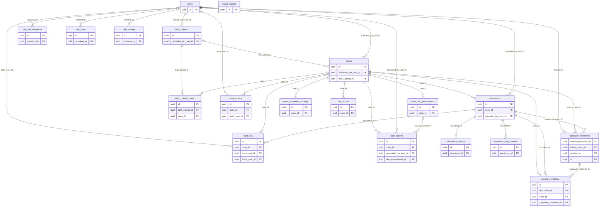

# Entity-relationship diagram

<!-- Generated from the live database's foreign keys by `docs/tools/gen_db_docs.py` (Alembic head f3b7d1e8a4c5).
     Only key columns are drawn to stay readable; the full column list is in schema.md. -->

Every tenant-owned table also references `companies` through `company_id`. Those edges are left out of
the first diagram so it stays readable; the second diagram shows them.

## Domain relationships

## Tenancy — what belongs to a company

Every table below references `companies.id` through the listed column (a table, not a diagram:
drawn, the fan-out from `companies` is too wide to read).

| Table | Column | Nullable | Row-Level Security |
|---|---|---|---|
| `company_usage_stats` | `company_id` | no | on |
| `users` | `company_id` | yes | on |
| `cases` | `company_id` | no | on |
| `documents` | `company_id` | no | on |
| `document_checks` | `company_id` | no | on |
| `document_page_hashes` | `company_id` | no | on |
| `cross_document_findings` | `company_id` | no | on |
| `issuer_registry` | `company_id` | no | on |
| `risk_rules` | `company_id` | no | on |
| `risk_settings` | `company_id` | no | on |
| `case_risk_assessments` | `company_id` | no | on |
| `risk_scores` | `company_id` | no | on |
| `case_actions` | `company_id` | no | on |
| `case_reports` | `company_id` | no | on |
| `audit_log` | `company_id` | yes | on |
| `signature_references` | `company_id` | no | on |
| `signature_matches` | `company_id` | no | on |
| `bulk_upload_cases` | `company_id` | no | on |
| `bulk_uploads` | `company_id` | no | on |

`users.company_id` and `audit_log.company_id` are nullable: NULL marks a platform admin and a platform-level event respectively. `risk_rule_templates` has no `company_id` — it is platform-level and only reachable by the platform database role.
