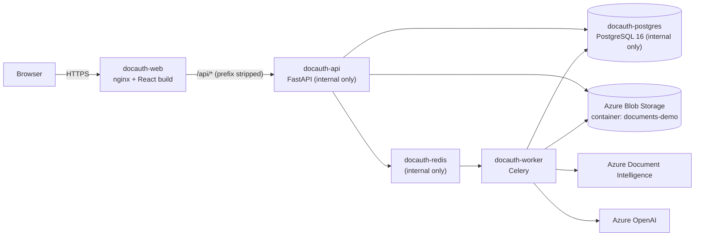

# Azure demo deployment

A small, low-cost Azure deployment used to demonstrate the platform. It is **not** the production design
(see [production-deployment.md](production-deployment.md) for that). It predates multi-tenancy and the
three processing queues — redeploying it with the current images needs the changes listed under
*Updating the demo to the current build* below.

## Topology

Only `docauth-web` has a public address. The API, Redis and PostgreSQL are reachable only from inside the
Container Apps environment, so the database is never exposed to the internet. The browser talks to a single origin, so no CORS configuration is needed.

## Resources

| Resource | Purpose |
|---|---|
| Azure Container Apps: `docauth-web`, `docauth-api`, `docauth-worker`, `docauth-redis`, `docauth-postgres` | The five runtime components (1 replica each) |
| Azure Container Registry | Holds the backend and frontend images |
| Azure Blob Storage container `documents-demo` | Original documents, signature crops and report PDFs (kept separate from development data) |
| Azure Document Intelligence, Azure OpenAI | Existing resources, used as in development |

## Images

Both images are built from the repository:

| Image | Source | Notes |
|---|---|---|
| Backend | `backend/Dockerfile` | One image for both the API (`start-api.sh`) and the worker (`start-worker.sh`) |
| Frontend | `frontend/Dockerfile`, `frontend/nginx.conf.template` | Static build served by nginx; `API_UPSTREAM` selects the backend address |

`start-api.sh` applies the Alembic migrations, seeds the administrator account, then starts the API, so a
new environment bootstraps itself.

## Configuration

All settings are environment variables (see [environment-variables.md](environment-variables.md)). Secrets
(database URL, JWT secret, storage connection string, Azure keys, seeded administrator password) are stored
as Container Apps secrets and referenced by the apps; none are in the images or the repository. The seeded
administrator email and password come from `SEED_ADMIN_EMAIL` / `SEED_ADMIN_PASSWORD`.

## Operating notes

- **PDF viewer requirements.** The browser loads the pdf.js worker from the web app and fetches each PDF
  directly from Blob Storage. This needs (1) the web server to serve `.mjs` files as `application/javascript`
  (configured in `frontend/nginx.conf.template`) and (2) a Blob Storage CORS rule allowing `GET`, `HEAD` and
  `OPTIONS` from the web app's address. Add the rule again if the web app's address changes.
- The Celery worker ran the default prefork pool with two processes (Linux) when the demo was set up,
  before the queue split (see *Updating the demo to the current build*).
- Redis and PostgreSQL run as containers on the container's temporary disk (no persistent volume). If either
  restarts, in-flight jobs (Redis) or all case data (PostgreSQL) are lost. Restart the API app to re-apply the migrations and re-seed the
  administrator, then re-upload the sample documents.
- This deployment is intended for demonstrations. For production use
  [production-deployment.md](production-deployment.md) (managed PostgreSQL and Redis with private
  networking, persistent storage, Key Vault, monitoring).

## Updating the demo to the current build

- **Workers:** the pipeline now uses three queues. A single `docauth-worker` must consume all of them:
  `celery -A app.tasks.celery_app worker -Q extraction_queue,vision_queue,forensics_queue,celery
  --pool=threads --concurrency=8` (or run `start-worker.sh extraction|vision|forensics` as three apps).
  `start-worker.sh` with no argument serves **only** `forensics_queue`, so documents would never be OCR'd.
- **Beat:** add one `start-beat.sh` app for the nightly usage reconciliation and queue metrics (optional
  for a demo).
- **Database roles:** the migrations now create `fddt_app` / `fddt_platform`; set
  `DATABASE_APP_PASSWORD` / `DATABASE_PLATFORM_PASSWORD` as secrets on every backend app. The Postgres
  container's `docauth` user is a superuser, which is fine for a demo.
- **Seeded account:** `admin@example.com` is now a **platform admin** — create a company and its users under
  *Platform* before submitting cases.
- **Uploads:** PDF only, per-company limits (10 MB / 300 MB zip by default); the nginx template caps request bodies at `UPLOAD_BODY_LIMIT` (11m) and bulk zips at `BULK_UPLOAD_BODY_LIMIT` (301m), both set by env vars.

## Tear-down

Delete the five `docauth-*` container apps, the container registry and the `documents-demo` container. The demo creates no other resources.
