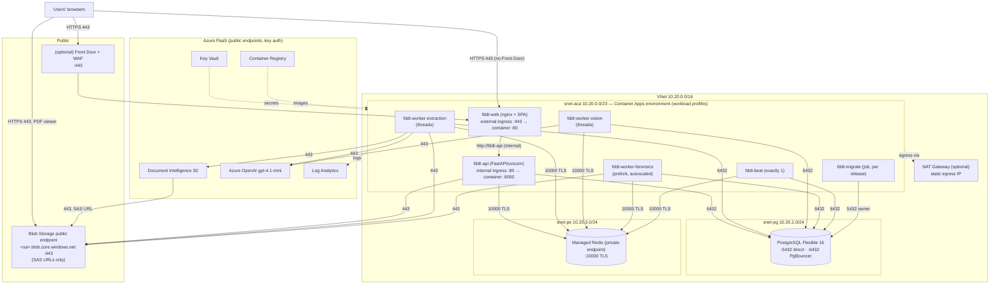

# Azure production deployment — step-by-step runbook

This is the **hands-on runbook** a DevOps engineer follows to stand up FDDT in production on Azure, from an
empty subscription to a verified go-live. Every step has the exact commands, the values to use, and a
**✅ Verify** check before moving on.

- The *why* (architecture choices, S/M/L service tiers, monthly costs) is in
  [production-deployment.md](production-deployment.md). This runbook implements that design and adds the
  network, port, IP, DNS, scaling and release details.
- All settings are explained in [environment-variables.md](environment-variables.md); queue, rate-limit and
  connection-pool design in [processing-queues.md](../processing-queues.md).
- Written against the code at Alembic head **`f3b7d1e8a4c5`** (2026-10-08). If `alembic heads` shows a
  newer revision, that is fine. Use whatever it reports in step 13.

> **First time on Azure? Read [0.4 Your workspace](#04-your-workspace-azure-cloud-shell-on-the-clients-screen) and
> [0.5 Finding things in the Azure portal](#05-finding-things-in-the-azure-portal) before step 1.**
>
> Every step starts with a **📍 Where** box with three lines:
> - **Who** does it: you, or the client's admin.
> - **Type in:** where you type the commands. Almost always *Azure Cloud Shell on the client's screen, in
>   `~/FDDT`*.
> - **Check in the portal:** where to click in https://portal.azure.com to see the result.
>
> Portal paths are written as **Resource › menu group › item**. For example, *fddtprod-pg › Settings ›
> Server parameters* means: open the resource `fddtprod-pg`, find the group **Settings** in its left menu,
> and click **Server parameters**.

---

## Contents

0. [Before you start: decisions, access, existing Azure limits](#0-before-you-start)
1. [Target architecture and traffic flow](#1-target-architecture-and-traffic-flow)
2. [Network, IP and port reference (DevOps sheet)](#2-network-ip-and-port-reference)
3. [Step 1 — Variables file](#step-1--variables-file)
4. [Step 2 — Resource group and providers](#step-2--resource-group-and-providers)
5. [Step 3 — Log Analytics](#step-3--log-analytics)
6. [Step 4 — Virtual network, subnets, NSGs, egress IP](#step-4--virtual-network-subnets-nsgs-static-egress-ip)
7. [Step 5 — Managed identity and Key Vault](#step-5--managed-identity-and-key-vault)
8. [Step 6 — Container Registry and images](#step-6--container-registry-and-images)
9. [Step 7 — PostgreSQL Flexible Server](#step-7--postgresql-flexible-server)
10. [Step 8 — Azure Managed Redis](#step-8--azure-managed-redis)
11. [Step 9 — Blob Storage](#step-9--blob-storage)
12. [Step 10 — Document Intelligence and Azure OpenAI](#step-10--document-intelligence-and-azure-openai)
13. [Step 11 — Secrets into Key Vault](#step-11--secrets-into-key-vault)
14. [Step 12 — Container Apps environment and shared YAML helpers](#step-12--container-apps-environment-and-shared-yaml-helpers)
15. [Step 13 — Database migration job](#step-13--database-migration-job)
16. [Step 14 — API](#step-14--api-fddt-api)
17. [Step 15 — Workers and scheduler](#step-15--workers-and-scheduler)
18. [Step 16 — Web front end](#step-16--web-front-end-fddt-web)
19. [Step 17 — Blob CORS for the app origin](#step-17--blob-cors-for-the-app-origin)
20. [Step 18 — Custom domain and TLS (DNS records)](#step-18--custom-domain-and-tls)
21. [Step 19 — Optional: Front Door + WAF](#step-19--optional-front-door--waf)
22. [Step 20 — Monitoring and alerts](#step-20--monitoring-and-alerts)
23. [Step 21 — Admin access to private data (Bastion / jump box)](#step-21--admin-access-to-the-private-database-and-redis)
24. [Step 22 — Smoke test and first-day setup](#step-22--smoke-test-and-first-day-setup)
25. [Step 23 — Post-go-live hardening](#step-23--post-go-live-hardening)
26. [Scaling playbook](#scaling-playbook)
27. [Release, rollback and staging](#release-rollback-and-staging)
28. [Backups, DR and routine operations](#backups-dr-and-routine-operations)
29. [Troubleshooting](#troubleshooting)
30. [Go-live checklist](#go-live-checklist)
31. [Handover sheet](#handover-sheet)

---

## 0. Before you start

### 0.1 Decisions to record (fill these in first)

| Decision | Options | Default in this runbook |
|---|---|---|
| **Service tier** | **S** pilot (~3k docs/month) · **M** production (~20k) · **L** scale (~100k). [Sizing and costs](production-deployment.md#2-service-tiers) | `M` |
| Region | One region for everything that stores data | `uaenorth` |
| App hostname | e.g. `fddt.client.com` | `app.<client-domain>` |
| Edge | Container Apps ingress only (free managed TLS) **or** Front Door Standard + WAF (rate limiting on login, edge TLS) | Container Apps only; Front Door in step 19 |
| Who may reach the UI | Whole internet **or** client office IP ranges only | Internet (restrict in step 16.4 if required) |
| Static egress IP | Needed only if a client/partner firewall must allow-list our outbound traffic, or to lock the AI services to our IP. A NAT Gateway costs ~$33/month + data | **No** (`USE_NAT="no"`); set `yes` if needed |
| **High availability (HA)** for PostgreSQL and Redis | HA = a standby in another zone (99.99 %). Without it: one zone, 99.9 %, a zone outage means a restore (~1 hour). Redis without HA is safe: lost tasks are re-queued automatically | **Tier M launches without HA** (saves ~$229/month); tier L keeps HA. Get the client's OK in writing |
| Azure OpenAI data processing | gpt-4.1-mini is **Global**-only in UAE North (prompts may be processed in any Azure region). **Get written client sign-off**, or pick a region with a regional/Data Zone deployment | Global, signed off |
| **OCR service** | Azure Document Intelligence, pricing tier **S0 (Standard)**. **Not F0 (Free)**: F0 analyses only the first 2 pages of each document and allows 500 pages per month at 1 request/s, which is not usable for production | **S0** (decided) |
| **LLM** | Azure OpenAI, model **gpt-4.1-mini**, deployment type **Global Standard**: pay per token, no commitment, and the largest default capacity. Not *Provisioned* (PTU: reserved capacity billed every hour even when idle) and not *Standard/Data Zone* (not offered for this model in UAE North) | **gpt-4.1-mini, Global Standard** (decided) |
| First platform admin | A real mailbox of the operator | `platform-admin@<operator-domain>` |
| On-call alert address | Email / distribution list | `ops@<operator-domain>` |

### 0.2 Access you need

| Permission | Scope | Why |
|---|---|---|
| **Owner**, or **Contributor + User Access Administrator** | The **subscription**. This is the account the client signs in with during the screen share | Creating the resource group, registering providers, creating resources **and** role assignments (AcrPull, Key Vault Secrets User) |
| Permission to create DNS records | The client's DNS zone | CNAME + TXT for the app hostname (step 18) |
| Azure OpenAI access | The subscription | Creating the gpt-4.1-mini deployment (step 10) |

### 0.3 Azure limits: use what the subscription already has (no quota requests)

**No quota is requested from Microsoft for this deployment.** Everything uses the limits the client's
subscription already has:

| Limit | What we use | What it means |
|---|---|---|
| **Azure OpenAI gpt-4.1-mini, Global Standard**, tokens per minute (TPM) | **All of the subscription's free TPM** for this model in the region. Step 10 reads the free amount and creates the deployment with it | This number decides how many documents per minute the platform can process ([scaling playbook](#scaling-playbook)). Unused capacity costs nothing: Global Standard is billed per token used |
| Document Intelligence **S0** | Default 15 requests/s; the app uses at most 10 | Enough for every tier |
| PostgreSQL vCores, Container Apps cores | Subscription defaults | Enough for tiers S and M. For tier L, check them first (below) |

> 📍 **Who:** you, in the client's Cloud Shell · **When:** at the start of the session, after section 0.4
> (Cloud Shell must be open) · **Check in the portal:** https://ai.azure.com → **Management center** →
> **Quota**, filter *UAE North*, *gpt-4.1-mini*, *Global Standard*: the same numbers as the command below,
> read-only.

Check how much gpt-4.1-mini Global Standard capacity is free in the region (unit: thousands of TPM, the same
unit `--sku-capacity` uses in step 10):

```bash
az cognitiveservices usage list -l uaenorth \
  --query "[?name.value=='OpenAI.GlobalStandard.gpt-4.1-mini'].{used:currentValue, limit:limit}" -o table
```

`limit − used` is the free capacity. For example, `limit 1000, used 0` means 1,000k TPM free. Compare it with
the tier's target (`AOAI_TPM_K` in `deploy.env`: S 100, M 150, L 500):

- **Free ≥ target:** fine. Step 10 uses all of it, so the platform gets more throughput at no extra cost.
- **Free < target:** the deployment still works, but processes fewer documents per minute than the tier was
  sized for (throughput = 80 % of TPM ÷ 32,000 two-page documents per minute). Tell the client the expected
  throughput. Documents simply queue longer at peaks; nothing fails.
- **Free = 0** (other deployments in this subscription use it all): step 10 cannot create the deployment.
  Free some capacity from another gpt-4.1-mini deployment in the region (Foundry → **Deployments** → that
  deployment → **Edit** → lower its TPM), or use a region where capacity is free.
- If the command shows nothing, the model name differs in that region. Run it without `--query` and look for
  the `gpt-4.1-mini` *GlobalStandard* row.

Tier L only: in the portal, search **Quotas** → **My quotas**, and filter *Azure Database for PostgreSQL Flexible
Server* and *Container Apps* for UAE North. You need about 8 free PostgreSQL vCores and about 60 Container Apps
cores. If they are lower, size down to tier M; no request is needed.

### 0.4 Your workspace: Azure Cloud Shell on the client's screen

**The setup:** the client's admin shares their screen (Teams, Zoom, …) and gives you control. They are signed
in at **https://portal.azure.com** with **their own account**: they type their own password and approve MFA
on their own phone. Never ask for their password. If Azure asks to sign in again, hand control back to them.

You **create** everything by pasting commands into **Azure Cloud Shell**, a Linux terminal inside the
portal. It is already signed in as the client and has the Azure CLI, git and openssl, so **nothing is
installed and nothing runs on your own PC**. You use the portal pages only to **check** that things look right.
Do not change settings by hand in the portal unless a step says so: if the portal and the commands disagree,
later steps break in confusing ways.

**Before the session (on your side)**
- **Push the exact version to deploy** to GitHub (`main`). Cloud Shell downloads the code from there, not from
  your PC. Uncommitted changes on your PC will not be deployed.
- The repository is private, so create a **GitHub personal access token** for the clone: github.com → your
  avatar → **Settings › Developer settings › Personal access tokens › Fine-grained tokens › Generate new
  token** → *Repository access*: only `FDDT` → *Permissions › Contents*: **Read-only** → expiry **1 day**.
  Keep it private; delete it after the deployment.
- **The runbook must be readable on the client's screen.** With remote control, *your* clipboard usually
  does **not** reach *their* computer, so you cannot copy from your own PDF and paste into their Cloud Shell.
  Once the code is cloned (step 4 below), open this file **inside Cloud Shell** and copy the commands from
  there. Alternatively, send the client the PDF beforehand and have them open it on their PC.

**Opening Cloud Shell (first time)**

1. In the portal's top bar, click the **>_** icon (*Cloud Shell*), just right of the search bar. If the bar
   is narrow, it is under the **…** menu.
2. Choose **Bash**. If it opens as *PowerShell*, click **Switch to Bash** in the Cloud Shell toolbar. Never
   use PowerShell: these commands are bash.
3. On *Getting started*, choose **Mount storage account** → pick the client's subscription → **Apply** →
   **We will create a storage account for you** → **Next**. This makes a small storage account (cents per
   month, in a resource group named like `cloud-shell-storage-<region>`) that **keeps your files** between
   sessions. **Do not** choose *No storage account required*: your files (`deploy.env`, `reload.sh`, the YAML)
   would be deleted every time the session ends.
4. **Get the code** (paste your token when asked for the *password*; the screen shows nothing while you
   type or paste it):
   ```bash
   git clone https://github.com/Deepraj-chawda/FDDT.git ~/FDDT
   cd ~/FDDT
   git checkout main && git log --oneline -1      # the commit you are deploying
   ```
5. **Open this runbook in Cloud Shell's editor**, to copy the commands from the client's screen:
   `code ~/FDDT/docs/deployment/azure-production-runbook.md`. Close the editor with **…** (top right of the
   editor) → **Close Editor**.
6. **Check the account and add the CLI extensions** (one time):
   ```bash
   az account show -o table                     # the client's subscription
   az extension add --name containerapp --upgrade
   az extension add --name redisenterprise --upgrade
   ```
   If the wrong subscription is shown, run `az account list -o table`, then `az account set --subscription
   "<name or id>"`.

**Make it comfortable:** maximize Cloud Shell with the **□** icon on its toolbar, or open
**https://shell.azure.com** in a separate browser tab: same files, full screen. Keep the portal in another tab
for the checks.

**How to paste and run**
- Paste in Cloud Shell: **Ctrl + Shift + V**, or **right-click → Paste**. Copy from the Cloud Shell editor
  with Ctrl + C.
- Paste **one code block at a time**. Wait until the prompt (`$`) comes back, and read the output before
  pasting the next block.
- Lines ending in `\` continue on the next line. Always paste the whole command.
- Output in **red** or starting with `ERROR:` means stop. Check [Troubleshooting](#troubleshooting) before
  continuing. Warnings in yellow are usually fine.
- Some commands run for 5–30 minutes (images, PostgreSQL, Redis) and show nothing while they work.

**Cloud Shell disconnects after ~20 minutes without keyboard input**, even while a long command is running.
- During long commands, click into Cloud Shell and press **Shift** every ~10 minutes.
- If it disconnects anyway, **the resource keeps being created in Azure**. The command was only waiting.
  Click **Reconnect** and run the block below. Check the resource in the portal (each step's 📍 box says where)
  until it is ready, then run the **remaining** commands of that step (those after the long one).

**Every time Cloud Shell (re)starts**, run this. Every step saves what it needs in Azure, so this brings all
values back:

```bash
cd ~/FDDT
source ~/fddt-deploy/reload.sh        # ~1 minute; re-creates all variables (file created in step 1)
```

### 0.5 Finding things in the Azure portal

1. The client is signed in at **https://portal.azure.com** (the same account Cloud Shell uses).
2. **Make sure you are in the right directory.** If the client's account sees several directories (tenants),
   click the avatar at the top right → **Switch directory** → pick the one that holds the subscription.
3. **Open a resource:** type its name (e.g. `fddtprod-pg`) in the **search bar at the top** and click it. Or
   search **Resource groups** → `rg-fddtprod` to list everything this runbook creates.
4. **The left menu** of every resource is grouped (*Overview*, *Activity log*, *Access control (IAM)*, then
   groups such as **Settings**, **Monitoring**, **Security + networking**). Click a group name to expand it.
   If you can't see an item, type it into the small **search box at the top of the left menu**.
5. **Did something fail?** The **bell icon** (top right, *Notifications*) and the resource group's
   **Activity log** show recent operations and their errors.
6. **Copy a value:** most fields have a **copy icon** (two squares) at their right end.
7. Menu names change slightly over time. If a path in this runbook doesn't match exactly, use the
   left-menu search box with the last word of the path.

Estimated time end to end: **3–4 hours**. PostgreSQL with HA takes ~15–20 min and Managed Redis ~15–30
min to provision. Start them early (steps 7–8) and continue with the other steps while they build.

---

## 1. Target architecture and traffic flow



**Rules this design enforces**

- `fddt-web` is the **only** public entry point. The API, workers, database and Redis have no public address.
- The SPA and the API share **one origin** (nginx proxies `/api/*`), so the backend needs no CORS.
- Blob Storage keeps its **public endpoint**, but only short-lived SAS URLs work (anonymous access is off).
  The browser's PDF viewer and Document Intelligence both fetch files by SAS URL; locking the storage account
  to private endpoints would need code changes.
- Database migrations run **once per release** as a job, never on API start.
- Each queue has its own worker app, so each scales on its own.

---

## 2. Network, IP and port reference

### 2.1 Address plan

| Subnet | CIDR | Usable IPs | Delegation | Holds |
|---|---|---|---|---|
| `snet-aca` | `10.20.0.0/23` | 507 | `Microsoft.App/environments` | Container Apps environment. The minimum is `/27`; `/23` leaves room to scale (every node and internal load balancer takes IPs) |
| `snet-pg` | `10.20.2.0/24` | 251 | `Microsoft.DBforPostgreSQL/flexibleServers` | PostgreSQL primary + HA standby (nothing else may be in this subnet) |
| `snet-pe` | `10.20.3.0/24` | 251 | — | Private endpoints: Redis (and optionally Key Vault later) |
| `AzureBastionSubnet` | `10.20.4.0/26` | 59 | — (name is fixed) | Azure Bastion (optional, step 21) |
| `snet-jump` | `10.20.5.0/28` | 11 | — | Admin jump VM (optional, step 21) |
| *reserved* | `10.20.6.0 – 10.20.255.255` | | | Staging peering, App Gateway, growth |

> If the VNet will ever be peered with the client's network or connected by VPN/ExpressRoute, **agree the
> range with their network team first**. Change `10.20.0.0/16` in `deploy.env` if it overlaps.

### 2.2 Port and flow matrix

| # | Source | Destination | Port / protocol | Purpose | Enforced by |
|---|---|---|---|---|---|
| 1 | Users (internet / client office) | `fddt-web` public ingress (env static IP) or Front Door | **443/TCP HTTPS** (80 → redirects to 443) | UI and `/api/*` | NSG `nsg-aca` inbound; ingress IP restrictions (optional) |
| 2 | Users' browsers | `<storage>.blob.core.windows.net` | **443/TCP** | PDF viewer reads documents by SAS URL | Client proxy/firewall must allow it; Blob CORS (step 17) |
| 3 | Container Apps ingress (Envoy) | `fddt-web` container | 80/TCP | nginx target port | Container Apps |
| 4 | `fddt-web` (nginx) | `fddt-api` internal ingress (`http://fddt-api`) → container **8000** | 80/TCP inside the environment | `/api/*` reverse proxy | Internal ingress, never public |
| 5 | API, workers, beat | PostgreSQL built-in PgBouncer | **6432/TCP + TLS** | App roles `fddt_app`, `fddt_platform` (tiers M/L) | NSG `nsg-pg` |
| 6 | Migration job, jump VM; **all apps on tier S** | PostgreSQL | **5432/TCP + TLS** | Owner role (migrations/seed), admin; tier S (Burstable) has no PgBouncer | NSG `nsg-pg` |
| 7 | API, workers, beat, KEDA scaler | Azure Managed Redis private endpoint | **10000/TCP TLS** | Celery broker, global rate limiter, fair-share counters, queue monitor | Private endpoint; NSG `nsg-pe` |
| 8 | API, workers | Blob Storage | 443/TCP | Write-once uploads, reads, SAS signing | Storage account (key auth) |
| 9 | Extraction worker (forensics, rarely) | Document Intelligence | 443/TCP | OCR / layout | Resource key (+ optional IP rule, step 23) |
| 10 | Extraction, vision workers (forensics, rarely) | Azure OpenAI | 443/TCP | Classification, visual review, signatures | Resource key (+ optional IP rule) |
| 11 | Document Intelligence service | Blob Storage | 443/TCP | Fetches the file by SAS URL | Storage must stay reachable from Azure public network |
| 12 | Container Apps platform | Container Registry | 443/TCP | Image pulls (managed identity, AcrPull) | RBAC |
| 13 | Container Apps platform | Key Vault | 443/TCP | Secret references (managed identity) | RBAC |
| 14 | Container Apps | Log Analytics | 443/TCP | Console/system logs | — |
| 15 | All VNet resources | Azure DNS `168.63.129.16` | 53/UDP+TCP | Resolves the private DNS zones (`*.postgres.database.azure.com`, `privatelink.redis.azure.net`) | Must not be blocked |
| 16 | Operator | Azure Bastion → jump VM | 443 → 22/TCP | Admin access to the database and Redis | Bastion |

**Ports inside containers:** `fddt-web` listens on **80**, `fddt-api` on **8000**. Workers, beat and the
job listen on nothing.

### 2.3 Static IPs and hostnames you will hand over

| Item | How to get it (after the step) | Used for |
|---|---|---|
| **Inbound public IP** of the Container Apps environment | `az containerapp env show -g $RG -n $ENV --query properties.staticIp -o tsv` (step 12) | Client firewall allow-lists; an A record if an apex domain is used |
| App default FQDN | `az containerapp show -g $RG -n fddt-web --query properties.configuration.ingress.fqdn -o tsv` | CNAME target (step 18) |
| **Outbound (egress) public IP** (only with `USE_NAT="yes"`) | `az network public-ip show -g $RG -n $PREFIX-egress-ip --query ipAddress -o tsv` (step 4) | Partner allow-lists; AI-service IP rules |
| PostgreSQL private IP | `az network private-dns record-set a list -g $RG -z $PG_DNS_ZONE -o table` | Diagnostics only (always connect by FQDN) |
| Redis private IP | `az network private-endpoint show -g $RG -n $REDIS-pe --query "customDnsConfigs[0].ipAddresses[0]" -o tsv` | Diagnostics only |
| Storage hostname | `$SA.blob.core.windows.net` | Client proxy allow-list (flow 2) |

### 2.4 NSG rules (created in step 4)

**`nsg-aca`** (on `snet-aca`). The default rules already allow VNet↔VNet and the Azure load balancer.

| Priority | Direction | Source | Destination port | Action | Note |
|---|---|---|---|---|---|
| 100 | Inbound | `Internet` (or client office CIDRs, or `AzureFrontDoor.Backend` if step 19) | 443 | Allow | HTTPS |
| 110 | Inbound | same | 80 | Allow | HTTP → HTTPS redirect |
| 65500 | Inbound | * | * | Deny | default |
| (default) | Outbound | * | * | Allow | Needs MCR, ACR, Entra ID, Azure Monitor, Storage, Cognitive Services on 443. If outbound is ever locked down (Azure Firewall/UDR), allow service tags `MicrosoftContainerRegistry`, `AzureFrontDoor.FirstParty`, `AzureContainerRegistry`, `AzureActiveDirectory`, `AzureMonitor`, `Storage`, `CognitiveServicesManagement`, `AzureKeyVault` and FQDNs `*.openai.azure.com`, `*.cognitiveservices.azure.com` on 443 |

**`nsg-pg`** (on `snet-pg`)

| Priority | Direction | Source | Destination port | Action |
|---|---|---|---|---|
| 100 | Inbound | `10.20.0.0/23` (snet-aca) | 5432, 6432 | Allow |
| 110 | Inbound | `10.20.5.0/28` (snet-jump) | 5432, 6432 | Allow |
| 120 | Inbound | `10.20.2.0/24` (snet-pg itself, HA replication) | * | Allow |
| 4000 | Inbound | `VirtualNetwork` | * | Deny |

**`nsg-pe`** (on `snet-pe`, private-endpoint network policies enabled)

| Priority | Direction | Source | Destination port | Action |
|---|---|---|---|---|
| 100 | Inbound | `10.20.0.0/23` | 10000 | Allow |
| 110 | Inbound | `10.20.5.0/28` | 10000 | Allow |
| 4000 | Inbound | `VirtualNetwork` | * | Deny |

---

## Step 1 — Variables file

> 📍 **Who:** you · **Type in:** Cloud Shell, in `~/FDDT` · **Check in the portal:** nothing yet. Search
> **Subscriptions** and confirm you can see the client's subscription.

All names, sizes and options live in one file, `~/fddt-deploy/deploy.env`. It is outside the repository, so
it can never be committed. There are three parts: **(a)** paste the block below, which creates the file with
example values; **(b)** open it in the editor and change the *edit these* block; **(c)** load it.

Where to find the values:
- `SUB` (subscription ID): run `az account show --query id -o tsv` in Cloud Shell, or portal → search
  **Subscriptions** → copy the *Subscription ID*.
- `PREFIX`: a short lowercase name, e.g. `fddtprod`. It becomes part of every resource name, and some of
  those (registry, Key Vault, storage) must be unique in all of Azure.
- `APP_DOMAIN`: the address users will type, agreed with the client, e.g. `fddt.client.com`.
- If the client already created the resource group for you, set `RG` (in the derived block) to its exact name.

```bash
mkdir -p ~/fddt-deploy
cat > ~/fddt-deploy/deploy.env <<'EOF'
# ---------- edit these ----------
export SUB="<subscription-id>"
export LOC="uaenorth"
export PREFIX="fddtprod"                 # lowercase letters/digits; must be globally unique for ACR/KV/storage
export TIER="M"                          # S | M | L
export APP_DOMAIN="app.client-domain.com"
export SEED_ADMIN_EMAIL="platform-admin@operator-domain.com"
export ALERT_EMAIL="ops@operator-domain.com"
export OFFICE_CIDRS=""                   # e.g. "203.0.113.0/24 198.51.100.10/32" to restrict the UI; empty = internet
export USE_NAT="no"                      # "yes" = NAT Gateway with a fixed outbound IP (~$33/month), only if someone must allow-list it

# ---------- network ----------
export VNET_CIDR="10.20.0.0/16"
export SNET_ACA="10.20.0.0/23"
export SNET_PG="10.20.2.0/24"
export SNET_PE="10.20.3.0/24"
export SNET_BASTION="10.20.4.0/26"
export SNET_JUMP="10.20.5.0/28"

# ---------- derived names (no need to edit) ----------
export RG="rg-$PREFIX"
export LAW="$PREFIX-logs"
export VNET="$PREFIX-vnet"
export UAMI="$PREFIX-id"
export KV="$PREFIX-kv"
export ACR="${PREFIX}acr"
export ACR_SERVER="${PREFIX}acr.azurecr.io"
export PG="$PREFIX-pg"
export PG_HOST="$PREFIX-pg.postgres.database.azure.com"
export PG_DNS_ZONE="$PREFIX-pg.private.postgres.database.azure.com"
export PG_DB="fddt"
export PG_OWNER="fddtowner"
export REDIS="$PREFIX-redis"
export SA="${PREFIX}files"
export SA_CONTAINER="documents"
export DI="$PREFIX-docintel"
export AOAI="$PREFIX-openai"
export AOAI_DEPLOYMENT="gpt-4.1-mini"
export ENV="$PREFIX-env"

# ---------- workspace ----------
# Folder for generated files. (MSYS_NO_PATHCONV and pwd -W only matter if these commands are ever run from
# the bash of Git for Windows instead of Cloud Shell; there they stop /subscriptions/... IDs being rewritten.)
export MSYS_NO_PATHCONV=1
mkdir -p ~/fddt-deploy/fddt-yaml
export WORK=$(cd ~/fddt-deploy && (pwd -W 2>/dev/null || pwd))

# ---------- tier sizing (from production-deployment.md section 2) ----------
case "$TIER" in
  S) export API_CPU=0.5 API_MEM=1Gi API_MIN=1 API_MAX=2
     export EXT_CPU=0.5 EXT_MEM=1Gi EXT_N=1
     export VIS_CPU=0.5 VIS_MEM=1Gi VIS_N=1
     export FOR_CPU=1   FOR_MEM=2Gi FOR_MIN=0 FOR_MAX=2     # forensics scales to zero when idle
     export WEB_MIN=1 WEB_MAX=2
     export PG_TIER=Burstable PG_SKU=Standard_B2s PG_STORAGE=64 PG_HA=Disabled
     export REDIS_SKU=Balanced_B0 REDIS_HA=Disabled
     export AOAI_TPM_K=100 ;;
  M) export API_CPU=1   API_MEM=2Gi API_MIN=1 API_MAX=4
     export EXT_CPU=1   EXT_MEM=2Gi EXT_N=1
     export VIS_CPU=1   VIS_MEM=2Gi VIS_N=1
     export FOR_CPU=2   FOR_MEM=4Gi FOR_MIN=0 FOR_MAX=4     # forensics scales to zero when idle
     export WEB_MIN=2 WEB_MAX=4
     export PG_TIER=GeneralPurpose PG_SKU=Standard_D2ds_v5 PG_STORAGE=128 PG_HA=Disabled   # HA: client decision (0.1)
     export REDIS_SKU=Balanced_B0 REDIS_HA=Disabled
     export AOAI_TPM_K=150 ;;
  L) export API_CPU=1   API_MEM=2Gi API_MIN=3 API_MAX=6
     export EXT_CPU=1   EXT_MEM=2Gi EXT_N=2
     export VIS_CPU=1   VIS_MEM=2Gi VIS_N=4
     export FOR_CPU=2   FOR_MEM=4Gi FOR_MIN=1 FOR_MAX=10
     export WEB_MIN=2 WEB_MAX=6
     export PG_TIER=GeneralPurpose PG_SKU=Standard_D4ds_v5 PG_STORAGE=512 PG_HA=ZoneRedundant
     export REDIS_SKU=Balanced_B3 REDIS_HA=Enabled
     export AOAI_TPM_K=500 ;;
esac
EOF
echo "created ~/fddt-deploy/deploy.env"
```

**(b) Edit the values:** run `code ~/fddt-deploy/deploy.env`. The file opens in Cloud Shell's editor above the
terminal. Change the lines in the *edit these* block (and `RG` if the client already made the resource group),
save with **Ctrl + S**, and close the editor with **…** → **Close Editor**.

**(c) Load it:**

```bash
source ~/fddt-deploy/deploy.env
az account set --subscription "$SUB"
export VERSION=$(git rev-parse --short HEAD)    # image tag = the current commit
```

Now create the **re-load script** that brings everything back after Cloud Shell restarts (see
[0.4](#04-your-workspace-azure-cloud-shell-on-the-clients-screen)). It asks Azure for every value, so it is safe to run at
any step: values for resources that don't exist yet just stay empty.

```bash
cat > ~/fddt-deploy/reload.sh <<'EOF'
source ~/fddt-deploy/deploy.env
az account set --subscription "$SUB"
q() { az "$@" -o tsv 2>/dev/null; }
export LA_ID=$(q monitor log-analytics workspace show -g $RG -n $LAW --query customerId)
export LA_KEY=$(q monitor log-analytics workspace get-shared-keys -g $RG -n $LAW --query primarySharedKey)
export LAW_RES_ID=$(q monitor log-analytics workspace show -g $RG -n $LAW --query id)
export ACA_SUBNET_ID=$(q network vnet subnet show -g $RG --vnet-name $VNET -n snet-aca --query id)
export EGRESS_IP=$(q network public-ip show -g $RG -n $PREFIX-egress-ip --query ipAddress)
export UAMI_ID=$(q identity show -g $RG -n $UAMI --query id)
export UAMI_PRINCIPAL=$(q identity show -g $RG -n $UAMI --query principalId)
export KV_ID=$(q keyvault show -g $RG -n $KV --query id)
export PG_OWNER_PW=$(q keyvault secret show --vault-name $KV -n pg-owner-password --query value)
export PG_ID=$(q postgres flexible-server show -g $RG -n $PG --query id)
export REDIS_ID=$(q redisenterprise show -g $RG -n $REDIS --query id)
export REDIS_HOST=$(q redisenterprise show -g $RG -n $REDIS --query hostName)
export REDIS_PORT=$(q redisenterprise database show -g $RG --cluster-name $REDIS --query port)
export REDIS_KEY=$(q redisenterprise database list-keys -g $RG --cluster-name $REDIS --query primaryKey)
export SA_CONN=$(q storage account show-connection-string -g $RG -n $SA)
export DI_ENDPOINT=$(q cognitiveservices account show -g $RG -n $DI --query properties.endpoint)
export DI_KEY=$(q cognitiveservices account keys list -g $RG -n $DI --query key1)
export AOAI_ENDPOINT=$(q cognitiveservices account show -g $RG -n $AOAI --query properties.endpoint)
export AOAI_KEY=$(q cognitiveservices account keys list -g $RG -n $AOAI --query key1)
RL=$(q cognitiveservices account deployment show -g $RG -n $AOAI --deployment-name $AOAI_DEPLOYMENT \
     --query "properties.rateLimits[].[key,count,renewalPeriod]")
export AOAI_RPM=$(echo "$RL" | awk '$1=="request"{printf "%d", $2*60/$3}')
export AOAI_TPM=$(echo "$RL" | awk '$1=="token"{printf "%d", $2*60/$3}')
[ -n "$AOAI_RPM" ] && export AOAI_RPM_CAP=$(( AOAI_RPM * 80 / 100 )) AOAI_TPM_CAP=$(( AOAI_TPM * 80 / 100 ))
export ENV_ID=$(q containerapp env show -g $RG -n $ENV --query id)
export ENV_DOMAIN=$(q containerapp env show -g $RG -n $ENV --query properties.defaultDomain)
export ENV_IP=$(q containerapp env show -g $RG -n $ENV --query properties.staticIp)
export WEB_FQDN=$(q containerapp show -g $RG -n fddt-web --query properties.configuration.ingress.fqdn)
export AG_ID=$(q monitor action-group show -g $RG -n $PREFIX-oncall --query id)
# Image tag: what is deployed now, otherwise the current commit
DEPLOYED=$(q containerapp show -g $RG -n fddt-api --query "properties.template.containers[0].image")
export VERSION=${DEPLOYED##*:}; [ -z "$DEPLOYED" ] && export VERSION=$(git rev-parse --short HEAD 2>/dev/null)
export BACKEND_IMAGE=$ACR_SERVER/fddt-backend:$VERSION WEB_IMAGE=$ACR_SERVER/fddt-web:$VERSION
[ -f ~/fddt-deploy/helpers.sh ] && source ~/fddt-deploy/helpers.sh
echo "Reloaded: RG=$RG TIER=$TIER VERSION=$VERSION ENV_IP=${ENV_IP:-<not yet>} AOAI caps=${AOAI_RPM_CAP:-?}/${AOAI_TPM_CAP:-?}"
EOF
echo "created ~/fddt-deploy/reload.sh"
```

✅ **Verify:** `echo $RG $TIER $PG_SKU $VERSION $WORK` prints sensible values (`$WORK` is
`/home/<user>/fddt-deploy`), and `az account show --query name -o tsv` is the client's subscription.

---

## Step 2 — Resource group and providers

> 📍 **Who:** you, in the client admin's session. Registering providers and creating a resource group need
> **subscription-level** rights (*Owner* or *Contributor* on the subscription). If the commands fail with
> *AuthorizationFailed*, the signed-in account lacks those rights: the client must use an account that has
> them. **Type in:** Cloud Shell.
> **Check in the portal:** search **Subscriptions** → the subscription → **Settings › Resource providers** →
> type `Microsoft.App` in the filter → *Status* = **Registered** (repeat for the others). Then search
> **Resource groups** → `rg-fddtprod` exists, in *UAE North*, and is empty.

```bash
for ns in Microsoft.App Microsoft.OperationalInsights Microsoft.ContainerRegistry Microsoft.DBforPostgreSQL \
          Microsoft.Cache Microsoft.Storage Microsoft.CognitiveServices Microsoft.KeyVault Microsoft.Network \
          Microsoft.ManagedIdentity Microsoft.Insights; do
  az provider register --namespace $ns
done
az group create -n $RG -l $LOC --tags app=fddt env=prod tier=$TIER
```

✅ **Verify:** `az provider show -n Microsoft.App --query registrationState` → `"Registered"` (may take a
few minutes).

---

## Step 3 — Log Analytics

> 📍 **Who:** you · **Type in:** Cloud Shell · **Check in the portal:** `rg-fddtprod` → `fddtprod-logs` →
> **Overview**. You will run log queries later in **fddtprod-logs › Logs**: close the *Queries* pop-up, and
> switch the editor from *Simple mode* to **KQL mode** at the top right.

```bash
az monitor log-analytics workspace create -g $RG -n $LAW -l $LOC --retention-time 30
# Guard against a runaway log bill: at most 1 GB ingested per day (the app normally logs far less)
az monitor log-analytics workspace update -g $RG -n $LAW --quota 1
export LA_ID=$(az monitor log-analytics workspace show -g $RG -n $LAW --query customerId -o tsv)
export LA_KEY=$(az monitor log-analytics workspace get-shared-keys -g $RG -n $LAW --query primarySharedKey -o tsv)
export LAW_RES_ID=$(az monitor log-analytics workspace show -g $RG -n $LAW --query id -o tsv)
```

✅ **Verify:** `echo $LA_ID` is a GUID.

---

## Step 4 — Virtual network, subnets, NSGs, static egress IP

> 📍 **Who:** you · **Type in:** Cloud Shell · **Check in the portal:**
> - **fddtprod-vnet › Settings › Subnets**: four subnets with the prefixes from [2.1](#21-address-plan); the
>   *Delegated to* column shows `Microsoft.App/environments` and `Microsoft.DBforPostgreSQL/flexibleServers`.
> - **nsg-aca / nsg-pg / nsg-pe › Settings › Inbound security rules**: the rules from [2.4](#24-nsg-rules-created-in-step-4).
> - Only if `USE_NAT="yes"`: **fddtprod-egress-ip › Overview**: *IP address* = the static outbound IP. Write it
>   in the handover sheet.

```bash
# NSGs
az network nsg create -g $RG -n nsg-aca
az network nsg create -g $RG -n nsg-pg
az network nsg create -g $RG -n nsg-pe

# nsg-aca: public HTTPS/HTTP in (internet, or only the office ranges)
SRC=${OFFICE_CIDRS:-Internet}
az network nsg rule create -g $RG --nsg-name nsg-aca -n allow-https-in --priority 100 --direction Inbound \
  --access Allow --protocol Tcp --source-address-prefixes $SRC --destination-port-ranges 443
az network nsg rule create -g $RG --nsg-name nsg-aca -n allow-http-in --priority 110 --direction Inbound \
  --access Allow --protocol Tcp --source-address-prefixes $SRC --destination-port-ranges 80

# nsg-pg: only Container Apps and the jump subnet reach Postgres / PgBouncer
az network nsg rule create -g $RG --nsg-name nsg-pg -n allow-aca-pg --priority 100 --direction Inbound \
  --access Allow --protocol Tcp --source-address-prefixes $SNET_ACA --destination-port-ranges 5432 6432
az network nsg rule create -g $RG --nsg-name nsg-pg -n allow-jump-pg --priority 110 --direction Inbound \
  --access Allow --protocol Tcp --source-address-prefixes $SNET_JUMP --destination-port-ranges 5432 6432
az network nsg rule create -g $RG --nsg-name nsg-pg -n allow-pg-subnet --priority 120 --direction Inbound \
  --access Allow --protocol '*' --source-address-prefixes $SNET_PG --destination-port-ranges '*'
az network nsg rule create -g $RG --nsg-name nsg-pg -n deny-vnet --priority 4000 --direction Inbound \
  --access Deny --protocol '*' --source-address-prefixes VirtualNetwork --destination-port-ranges '*'

# nsg-pe: only Container Apps and the jump subnet reach Redis
az network nsg rule create -g $RG --nsg-name nsg-pe -n allow-aca-redis --priority 100 --direction Inbound \
  --access Allow --protocol Tcp --source-address-prefixes $SNET_ACA --destination-port-ranges 10000
az network nsg rule create -g $RG --nsg-name nsg-pe -n allow-jump-redis --priority 110 --direction Inbound \
  --access Allow --protocol Tcp --source-address-prefixes $SNET_JUMP --destination-port-ranges 10000
az network nsg rule create -g $RG --nsg-name nsg-pe -n deny-vnet --priority 4000 --direction Inbound \
  --access Deny --protocol '*' --source-address-prefixes VirtualNetwork --destination-port-ranges '*'

# Optional static egress IP (NAT Gateway): every outbound call from the apps leaves from this one IP
NAT_ARGS=""
if [ "$USE_NAT" = "yes" ]; then
  az network public-ip create -g $RG -n $PREFIX-egress-ip --sku Standard --allocation-method Static
  az network nat gateway create -g $RG -n $PREFIX-nat --public-ip-addresses $PREFIX-egress-ip --idle-timeout 10
  NAT_ARGS="--nat-gateway $PREFIX-nat"
fi

# VNet + subnets
az network vnet create -g $RG -n $VNET -l $LOC --address-prefixes $VNET_CIDR
az network vnet subnet create -g $RG --vnet-name $VNET -n snet-aca --address-prefixes $SNET_ACA \
  --delegations Microsoft.App/environments --network-security-group nsg-aca $NAT_ARGS
az network vnet subnet create -g $RG --vnet-name $VNET -n snet-pg --address-prefixes $SNET_PG \
  --delegations Microsoft.DBforPostgreSQL/flexibleServers --network-security-group nsg-pg
az network vnet subnet create -g $RG --vnet-name $VNET -n snet-pe --address-prefixes $SNET_PE \
  --network-security-group nsg-pe --private-endpoint-network-policies Enabled
az network vnet subnet create -g $RG --vnet-name $VNET -n snet-jump --address-prefixes $SNET_JUMP

export ACA_SUBNET_ID=$(az network vnet subnet show -g $RG --vnet-name $VNET -n snet-aca --query id -o tsv)
[ "$USE_NAT" = "yes" ] && export EGRESS_IP=$(az network public-ip show -g $RG -n $PREFIX-egress-ip --query ipAddress -o tsv)
echo "Egress IP: ${EGRESS_IP:-none (no NAT Gateway)}"
```

> The NAT Gateway (~$33/month + data) is what gives a **guaranteed** static outbound IP. It is off by default
> (`USE_NAT="no"`). It can be added later: create the two resources above, then
> `az network vnet subnet update -g $RG --vnet-name $VNET -n snet-aca --nat-gateway $PREFIX-nat`.

✅ **Verify:** `az network vnet subnet list -g $RG --vnet-name $VNET -o table` shows four subnets with the
right prefixes; note `$EGRESS_IP` in the [handover sheet](#handover-sheet).

---

## Step 5 — Managed identity and Key Vault

> 📍 **Who:** you · **Type in:** Cloud Shell · **Check in the portal:**
> - **fddtprod-id › Azure role assignments**: *Key Vault Secrets User* (AcrPull appears after step 6).
> - **fddtprod-kv › Access control (IAM) › Role assignments** tab: the identity, and you as *Key Vault
>   Secrets Officer*.
> - Later, the secrets themselves: **fddtprod-kv › Objects › Secrets**.

One **user-assigned managed identity** is used by every app to pull images and read secrets.

```bash
az identity create -g $RG -n $UAMI
export UAMI_ID=$(az identity show -g $RG -n $UAMI --query id -o tsv)
export UAMI_PRINCIPAL=$(az identity show -g $RG -n $UAMI --query principalId -o tsv)

az keyvault create -g $RG -n $KV -l $LOC --enable-rbac-authorization true \
  --enable-purge-protection true --retention-days 90
export KV_ID=$(az keyvault show -g $RG -n $KV --query id -o tsv)

# The identity reads secrets; you (the operator) write them
az role assignment create --assignee-object-id $UAMI_PRINCIPAL --assignee-principal-type ServicePrincipal \
  --role "Key Vault Secrets User" --scope $KV_ID
az role assignment create --assignee $(az ad signed-in-user show --query id -o tsv) \
  --role "Key Vault Secrets Officer" --scope $KV_ID
```

✅ **Verify:** `az role assignment list --scope $KV_ID -o table` shows both assignments. Role assignments take
**1–5 minutes** to apply. If a later `secret set` fails with *Forbidden*, wait and retry.

---

## Step 6 — Container Registry and images

> 📍 **Who:** you · **Type in:** Cloud Shell, **in `~/FDDT`** (`./backend` and `./frontend` are uploaded
> and built in Azure: ~5–10 minutes each, with the build log streaming in the terminal; if Cloud Shell
> disconnects, the build carries on) · **Check in the portal:**
> - **fddtprodacr › Services › Repositories**: `fddt-backend` and `fddt-web` → click one → the tag = `$VERSION`.
> - If a build fails: **fddtprodacr › Services › Tasks › Runs** tab → click the run → full log.

```bash
az acr create -g $RG -n $ACR --sku Basic --admin-enabled false
az role assignment create --assignee-object-id $UAMI_PRINCIPAL --assignee-principal-type ServicePrincipal \
  --role AcrPull --scope $(az acr show -n $ACR --query id -o tsv)

# Build in Azure (no local Docker needed). Run from the repo root.
az acr build -r $ACR -t fddt-backend:$VERSION ./backend
az acr build -r $ACR -t fddt-web:$VERSION ./frontend

export BACKEND_IMAGE=$ACR_SERVER/fddt-backend:$VERSION
export WEB_IMAGE=$ACR_SERVER/fddt-web:$VERSION
```

- One backend image runs the API, all three workers, beat and the migration job. Only the command differs.
- The web image is built with the default `VITE_API_BASE_URL=/api`. Do not change it.

✅ **Verify:** `az acr repository show-tags -n $ACR --repository fddt-backend -o table` lists `$VERSION`.

---

## Step 7 — PostgreSQL Flexible Server

> 📍 **Who:** you · **Type in:** Cloud Shell. The create command runs **15–20 minutes**: press Shift now
> and then so Cloud Shell does not time out. If it disconnects, reconnect, run `reload.sh`, wait until the
> server shows **Ready** in the portal, then run the commands **after** `flexible-server create`. The
> `PG_OWNER_PW` line must not be re-run: if it was lost, see the note under the code.
> **Check in the portal:**
> - **fddtprod-pg › Overview**: *Status* **Ready**; *Server name* = `$PG_HOST`.
> - **fddtprod-pg › Settings › Networking**: *Private access (VNet Integration)*, subnet `snet-pg`.
> - **fddtprod-pg › Settings › High availability** (tiers M/L): *Zone redundant*, *Healthy*.
> - **fddtprod-pg › Settings › Server parameters**: search `pgbouncer.enabled` → **ON** (tiers M/L).
> - **fddtprod-pg › Settings › Databases**: `fddt` is listed.

```bash
export PG_OWNER_PW=$(openssl rand -base64 48 | tr -dc 'A-Za-z0-9' | head -c 32)   # alphanumeric: no URL-encoding needed
# Save it in Key Vault BEFORE the long create, so a disconnect can't lose it (reload.sh reads it back)
az keyvault secret set --vault-name $KV -n pg-owner-password --value "$PG_OWNER_PW" -o none

HA_ARGS=""; [ "$PG_HA" = "ZoneRedundant" ] && HA_ARGS="--high-availability ZoneRedundant"
az postgres flexible-server create -g $RG -n $PG -l $LOC --version 16 \
  --tier $PG_TIER --sku-name $PG_SKU --storage-size $PG_STORAGE --storage-auto-grow Enabled \
  $HA_ARGS --backup-retention 35 \
  --vnet $VNET --subnet snet-pg --private-dns-zone $PG_DNS_ZONE \
  --admin-user $PG_OWNER --admin-password "$PG_OWNER_PW" --yes

az postgres flexible-server db create -g $RG -s $PG -d $PG_DB

# Built-in PgBouncer: General Purpose / Memory Optimized only (tiers M and L). NOT on Burstable (tier S).
if [ "$TIER" != "S" ]; then
  az postgres flexible-server parameter set -g $RG -s $PG -n pgbouncer.enabled --value true
  az postgres flexible-server parameter set -g $RG -s $PG -n metrics.pgbouncer_diagnostics --value on
fi
# Slow-query log (≥ 1 s) for capacity planning
az postgres flexible-server parameter set -g $RG -s $PG -n log_min_duration_statement --value 1000
```

> If Cloud Shell disconnected during the create, `reload.sh` restores `PG_OWNER_PW` from Key Vault, so the
> next steps still work. If you ever need to set a new owner password: `az postgres flexible-server update
> -g $RG -n $PG --admin-password "$PG_OWNER_PW"` after generating and saving a new one as above.

**Settings and why**

| Setting | Value | Why |
|---|---|---|
| Version | 16 | What the app and migrations are tested on |
| Admin user `fddtowner` | **Owner** role the migrations run as | Has CREATEROLE (through `azure_pg_admin`) but is not a superuser. That is all the migrations need: they create `fddt_app` and `fddt_platform` themselves, without BYPASSRLS |
| Extensions | none | The migrations need no extension, so nothing to allow-list in `azure.extensions` |
| `require_secure_transport` | `on` (default) | Leave it. Every URL ends in `?sslmode=require` |
| PgBouncer | port **6432**, transaction mode, `default_pool_size` 50 per (user, db) | Tenant context is transaction-local (`set_config(..., true)`), proven safe by `tests/test_pgbouncer_rls.py` |
| `max_connections` | the SKU default (B2s ≈ 429, D2ds_v5 ≈ 859) | PgBouncer uses at most 2 roles × 50 = 100 server connections + owner/admin. Plenty |
| HA | **Off on S and M** (launch), zone-redundant on L | With HA: automatic failover in 60–120 s. Without: 99.9 %, a zone outage means a point-in-time restore (~1 hour). Turn it on later with `az postgres flexible-server update -g $RG -n $PG --high-availability ZoneRedundant` (doubles the database cost) |
| Backups | 35 days PITR | Restore target for a bad migration |

✅ **Verify:**
`az postgres flexible-server show -g $RG -n $PG --query "{state:state,ha:highAvailability.state,fqdn:fullyQualifiedDomainName}"`
→ `Ready`, HA `Healthy` (M/L), fqdn = `$PG_HOST`. Tiers M/L:
`az postgres flexible-server parameter show -g $RG -s $PG -n pgbouncer.enabled --query value` → `"true"`.

---

## Step 8 — Azure Managed Redis

> 📍 **Who:** you · **Type in:** Cloud Shell (creation takes **15–30 minutes**) · **Check in the portal:**
> - **fddtprod-redis › Overview**: *Status* **Running**; the *Host name* ends in `.redis.azure.net`.
> - **fddtprod-redis › Settings › Advanced settings** (or the *Properties* on Overview): *Clustering policy* =
>   **Non-clustered**.
> - **fddtprod-redis › Settings › Authentication**: *Access keys authentication* enabled.
> - **fddtprod-redis › Settings › Private endpoint** (or *Networking*): `fddtprod-redis-pe`, *Approved*.
> - **privatelink.redis.azure.net › DNS Management › Recordsets**: an A record pointing to `10.20.3.x`.

Celery's Redis transport and the fair-share priority lists use multi-key commands, so the cache **must** use
the **Non-Clustered** policy. **The clustering policy cannot be changed after creation.**

```bash
az redisenterprise create -g $RG --cluster-name $REDIS -l $LOC --sku $REDIS_SKU \
  --clustering-policy NoCluster --high-availability $REDIS_HA \
  --minimum-tls-version 1.2 --public-network-access Disabled --access-keys-authentication Enabled
```

> If your CLI rejects `NoCluster` (older versions only accept `OSSCluster` / `EnterpriseCluster`), create it in
> the **portal**: *Azure Managed Redis → Create → Balanced B0 (or B3) → Advanced → Clustering policy:
> **Non-clustered**, Access keys authentication: Enabled → Networking: Private endpoint*. Then continue below.

Private endpoint + private DNS (so the apps resolve the hostname to a `10.20.3.x` address):

```bash
export REDIS_ID=$(az redisenterprise show -g $RG -n $REDIS --query id -o tsv)
az network private-dns zone create -g $RG -n privatelink.redis.azure.net
az network private-dns link vnet create -g $RG -z privatelink.redis.azure.net -n link-$VNET -v $VNET -e false
az network private-endpoint create -g $RG -n $REDIS-pe --vnet-name $VNET --subnet snet-pe \
  --private-connection-resource-id $REDIS_ID --group-id redisEnterprise --connection-name redis
az network private-endpoint dns-zone-group create -g $RG --endpoint-name $REDIS-pe -n default \
  --private-dns-zone privatelink.redis.azure.net --zone-name redis

export REDIS_HOST=$(az redisenterprise show -g $RG -n $REDIS --query hostName -o tsv)
export REDIS_PORT=$(az redisenterprise database show -g $RG --cluster-name $REDIS --query port -o tsv)   # 10000
export REDIS_KEY=$(az redisenterprise database list-keys -g $RG --cluster-name $REDIS --query primaryKey -o tsv)
```

**Settings and why**

| Setting | Value | Why |
|---|---|---|
| Clustering policy | **Non-clustered** | Multi-key commands across `<queue>`, `<queue>:1…9` |
| Port / TLS | **10000**, TLS only | Use `rediss://` |
| Database | **0 only** | **Both** `CELERY_BROKER_URL` and `CELERY_RESULT_BACKEND` point to `/0`. Keys are prefixed, so sharing is safe |
| `ssl_cert_reqs=required` in the URL | **mandatory** | Celery 5.4 refuses a `rediss://` URL without it ("A rediss:// URL must have parameter ssl_cert_reqs"). `required` is accepted by both Celery and redis-py |
| Eviction | leave the default (no eviction of broker keys) | Queued tasks must never be evicted |
| HA | **Off on S and M**, on for L | Redis holds no durable data. If it restarts and loses queued tasks, the stuck-document job (every 5 min) queues the affected documents again. Whether HA can be switched on later depends on the SKU: check *Settings › High availability* in the portal; otherwise it means a new cache (a short maintenance window, nothing to migrate) |

✅ **Verify:** `az redisenterprise show -g $RG -n $REDIS --query "{state:provisioningState,res:resourceState}"`
→ `Succeeded` / `Running`; `echo $REDIS_HOST:$REDIS_PORT`.

---

## Step 9 — Blob Storage

> 📍 **Who:** you · **Type in:** Cloud Shell · **Check in the portal** (`fddtprodfiles`):
> - **Data storage › Containers**: `documents`, *Anonymous access level* = **Private**.
> - **Data management › Data protection**: soft delete for blobs and containers (14 days) and versioning ticked.
> - **Data management › Lifecycle management**: rule `cool-after-180d`.
> - **Security + networking › Networking**: *Public network access* = **Enabled from all networks**. This is
>   intended: see the note below.

```bash
az storage account create -g $RG -n $SA -l $LOC --sku Standard_ZRS --kind StorageV2 --access-tier Hot \
  --min-tls-version TLS1_2 --allow-blob-public-access false --https-only true \
  --allow-shared-key-access true --public-network-access Enabled --default-action Allow
export SA_CONN=$(az storage account show-connection-string -g $RG -n $SA -o tsv)

az storage container create -n $SA_CONTAINER --connection-string "$SA_CONN" --public-access off

# Defence in depth: soft delete + versioning (the app never deletes or overwrites)
az storage account blob-service-properties update -g $RG --account-name $SA \
  --enable-delete-retention true --delete-retention-days 14 \
  --enable-container-delete-retention true --container-delete-retention-days 14 \
  --enable-versioning true

# Cost: move files untouched for 180 days to Cool
cat > $WORK/lifecycle.json <<'EOF'
{"rules":[{"enabled":true,"name":"cool-after-180d","type":"Lifecycle",
  "definition":{"actions":{"baseBlob":{"tierToCool":{"daysAfterModificationGreaterThan":180}}},
                "filters":{"blobTypes":["blockBlob"]}}}]}
EOF
az storage account management-policy create -g $RG --account-name $SA --policy @$WORK/lifecycle.json
```

**Why the public endpoint stays on:** the case viewer in the browser and Document Intelligence both fetch files
by **SAS URL**. Anonymous access is off, so a file can only be read with a valid, short-lived SAS. The code
signs SAS URLs with the **account key**, which is why shared-key access stays enabled. CORS is added in step 17
once the app hostname exists.

✅ **Verify:** `az storage container show -n $SA_CONTAINER --connection-string "$SA_CONN" --query properties.publicAccess`
→ `null` (private).

---

## Step 10 — Document Intelligence and Azure OpenAI

> 📍 **Who:** you · **Type in:** Cloud Shell · **Check in the portal:**
> - **fddtprod-docintel › Resource Management › Keys and Endpoint**: an endpoint and two keys.
> - **fddtprod-openai › Resource Management › Keys and Endpoint**: the same for OpenAI.
> - The model and its limits: **fddtprod-openai › Overview** → button **Go to Azure AI Foundry portal** →
>   left menu **Deployments** → `gpt-4.1-mini` → *Tokens per Minute Rate Limit* and *Rate limit (requests per
>   minute)*. These are the numbers the commands below read.
> - The deployment is sized to the subscription's **free** gpt-4.1-mini Global Standard capacity
>   ([0.3](#03-azure-limits-use-what-the-subscription-already-has-no-quota-requests)). If the create fails with *InsufficientQuota*, the free capacity is 0: see 0.3.

```bash
# Document Intelligence (OCR / layout)
az cognitiveservices account create -g $RG -n $DI -l $LOC --kind FormRecognizer --sku S0 \
  --custom-domain $DI --yes
export DI_ENDPOINT=$(az cognitiveservices account show -g $RG -n $DI --query properties.endpoint -o tsv)
export DI_KEY=$(az cognitiveservices account keys list -g $RG -n $DI --query key1 -o tsv)

# Azure OpenAI resource (the resource's pricing tier is always S0)
az cognitiveservices account create -g $RG -n $AOAI -l $LOC --kind OpenAI --sku S0 \
  --custom-domain $AOAI --yes

# Free gpt-4.1-mini Global Standard capacity in the region (thousands of TPM): no quota request, we use it all
read AOAI_USED AOAI_LIMIT <<< "$(az cognitiveservices usage list -l $LOC \
  --query "[?name.value=='OpenAI.GlobalStandard.gpt-4.1-mini'] | [0].[currentValue, limit]" -o tsv)"
export AOAI_CAPACITY_K=$(( ${AOAI_LIMIT%.*} - ${AOAI_USED%.*} ))
echo "free: ${AOAI_CAPACITY_K}k TPM (tier $TIER was sized for ${AOAI_TPM_K}k)"
# If the client runs other gpt-4.1-mini apps in this region and wants to keep some capacity for them,
# set a smaller number here by hand, e.g.: export AOAI_CAPACITY_K=150

# The deployment: model gpt-4.1-mini, deployment type Global Standard
az cognitiveservices account deployment create -g $RG -n $AOAI --deployment-name $AOAI_DEPLOYMENT \
  --model-name gpt-4.1-mini --model-version 2025-04-14 --model-format OpenAI \
  --sku-name GlobalStandard --sku-capacity $AOAI_CAPACITY_K
export AOAI_ENDPOINT=$(az cognitiveservices account show -g $RG -n $AOAI --query properties.endpoint -o tsv)
export AOAI_KEY=$(az cognitiveservices account keys list -g $RG -n $AOAI --query key1 -o tsv)

# Read the granted limits (each has its own renewal period in seconds) and set the app caps to 80 %
RL=$(az cognitiveservices account deployment show -g $RG -n $AOAI --deployment-name $AOAI_DEPLOYMENT \
     --query "properties.rateLimits[].[key,count,renewalPeriod]" -o tsv)
echo "$RL"
export AOAI_RPM=$(echo "$RL" | awk '$1=="request"{printf "%d", $2*60/$3}')
export AOAI_TPM=$(echo "$RL" | awk '$1=="token"{printf "%d", $2*60/$3}')
export AOAI_RPM_CAP=$(( AOAI_RPM * 80 / 100 ))
export AOAI_TPM_CAP=$(( AOAI_TPM * 80 / 100 ))
echo "quota: $AOAI_RPM RPM, $AOAI_TPM TPM  ->  app caps: $AOAI_RPM_CAP RPM, $AOAI_TPM_CAP TPM"
```

The last line must show real numbers. With 150k TPM free it shows about `150 RPM, 150000 TPM -> 120,
120000`. If it shows zeros, compare with the limits on the deployment's page in the Foundry portal (see the 📍
box) and set the two `AOAI_*` values by hand. Write the TPM in the handover sheet: it decides the platform's
throughput.

**Why 80 %:** the app's global limiter (Redis sliding windows, shared by every worker) keeps traffic under the
quota so Azure never throttles. At 85 % a load test saw one 429 in 123 calls, because two independent sliding
windows can race. At 80 % there were none.

- The **deployment name must contain `gpt-4.1`** (or `gpt-4o`). The app checks that the model is
  vision-capable by name.
- Document Intelligence uses pricing tier **S0** (`--sku S0`), never F0 (see [0.1](#01-decisions-to-record-fill-these-in-first)).
  S0 allows **15 requests/s**; the app caps at **10** (`AZURE_DOCUMENT_INTELLIGENCE_MAX_CALLS_PER_SECOND`).
- The model deployment is **Global Standard** (`--sku-name GlobalStandard`), pay per token. The account's own
  `--sku S0` is just the Azure OpenAI resource tier; it is always S0.

✅ **Verify:** `curl -s -o /dev/null -w "%{http_code}\n" "${AOAI_ENDPOINT%/}/openai/deployments/$AOAI_DEPLOYMENT/chat/completions?api-version=2024-10-21" -H "api-key: $AOAI_KEY" -H "Content-Type: application/json" -d '{"messages":[{"role":"user","content":"ping"}],"max_tokens":5}'`
→ `200`.

---

## Step 11 — Secrets into Key Vault

> 📍 **Who:** you · **Type in:** Cloud Shell · **Check in the portal:** **fddtprod-kv › Objects › Secrets**:
> 11 secrets. To check one, click its name → the current version → **Show Secret Value**. Have your
> **team password manager open**: the last command prints the first admin's password once.

```bash
export JWT_SECRET=$(openssl rand -base64 96 | tr -dc 'A-Za-z0-9' | head -c 64)
export APP_DB_PW=$(openssl rand -base64 48 | tr -dc 'A-Za-z0-9' | head -c 32)
export PLATFORM_DB_PW=$(openssl rand -base64 48 | tr -dc 'A-Za-z0-9' | head -c 32)
export SEED_ADMIN_PW=$(openssl rand -base64 36 | tr -dc 'A-Za-z0-9' | head -c 20)
export REDIS_KEY_ENC=$(printf '%s' "$REDIS_KEY" | sed -e 's/%/%25/g' -e 's/+/%2B/g' -e 's#/#%2F#g' -e 's/=/%3D/g')   # URL-encode

kvset() { az keyvault secret set --vault-name $KV -n "$1" --value "$2" -o none && echo "set $1"; }
kvset jwt-secret            "$JWT_SECRET"
kvset owner-db-url          "postgresql+psycopg2://$PG_OWNER:$PG_OWNER_PW@$PG_HOST:5432/$PG_DB?sslmode=require"
kvset app-db-password       "$APP_DB_PW"
kvset platform-db-password  "$PLATFORM_DB_PW"
kvset redis-url             "rediss://:$REDIS_KEY_ENC@$REDIS_HOST:$REDIS_PORT/0?ssl_cert_reqs=required"
kvset redis-key             "$REDIS_KEY"
kvset storage-conn          "$SA_CONN"
kvset docintel-key          "$DI_KEY"
kvset openai-key            "$AOAI_KEY"
kvset seed-admin-password   "$SEED_ADMIN_PW"
echo "First platform admin: $SEED_ADMIN_EMAIL / $SEED_ADMIN_PW   <- store in the team password manager NOW"
```

| Secret | Used by | Notes |
|---|---|---|
| `jwt-secret` | API | Rotating it signs every user out |
| `owner-db-url` | all backend apps | Migration job connects with it; the apps take host/port/db from it and connect as the app roles |
| `app-db-password`, `platform-db-password` | all backend apps | The migration creates `fddt_app` / `fddt_platform` **with these passwords**, so set them before the first migration |
| `redis-url` | all backend apps | Key is URL-encoded; `/0`; `ssl_cert_reqs=required` |
| `redis-key` | KEDA scale rules | Raw key |
| `storage-conn`, `docintel-key`, `openai-key` | API + workers | |
| `seed-admin-password` | migration job only | `seed.py` **resets** the admin's password to this value on every run |

✅ **Verify:** `az keyvault secret list --vault-name $KV --query "[].name" -o tsv | sort` lists 11 names (the
10 above + `pg-owner-password` from step 7).

---

## Step 12 — Container Apps environment and shared YAML helpers

> 📍 **Who:** you · **Type in:** Cloud Shell (the environment takes ~5–10 minutes) · **Check in the portal:**
> - **fddtprod-env › Overview**: *Static IP* (the **inbound public IP**) and *Default domain*. Copy both into
>   the handover sheet.
> - **fddtprod-env › Settings › Workload profiles**: *Consumption*.
> - **fddtprod-env › Settings › Networking**: VNet `fddtprod-vnet`, subnet `snet-aca`.

### 12.1 Environment

```bash
ZR=""; [ "$TIER" != "S" ] && ZR="--zone-redundant"
az containerapp env create -g $RG -n $ENV -l $LOC --enable-workload-profiles \
  --infrastructure-subnet-resource-id $ACA_SUBNET_ID --internal-only false \
  --logs-destination log-analytics --logs-workspace-id $LA_ID --logs-workspace-key $LA_KEY $ZR

export ENV_ID=$(az containerapp env show -g $RG -n $ENV --query id -o tsv)
export ENV_DOMAIN=$(az containerapp env show -g $RG -n $ENV --query properties.defaultDomain -o tsv)
export ENV_IP=$(az containerapp env show -g $RG -n $ENV --query properties.staticIp -o tsv)
echo "Inbound IP: $ENV_IP   default domain: $ENV_DOMAIN"
```

- `--internal-only false` makes the environment **external**: it gets one public static IP, but only apps
  with `external: true` ingress (just `fddt-web`) are reachable on it.
- All apps run on the **Consumption** workload profile (max 4 vCPU / 8 GiB per replica), which covers every
  tier.

### 12.2 Shared YAML helpers

Every backend app gets the same secrets and environment variables, so they are generated by shell
functions. This block saves them to `~/fddt-deploy/helpers.sh` (so `reload.sh` brings them back) and loads
them.

```bash
cat > ~/fddt-deploy/helpers.sh <<'HELPERS'
export KV_URL=https://$KV.vault.azure.net/secrets
SECRETS="jwt-secret owner-db-url app-db-password platform-db-password redis-url redis-key storage-conn docintel-key openai-key seed-admin-password"

secrets_yaml() {
  for s in $SECRETS; do
    printf '      - name: %s\n        keyVaultUrl: %s/%s\n        identity: %s\n' "$s" "$KV_URL" "$s" "$UAMI_ID"
  done
}
env_v() { printf '          - name: %s\n            value: "%s"\n' "$1" "$2"; }
env_s() { printf '          - name: %s\n            secretRef: %s\n' "$1" "$2"; }

backend_env() {
  env_v ENVIRONMENT production
  env_s DATABASE_URL owner-db-url
  env_s DATABASE_APP_PASSWORD app-db-password
  env_s DATABASE_PLATFORM_PASSWORD platform-db-password
  if [ "$TIER" = "S" ]; then          # Burstable: no PgBouncer, small direct pools
    env_v DB_POOL_SIZE 3
    env_v DB_MAX_OVERFLOW 5
  else                                # built-in PgBouncer, no per-process pool
    env_v DATABASE_POOLER_HOST "$PG_HOST"
    env_v DATABASE_POOLER_PORT 6432
  fi
  env_s CELERY_BROKER_URL redis-url
  env_s CELERY_RESULT_BACKEND redis-url
  env_s JWT_SECRET_KEY jwt-secret
  env_s AZURE_STORAGE_CONNECTION_STRING storage-conn
  env_v AZURE_STORAGE_CONTAINER_NAME "$SA_CONTAINER"
  env_v AZURE_DOCUMENT_INTELLIGENCE_ENDPOINT "$DI_ENDPOINT"
  env_s AZURE_DOCUMENT_INTELLIGENCE_KEY docintel-key
  env_v AZURE_DOCUMENT_INTELLIGENCE_MAX_CALLS_PER_SECOND 10
  env_v AZURE_OPENAI_ENDPOINT "$AOAI_ENDPOINT"
  env_s AZURE_OPENAI_KEY openai-key
  env_v AZURE_OPENAI_DEPLOYMENT_NAME "$AOAI_DEPLOYMENT"
  env_v AZURE_OPENAI_MAX_REQUESTS_PER_MINUTE "$AOAI_RPM_CAP"
  env_v AZURE_OPENAI_MAX_TOKENS_PER_MINUTE "$AOAI_TPM_CAP"
  env_v DEFAULT_MAX_FILE_SIZE_MB 10
  env_v DEFAULT_MAX_ZIP_SIZE_MB 300
  env_v EXTRACTION_WORKER_CONCURRENCY 4
  env_v VISION_WORKER_CONCURRENCY 4
  env_v FORENSICS_WORKER_CONCURRENCY 0
  env_v FAIR_SHARE_BUCKET_SIZE 5
  env_v QUEUE_ALERT_OLDEST_WAITING_SECONDS 300
  env_v USAGE_RECONCILIATION_HOUR_UTC 2
}

# Common head of every backend app / job YAML (identity, environment, registry, Key Vault secrets)
yaml_head() {
cat <<EOF
location: $LOC
identity:
  type: UserAssigned
  userAssignedIdentities:
    $UAMI_ID: {}
properties:
  environmentId: $ENV_ID
  workloadProfileName: Consumption
  configuration:
    registries:
      - server: $ACR_SERVER
        identity: $UAMI_ID
    secrets:
$(secrets_yaml)
EOF
}
HELPERS
source ~/fddt-deploy/helpers.sh
```

> The generated YAML files contain **no secret values**, only Key Vault references. They are safe to keep, but
> the project keeps IaC out of the repo for now, so they stay in `~/fddt-deploy/fddt-yaml` on your PC.

✅ **Verify:** `yaml_head | head -20` and `backend_env | head -12` print well-indented YAML with your values;
`echo $ENV_IP` is a public IP.

---

## Step 13 — Database migration job

> 📍 **Who:** you · **Type in:** Cloud Shell · **Check in the portal:** **fddt-migrate › Execution history** →
> the newest row's *Status* is **Succeeded** (click **Refresh** at the top; it takes 1–3 minutes) → click the
> execution → **Console logs** (opens a log query; logs arrive 2–5 minutes late).

Runs `alembic upgrade head`, creates/refreshes the first platform admin (`seed.py`), and prints the revision.
It runs **once per release, before the apps are updated**, and never on API start (several API replicas would
race).

```bash
export MIGRATE_CMD="alembic upgrade head && python seed.py && alembic current"

{ yaml_head; cat <<EOF
    triggerType: Manual
    replicaTimeout: 1800
    replicaRetryLimit: 0
    manualTriggerConfig:
      parallelism: 1
      replicaCompletionCount: 1
  template:
    containers:
      - name: migrate
        image: $BACKEND_IMAGE
        command: ["sh", "-c"]
        args: ["$MIGRATE_CMD"]
        resources:
          cpu: 0.5
          memory: 1Gi
        env:
$(backend_env)
$(env_v SEED_ADMIN_EMAIL "$SEED_ADMIN_EMAIL")
$(env_s SEED_ADMIN_PASSWORD seed-admin-password)
EOF
} > $WORK/fddt-yaml/migrate.yaml

az containerapp job create -g $RG -n fddt-migrate --yaml $WORK/fddt-yaml/migrate.yaml
az containerapp job start -g $RG -n fddt-migrate
# Poll until Succeeded (typically 1–2 minutes)
az containerapp job execution list -g $RG -n fddt-migrate \
  --query "[0].{name:name,status:properties.status,start:properties.startTime}" -o table
```

✅ **Verify:**
- The execution status is **Succeeded**.
- Logs (portal → *fddt-migrate → Execution history → Console logs*, or the query below; logs arrive 2–5 minutes
  late) end with `f3b7d1e8a4c5 (head)` or a later head.

```bash
az monitor log-analytics query -w $LA_ID --analytics-query \
 "ContainerAppConsoleLogs_CL | where ContainerGroupName_s startswith 'fddt-migrate' | project TimeGenerated, Log_s | order by TimeGenerated asc" -o table
```

If it fails: *password authentication failed* means the owner URL is wrong. *could not translate host name*
means the private DNS zone is not linked (step 7). *permission denied to create role* means the server's admin
user is not the one in `owner-db-url`.

---

## Step 14 — API (`fddt-api`)

> 📍 **Who:** you · **Type in:** Cloud Shell · **Check in the portal** (`fddt-api`):
> - **Application › Revisions and replicas**: the active revision shows *Running status* **Running** and
>   *Health* **Healthy**, with `API_MIN` replicas.
> - **Monitoring › Log stream**: live output; you should see `Uvicorn running on http://0.0.0.0:8000`.
> - **Application › Containers** → **Environment variables** tab: the variables from step 12. Secrets show as
>   *Reference a secret*.
> - **Settings › Secrets**: 10 secrets, each *Key Vault reference*.
> - **Networking › Ingress**: *Accepting traffic from* = **Limited to Container Apps Environment**;
>   *Insecure connections* = **Allowed**; *Target port* 8000.
> - **Application › Scale**: min/max replicas and the `http-concurrency` rule.

Internal ingress only. `allowInsecure: true` lets nginx in `fddt-web` call it as `http://fddt-api` inside the
environment. The traffic never leaves the environment.

```bash
{ yaml_head; cat <<EOF
    activeRevisionsMode: Single
    ingress:
      external: false
      targetPort: 8000
      transport: http
      allowInsecure: true
  template:
    terminationGracePeriodSeconds: 60
    containers:
      - name: api
        image: $BACKEND_IMAGE
        command: ["uvicorn"]
        args: ["app.main:app", "--host", "0.0.0.0", "--port", "8000", "--workers", "2",
               "--proxy-headers", "--forwarded-allow-ips", "*", "--timeout-keep-alive", "75"]
        resources:
          cpu: $API_CPU
          memory: $API_MEM
        env:
$(backend_env)
        probes:
          - type: Startup
            httpGet: { path: /health, port: 8000 }
            periodSeconds: 5
            failureThreshold: 10
          - type: Liveness
            httpGet: { path: /health, port: 8000 }
            periodSeconds: 15
            failureThreshold: 3
          - type: Readiness
            httpGet: { path: /health, port: 8000 }
            periodSeconds: 10
            failureThreshold: 3
    scale:
      minReplicas: $API_MIN
      maxReplicas: $API_MAX
      rules:
        - name: http-concurrency
          http:
            metadata:
              concurrentRequests: "30"
EOF
} > $WORK/fddt-yaml/api.yaml

az containerapp create -g $RG -n fddt-api --yaml $WORK/fddt-yaml/api.yaml
```

- **Two uvicorn workers per replica** (1 vCPU). The API scales **out** on HTTP concurrency (30 concurrent
  requests per replica) between `API_MIN` and `API_MAX`.
- `/health` does not touch the database or Redis, so a database failover never restarts the API.

✅ **Verify:** `az containerapp revision list -g $RG -n fddt-api --query "[].{rev:name,health:properties.healthState,running:properties.runningState}" -o table`
→ `Healthy` / `Running`. If it shows a Key Vault error, the identity's *Key Vault Secrets User* role has not
applied yet. Wait 5 minutes and run `az containerapp update -g $RG -n fddt-api --yaml $WORK/fddt-yaml/api.yaml`.

---

## Step 15 — Workers and scheduler

> 📍 **Who:** you · **Type in:** Cloud Shell · **Check in the portal** (each of `fddt-worker-extraction`,
> `fddt-worker-vision`, `fddt-worker-forensics`, `fddt-beat`):
> - **Application › Revisions and replicas**: **Running**. Workers have no ingress, so the *Health* column
>   may stay empty. That is normal.
> - **Monitoring › Log stream**: a worker prints `Connected to rediss://…` and `… ready.`; `fddt-beat` prints
>   `beat: Starting...` and `housekeeping@… ready.`, then a `log_queue_metrics` task every minute.
> - `fddt-worker-forensics` showing **0 replicas** while no documents are being processed is **normal** (scale
>   to zero). Upload a document and it starts within ~30–60 s.
> - `fddt-worker-forensics` **› Application › Scale**: the two Redis rules `backlog-level0` and `backlog-level9`.

No ingress. `terminationGracePeriodSeconds: 300` matters: on scale-in or a new revision, Celery gets SIGTERM,
stops taking new tasks and finishes the running ones. Tasks are acknowledged late, so one killed mid-run is
redelivered. With Redis that redelivery happens only after Celery's 1-hour visibility timeout, so a generous
grace period avoids that delay.

### 15.1 Extraction and vision workers (fixed replicas, bounded by Azure quota)

```bash
worker_yaml() {   # $1=queue $2=cpu $3=mem $4=min $5=max
{ yaml_head; cat <<EOF
    activeRevisionsMode: Single
  template:
    terminationGracePeriodSeconds: 300
    containers:
      - name: worker-$1
        image: $BACKEND_IMAGE
        command: ["sh"]
        args: ["start-worker.sh", "$1"]
        resources:
          cpu: $2
          memory: $3
        env:
$(backend_env)
    scale:
      minReplicas: $4
      maxReplicas: $5
EOF
}; }

worker_yaml extraction $EXT_CPU $EXT_MEM $EXT_N $EXT_N > $WORK/fddt-yaml/worker-extraction.yaml
worker_yaml vision     $VIS_CPU $VIS_MEM $VIS_N $VIS_N > $WORK/fddt-yaml/worker-vision.yaml
az containerapp create -g $RG -n fddt-worker-extraction --yaml $WORK/fddt-yaml/worker-extraction.yaml
az containerapp create -g $RG -n fddt-worker-vision     --yaml $WORK/fddt-yaml/worker-vision.yaml
```

**Do not autoscale these two on queue length.** Their throughput is capped by the Azure OpenAI and Document
Intelligence quotas through the global limiter. Extra replicas would only sit waiting on the limiter. Size
them so the threads just saturate the caps (see the [scaling playbook](#scaling-playbook)).

### 15.2 Forensics worker (CPU-bound, autoscaled on queue backlog, scale to zero)

Forensics has no external rate limit, so it is the queue that benefits from scaling out, and from scaling
**to zero** when there is no work (`FOR_MIN=0` on tiers S/M). That works because the every-minute platform jobs
run on their own `housekeeping_queue` in the beat container (15.3), so nothing wakes the forensics workers
except real work. The Redis rules below start the first replica as soon as one forensics task waits, and the
platform stops the last replica after ~5 minutes without work. The first document after a quiet period
waits ~30–60 s longer for its forensic checks.
`start-worker.sh forensics` runs **one prefork process per vCPU of the container's limit** (it reads the
cgroup quota). Give it about **2 GiB per vCPU**: pages are rendered at 200 DPI in memory.

KEDA's Redis scaler watches list lengths. Celery's Redis transport keeps one list per priority level
(`forensics_queue`, `forensics_queue:1` … `forensics_queue:9`), and Container Apps scales on the **largest**
of all rules. Fair-share puts a big batch's tail at level 9 and new or small companies at level 0, so two rules
cover the real cases.

```bash
worker_yaml forensics $FOR_CPU $FOR_MEM $FOR_MIN $FOR_MAX > $WORK/fddt-yaml/worker-forensics.yaml
cat >> $WORK/fddt-yaml/worker-forensics.yaml <<EOF
      rules:
        - name: backlog-level0
          custom:
            type: redis
            metadata:
              address: "$REDIS_HOST:$REDIS_PORT"
              listName: "forensics_queue"
              listLength: "20"
              enableTLS: "true"
            auth:
              - secretRef: redis-key
                triggerParameter: password
        - name: backlog-level9
          custom:
            type: redis
            metadata:
              address: "$REDIS_HOST:$REDIS_PORT"
              listName: "forensics_queue:9"
              listLength: "20"
              enableTLS: "true"
            auth:
              - secretRef: redis-key
                triggerParameter: password
EOF
az containerapp create -g $RG -n fddt-worker-forensics --yaml $WORK/fddt-yaml/worker-forensics.yaml
```

`listLength: 20` adds one replica per ~20 waiting forensics tasks (each document creates about 4 of them).
Lower it to scale out sooner. For fixed replicas instead, delete the `rules:` block and set
`FOR_MIN = FOR_MAX` (never `FOR_MIN=0` without the rules: nothing would start the worker).

### 15.3 Beat (scheduler + housekeeping worker) — exactly one replica

```bash
{ yaml_head; cat <<EOF
    activeRevisionsMode: Single
  template:
    containers:
      - name: beat
        image: $BACKEND_IMAGE
        command: ["sh"]
        args: ["start-beat.sh"]
        resources:
          cpu: 0.5
          memory: 1Gi
        env:
$(backend_env)
    scale:
      minReplicas: 1
      maxReplicas: 1
EOF
} > $WORK/fddt-yaml/beat.yaml
az containerapp create -g $RG -n fddt-beat --yaml $WORK/fddt-yaml/beat.yaml
```

`start-beat.sh` runs Celery beat **and** a one-slot worker for `housekeeping_queue` in the same process. That
worker runs the jobs beat schedules: the per-minute `queue_metrics` / `queue_alert` log lines, the
stuck-document recovery every 5 minutes, and the nightly (02:00 UTC) usage reconciliation. **Two beats would
run every job twice. Never scale it above 1.**

✅ **Verify (all four):**
`for a in fddt-worker-extraction fddt-worker-vision fddt-worker-forensics fddt-beat; do az containerapp revision list -g $RG -n $a --query "[0].properties.runningState" -o tsv; done`
→ `Running` × 4. In the logs, each worker prints `Connected to rediss://...` and `celery@<queue>@... ready.`:

```bash
az containerapp logs show -g $RG -n fddt-worker-forensics --tail 50
```

---

## Step 16 — Web front end (`fddt-web`)

> 📍 **Who:** you · **Type in:** Cloud Shell, then your **browser** · **Check in the portal** (`fddt-web`):
> - **Overview › Application Url**: click it. The app's sign-in page must open (on the `*.azurecontainerapps.io`
>   address, until step 18).
> - **Networking › Ingress**: *Accepting traffic from anywhere*, target port 80.
> - **Application › Containers › Environment variables**: `API_UPSTREAM` and the two body limits.

### 16.1 Create

```bash
cat > $WORK/fddt-yaml/web.yaml <<EOF
location: $LOC
identity:
  type: UserAssigned
  userAssignedIdentities:
    $UAMI_ID: {}
properties:
  environmentId: $ENV_ID
  workloadProfileName: Consumption
  configuration:
    activeRevisionsMode: Single
    ingress:
      external: true
      targetPort: 80
      transport: auto
      allowInsecure: false
    registries:
      - server: $ACR_SERVER
        identity: $UAMI_ID
  template:
    containers:
      - name: web
        image: $WEB_IMAGE
        resources:
          cpu: 0.25
          memory: 0.5Gi
        env:
          - name: API_UPSTREAM
            value: "http://fddt-api"
          - name: UPLOAD_BODY_LIMIT
            value: "11m"
          - name: BULK_UPLOAD_BODY_LIMIT
            value: "301m"
        probes:
          - type: Liveness
            httpGet: { path: /, port: 80 }
            periodSeconds: 15
          - type: Readiness
            httpGet: { path: /, port: 80 }
            periodSeconds: 10
    scale:
      minReplicas: $WEB_MIN
      maxReplicas: $WEB_MAX
      rules:
        - name: http-concurrency
          http:
            metadata:
              concurrentRequests: "100"
EOF
az containerapp create -g $RG -n fddt-web --yaml $WORK/fddt-yaml/web.yaml
export WEB_FQDN=$(az containerapp show -g $RG -n fddt-web --query properties.configuration.ingress.fqdn -o tsv)
echo "https://$WEB_FQDN"
```

### 16.2 What nginx does (`frontend/nginx.conf.template`)

| Setting | Value | Notes |
|---|---|---|
| `API_UPSTREAM` | `http://fddt-api` | nginx strips `/api` and forwards to the API; `Host` = `fddt-api` (Container Apps routes by host) |
| `UPLOAD_BODY_LIMIT` | `11m` | Single uploads. Must be ≥ the **largest per-company file limit** + ~1 MB multipart overhead |
| `BULK_UPLOAD_BODY_LIMIT` | `301m` | Bulk zip uploads (streamed, unbuffered). Must be ≥ the largest per-company zip limit |
| Proxy timeouts | 300 s | The Container Apps ingress itself caps a request at **240 s**. A 300 MB zip therefore needs ≥ ~10 Mbit/s of client upload bandwidth |
| `.mjs` MIME type | `application/javascript` | Needed for the pdf.js worker |

**When a platform admin raises a company's limits** (e.g. 20 MB / 500 MB), raise these too:
`az containerapp update -g $RG -n fddt-web --set-env-vars UPLOAD_BODY_LIMIT=21m BULK_UPLOAD_BODY_LIMIT=501m`.

### 16.3 Verify the proxy path

```bash
curl -s https://$WEB_FQDN/api/health          # {"status":"ok","environment":"production"}
curl -s -o /dev/null -w "%{http_code}\n" https://$WEB_FQDN/        # 200
```

A `502`/`504` here means nginx cannot reach the API. Check `allowInsecure: true` on `fddt-api` and test from
inside: `az containerapp exec -g $RG -n fddt-web --command "wget -qO- http://fddt-api/health"`.

### 16.4 Optional — restrict the UI to office IPs

```bash
for cidr in $OFFICE_CIDRS; do
  az containerapp ingress access-restriction set -g $RG -n fddt-web \
    --rule-name "office-${cidr//[\/.]/-}" --ip-address $cidr --action Allow
done
```

(Once any *Allow* rule exists, every other source is denied.) Blob SAS URLs stay reachable from anywhere,
but they expire quickly.

---

## Step 17 — Blob CORS for the app origin

> 📍 **Who:** you · **Type in:** Cloud Shell · **Check in the portal:** **fddtprodfiles › Settings › Resource
> sharing (CORS)** → **Blob service** tab: one row with your origins and `GET, HEAD, OPTIONS`.

The PDF viewer fetches files from Blob Storage directly, so the storage account must allow the app's origin(s).

```bash
az storage cors clear --services b --connection-string "$SA_CONN"
az storage cors add --services b --methods GET HEAD OPTIONS \
  --origins "https://$APP_DOMAIN" "https://$WEB_FQDN" \
  --allowed-headers '*' --exposed-headers '*' --max-age 3600 --connection-string "$SA_CONN"
```

Add the Front Door endpoint hostname here too if you use step 19. **Re-run this step whenever an app hostname
changes.**

✅ **Verify:** `az storage cors list --services b --connection-string "$SA_CONN" -o table`.

---

## Step 18 — Custom domain and TLS

> 📍 **Who:** **you** run the commands (Cloud Shell). The **client's DNS administrator** creates the two DNS
> records, wherever their domain is managed (Azure DNS, GoDaddy, Cloudflare, …). Send them the table in 18.1.
> **Check:** `nslookup <APP_DOMAIN>` in Cloud Shell, or https://dnschecker.org, shows the CNAME. Then in the portal:
> **fddt-web › Settings › Custom domains**: your domain with *Binding type* **SNI SSL** /
> *Certificate* **Managed**, status **Secured**.

### 18.1 DNS records to create (in the client's DNS zone)

```bash
export VERIFY_ID=$(az containerapp show -g $RG -n fddt-web --query properties.customDomainVerificationId -o tsv)
echo "CNAME  ${APP_DOMAIN}            ->  $WEB_FQDN"
echo "TXT    asuid.${APP_DOMAIN}      ->  $VERIFY_ID"
```

| Type | Name | Value | TTL |
|---|---|---|---|
| CNAME | `app` (the host part of `$APP_DOMAIN`) | `$WEB_FQDN` | 3600 |
| TXT | `asuid.app` | `$VERIFY_ID` | 3600 |
| *(apex domain only, instead of CNAME)* A | `@` | `$ENV_IP` | 3600 |

### 18.2 Bind the hostname with a free managed certificate

After the records resolve (`nslookup $APP_DOMAIN`):

```bash
az containerapp hostname add  -g $RG -n fddt-web --hostname $APP_DOMAIN
az containerapp hostname bind -g $RG -n fddt-web --hostname $APP_DOMAIN \
  --environment $ENV --validation-method CNAME          # use HTTP for an apex A record
```

The certificate is issued and renewed automatically (it can take up to ~20 minutes the first time).

✅ **Verify:** `curl -sI https://$APP_DOMAIN | head -1` → `HTTP/2 200`, and the browser shows a valid
certificate.

---

## Step 19 — Optional: Front Door + WAF

> 📍 **Who:** you (commands); the client's DNS admin (records) · **Type in:** Cloud Shell, then the portal for
> the domain and WAF parts · **Check in the portal:** `fddtprod-afd` **› Settings › Front Door manager**
> (endpoint, route `default`, origin group `web`), **› Settings › Domains** (*Validation state* **Approved**,
> certificate *Deployed*), **› Settings › Security policies** (the WAF policy attached).

Optional, and not needed for sign-in protection: the app itself throttles sign-ins (5 failures lock an email
address for 15 minutes; 20 attempts per IP per minute). Use Front Door only if you want an edge WAF, or global
edge caching of the static files (~$35/month + usage). The Front Door **Standard** tier supports WAF *custom rules*
(including rate limits). The managed OWASP rule sets and bot protection need **Premium**.

```bash
az afd profile create -g $RG --profile-name $PREFIX-afd --sku Standard_AzureFrontDoor \
  --origin-response-timeout-seconds 240
az afd endpoint create -g $RG --profile-name $PREFIX-afd --endpoint-name $PREFIX-web --enabled-state Enabled
az afd origin-group create -g $RG --profile-name $PREFIX-afd --origin-group-name web \
  --probe-request-type HEAD --probe-protocol Https --probe-interval-in-seconds 60 --probe-path / \
  --sample-size 4 --successful-samples-required 3 --additional-latency-in-milliseconds 50
az afd origin create -g $RG --profile-name $PREFIX-afd --origin-group-name web --origin-name aca \
  --host-name $WEB_FQDN --origin-host-header $WEB_FQDN --https-port 443 --http-port 80 \
  --priority 1 --weight 1000 --enabled-state Enabled
az afd route create -g $RG --profile-name $PREFIX-afd --endpoint-name $PREFIX-web --route-name default \
  --origin-group web --supported-protocols Http Https --https-redirect Enabled \
  --forwarding-protocol HttpsOnly --link-to-default-domain Enabled --patterns-to-match "/*"
```

Then:

1. **Custom domain on Front Door** (instead of step 18): portal → Front Door → *Domains → Add* →
   `$APP_DOMAIN`, *AFD managed certificate*. Create the `_dnsauth.app` TXT record it shows, then a CNAME `app` →
   the endpoint hostname (`<endpoint>.z01.azurefd.net`). Associate the domain with route `default`.
2. **WAF policy** (portal → *Front Door → Security policies → Add*): mode **Prevention**, custom rule
   *Rate limit*: `RequestUri` contains `/api/auth/login`, threshold **20 requests per 1 minute per client IP**,
   action **Block**.
3. **Lock the origin to Front Door:** change `nsg-aca` rules 100/110 to source service tag
   `AzureFrontDoor.Backend`:
   ```bash
   az network nsg rule update -g $RG --nsg-name nsg-aca -n allow-https-in --source-address-prefixes AzureFrontDoor.Backend
   az network nsg rule update -g $RG --nsg-name nsg-aca -n allow-http-in  --source-address-prefixes AzureFrontDoor.Backend
   ```
4. Add the Front Door hostnames to the Blob CORS rule (step 17).
5. Front Door **does not cache `/api/*`**: caching is off on the route by default. Leave it off.

---

## Step 20 — Monitoring and alerts

> 📍 **Who:** you · **Type in:** Cloud Shell, then the portal for the extra alerts · **Check in the portal:**
> search **Monitor** → **Alerts › Alert rules**: filter by resource group `rg-fddtprod` → 7 log alerts + 3
> PostgreSQL alerts. **Monitor › Alerts › Action groups** → `fddtprod-oncall` → **Test action group** sends a
> test email. To add a portal-only alert: open the resource → **Monitoring › Alerts** → **+ Create › Alert
> rule** → pick the *Signal name* from the table below → threshold → *Actions*: select `fddtprod-oncall`.

```bash
az monitor action-group create -g $RG -n $PREFIX-oncall --short-name fddtops \
  --action email oncall $ALERT_EMAIL
export AG_ID=$(az monitor action-group show -g $RG -n $PREFIX-oncall --query id -o tsv)

logalert() {   # $1 name  $2 KQL  $3 threshold(count >)  $4 window  $5 severity
  az monitor scheduled-query create -g $RG -n "$1" --scopes $LAW_RES_ID \
    --condition "count 'Q' > $3" --condition-query Q="$2" \
    --evaluation-frequency 5m --window-size $4 --severity $5 --action-groups $AG_ID -o none && echo "alert $1"
}
logalert fddt-queue-backlog   "ContainerAppConsoleLogs_CL | where Log_s has 'queue_alert'" 0 5m 2
logalert fddt-worker-errors   "ContainerAppConsoleLogs_CL | where ContainerAppName_s startswith 'fddt-worker' | where Log_s has_any ('ERROR','Traceback')" 5 15m 2
logalert fddt-db-permission   "ContainerAppConsoleLogs_CL | where Log_s has 'permission denied'" 0 15m 1
logalert fddt-azure-throttled "ContainerAppConsoleLogs_CL | where Log_s has '429'" 10 15m 3
logalert fddt-stuck-documents "ContainerAppConsoleLogs_CL | where Log_s has 'stuck_documents_requeued'" 0 15m 3
logalert fddt-login-lockouts  "ContainerAppConsoleLogs_CL | where Log_s has 'login_lockout'" 10 15m 2
logalert fddt-api-errors      "ContainerAppConsoleLogs_CL | where ContainerAppName_s == 'fddt-api' | where Log_s has_any ('ERROR','Traceback')" 5 15m 2

export PG_ID=$(az postgres flexible-server show -g $RG -n $PG --query id -o tsv)
az monitor metrics alert create -g $RG -n fddt-pg-cpu     --scopes $PG_ID --condition "avg cpu_percent > 80"     --window-size 15m --evaluation-frequency 5m --action $AG_ID
az monitor metrics alert create -g $RG -n fddt-pg-storage --scopes $PG_ID --condition "avg storage_percent > 80" --window-size 30m --evaluation-frequency 15m --action $AG_ID
az monitor metrics alert create -g $RG -n fddt-pg-memory  --scopes $PG_ID --condition "avg memory_percent > 90"  --window-size 15m --evaluation-frequency 5m --action $AG_ID
```

Add in the portal (metric names differ between API versions):

| Resource | Alert | Threshold |
|---|---|---|
| PostgreSQL (M/L) | PgBouncer *client connections waiting* | > 0 for 5 min |
| Managed Redis | *Used memory percentage* / *Server load* | > 70 % / > 80 % |
| `fddt-api`, `fddt-web` | *Requests* filtered to status 5xx | > 20 in 5 min |
| Each container app | *Restart count* | > 3 in 15 min |
| Document Intelligence / OpenAI | *Client errors* (429) | sustained |

**Dashboards:** the app writes one `queue_metrics {json}` line per queue per minute. Chart it in Log Analytics:

```kusto
ContainerAppConsoleLogs_CL
| where Log_s has "queue_metrics "
| extend m = parse_json(extract("queue_metrics (.*)", 1, Log_s))
| project TimeGenerated, queue = tostring(m.queue), waiting = toint(m.waiting),
          running = toint(m.running), oldest = todouble(m.oldest_waiting_seconds), p95 = todouble(m.p95_wait_seconds)
| render timechart
```

The live view is also in the app: **Platform › Processing queues**.

✅ **Verify:** `az monitor scheduled-query list -g $RG -o table` lists 7 alerts; the action group's test
notification (portal → *Test action group*) reaches the on-call mailbox.

---

## Step 21 — Admin access to the private database and Redis

> 📍 **Who:** you, only when you need database access (not needed for go-live) · **Type in:** Cloud Shell
> (create and connect) · **Check in the portal:** **fddtprod-bastion › Overview** (*Succeeded*) and
> **fddtprod-jump › Overview** (*Running*). Stop the VM when done: **fddtprod-jump › Overview › Stop**.

PostgreSQL and Redis have **no public endpoint**. For `psql` / `redis-cli` (incident work, issuer-registry bulk
loads, PgBouncer stats), use a small jump VM reached only through Azure Bastion. Delete or stop the jump VM
when not in use; Bastion Standard costs about $210/month, so delete it too if access is rare.

```bash
az network vnet subnet create -g $RG --vnet-name $VNET -n AzureBastionSubnet --address-prefixes $SNET_BASTION
az network public-ip create -g $RG -n $PREFIX-bastion-ip --sku Standard
az network bastion create -g $RG -n $PREFIX-bastion --vnet-name $VNET --public-ip-address $PREFIX-bastion-ip \
  --sku Standard --enable-tunneling true
az vm create -g $RG -n $PREFIX-jump --image Ubuntu2404 --size Standard_B1s \
  --vnet-name $VNET --subnet snet-jump --public-ip-address "" --nsg "" \
  --admin-username azureops --generate-ssh-keys

# Connect from Cloud Shell (the key was created in ~/.ssh by --generate-ssh-keys above)
az network bastion ssh -g $RG -n $PREFIX-bastion --auth-type ssh-key --username azureops \
  --ssh-key ~/.ssh/id_rsa --target-resource-id $(az vm show -g $RG -n $PREFIX-jump --query id -o tsv)
# On the VM:
sudo apt-get update && sudo apt-get install -y postgresql-client redis-tools
psql "host=<PG_HOST> port=5432 dbname=fddt user=fddtowner sslmode=require"
redis-cli -h <REDIS_HOST> -p 10000 --tls -a '<REDIS_KEY>' LLEN forensics_queue
```

**When you are done, remove Bastion** (it costs ~$0.29/hour while it exists, ~$210/month if forgotten) and stop
the VM; recreate both next time with the commands above:

```bash
az network bastion delete -g $RG -n $PREFIX-bastion
az network public-ip delete -g $RG -n $PREFIX-bastion-ip
az vm deallocate -g $RG -n $PREFIX-jump
```

---

## Step 22 — Smoke test and first-day setup

> 📍 **Who:** you, with the client's key user for items 2–3 and 9 · **Where:** a **new browser tab** on the
> client's screen at `https://<APP_DOMAIN>`; Cloud Shell only for the last block · **Also open:** **fddt-worker-forensics ›
> Monitoring › Log stream**, to watch the document being processed.

1. Open `https://<APP_DOMAIN>` and sign in as the `SEED_ADMIN_EMAIL` with the password printed in step 11.
   **Change the password** right away: **Change password** in the top navigation bar.
2. **Platform › Companies** → create the client company. It receives the template risk rules and 30/60
   thresholds, and its **issuer registry is empty**. Set its upload limits; if they exceed 10 MB / 300 MB, raise
   the nginx limits (step 16.2).
3. **Platform › Users** → create the company's users (submitter, Reviewer L1, Reviewer L2).
4. **Platform › Processing queues** → extraction and vision show **≥ 1 consumer**; waiting = 0. Forensics may
   show 0 consumers while idle (scale to zero); after the upload in item 5 it shows one.
5. As a company user, create a case and upload one sample PDF from `sample-documents/`. Confirm:
   - the document goes `pending → processing → completed` and gets a risk tier within a few minutes;
   - **the PDF renders in the case viewer** (if it is blank, Blob CORS is wrong: step 17);
   - the checks panel shows results from all queues (extraction, visual review, forensics).
6. Upload an **image** and a **password-protected PDF**. Each must be refused with its specific message.
7. Upload a small **bulk zip**. It must split into cases.
8. As a reviewer, **generate a report** and open it.
9. As Reviewer L2, load the client's **real issuer registry**. Until then almost every document flags
   `issuer.not_in_registry`.
10. **Sign-in throttling:** in a private browser window, sign in with a wrong password 6 times for a test
    user. The 6th answer must be *Too many sign-in attempts. Try again in 15 minutes.* (It clears by itself
    after 15 minutes, or at once after a successful sign-in from another session.)
11. Check the logs: no `ERROR` / `Traceback` / `429` from the Azure services in the last hour (the Log
    Analytics queries from step 20).

Then **remove the seed step** from the migration job, so later releases do not reset the admin password:

```bash
export MIGRATE_CMD="alembic upgrade head && alembic current"
sed -i 's|args: \[".*"\]|args: ["alembic upgrade head \&\& alembic current"]|' $WORK/fddt-yaml/migrate.yaml
az containerapp job update -g $RG -n fddt-migrate --yaml $WORK/fddt-yaml/migrate.yaml
```

---

## Step 23 — Post-go-live hardening

> 📍 **Who:** you, plus the client admin for Defender (it is enabled per subscription/storage account) ·
> **Type in:** Cloud Shell, or the portal paths in the table.

| Item | How | Priority |
|---|---|---|
| Lock the AI services to our egress IP | `az cognitiveservices account network-rule add -g $RG -n $DI --ip-address $EGRESS_IP`, then `az resource update --ids $(az cognitiveservices account show -g $RG -n $DI --query id -o tsv) --set properties.networkAcls.defaultAction=Deny` (repeat both for `$AOAI`). Only with the NAT Gateway from step 4 | High |
| Defender for Storage malware scanning on upload | Portal → Storage account → *Microsoft Defender for Cloud* → enable *On-upload malware scanning* (billed per GB scanned) | High (the app has no malware scan) |
| Key Vault diagnostic logs → Log Analytics | Portal → Key Vault → *Diagnostic settings* | Medium |
| PostgreSQL reserved capacity (1 year ≈ −40 % of compute) | Portal → Reservations, after 1–2 months on a stable size | Medium (cost) |
| Document Intelligence commitment tier | When volume is steady ([cost levers](production-deployment.md#cost-levers)) | Medium (cost) |
| Check the real bill and right-size | Cost Management, filter tag `app=fddt`; compare with [the estimate](production-deployment.md#monthly-estimate-per-tier-2-page-documents); shrink apps whose CPU/memory stay low (each app › **Monitoring › Metrics**) | Medium (cost), after month 1 |
| Resource lock on the RG | `az lock create -g $RG -n no-delete --lock-type CanNotDelete` | High |

**Known application gaps to accept or schedule** (from [azure-migration-notes.md](azure-migration-notes.md)):
no forgot-password flow (users change their own password; admins reset others); JWT in `localStorage`; no
automatic retry of a failed Azure call (documents whose queued tasks were lost are re-queued, but a check lost
after extraction finished is not); keys and connection strings, not managed identity, for Storage / Document
Intelligence / OpenAI; no page-count limit on uploads.

---

## Scaling playbook

### What limits throughput

| Stage | Bound by | Scales by |
|---|---|---|
| Upload / UI | API replicas (HTTP autoscale), nginx | Automatic: `API_MIN…API_MAX`, `WEB_MIN…WEB_MAX` |
| OCR (`extraction_queue`) | Document Intelligence cap **10 calls/s** (Azure S0 allows 15) | Rarely the bottleneck. Raise the cap only after an Azure TPS increase |
| AI review (`vision_queue`, plus the classification call in extraction) | **The gpt-4.1-mini deployment's TPM** (= the subscription's free capacity, step 10). The app reserves ~24k tokens per 1-page and ~32k per 2-page document | Only more TPM helps; replicas alone do nothing. We don't request quota, so this is the ceiling. Plan with it |
| Forensics (`forensics_queue`) | CPU | Automatic: KEDA on backlog, `FOR_MIN…FOR_MAX` (0 = scale to zero), 1 process per vCPU |
| Database | vCores / connections | Scale the SKU; PgBouncer already multiplexes connections |
| Redis | Memory / ops (small: queues and counters only) | B0 → B3 |

**Platform-wide document throughput ≈ `AZURE_OPENAI_MAX_TOKENS_PER_MINUTE` ÷ 32,000 per minute** for 2-page
documents:

| Deployment TPM (free capacity) | App cap (80 %) | ≈ 2-page docs / minute | ≈ docs / day (24 h) |
|---:|---:|---:|---:|
| 100k (tier S target) | 80k | 2.5 | 3,600 |
| 150k (tier M target) | 120k | 3.75 | 5,400 |
| 500k (tier L target) | 400k | 12.5 | 18,000 |
| *yours:* `$AOAI_TPM` | `$AOAI_TPM_CAP` | `$AOAI_TPM_CAP ÷ 32,000` | × 1,440 |

**Fairness under load is automatic:** each task's priority is computed from its company's outstanding work
(`FAIR_SHARE_BUCKET_SIZE` = 5), so a company that submits one document is served before the tail of another
company's 1,000-document batch. Nothing to configure per company.

### Thread sizing for the Azure queues

Threads needed in flight ≈ (calls per minute ÷ 60) × average call latency (s).
Calls per minute ≈ `TPM cap ÷ ~4,000` (average reservation per vision call).

| Tier | Vision calls/min | In-flight at ~8 s | Configured (replicas × `VISION_WORKER_CONCURRENCY`) |
|---|---:|---:|---|
| S | 20 | ~3 | 1 × 4 |
| M | 30 | ~4 | 1 × 4 (raise to 6 if the limiter shows spare tokens) |
| L | 100 | ~13 | 4 × 4 |

A thread waiting on the limiter holds its slot, so do **not** oversize: far more threads than the caps can
feed only add waiting. Extraction: `EXTRACTION_WORKER_CONCURRENCY` 4 per replica saturates the 10 calls/s cap
at typical latency.

### Symptom → action

| Symptom (where you see it) | Likely cause | Action |
|---|---|---|
| `queue_alert` on **vision** / **extraction**; limiter "throttled" counters high (Platform › Processing queues) | The deployment's TPM is the ceiling | Expected at peaks: documents queue and finish later. If capacity has been freed in the subscription since step 10 (another deployment removed or lowered), raise this deployment's capacity and the caps (below). Otherwise this is the platform's limit |
| `queue_alert` on **forensics**; forensics replicas at `FOR_MAX` | CPU | Raise `--max-replicas` and/or `--cpu 4 --memory 8Gi` |
| Forensics OOM-killed (restart count) | Very large/many-page PDFs | Keep ~2 GiB per vCPU: `--cpu 2 --memory 4Gi`, or set `FORENSICS_WORKER_CONCURRENCY=1` with more replicas |
| `429` in logs | Caps above the real quota (quota lowered, or different RPM/TPM) | Re-read `rateLimits` (step 10), set caps to 80 % |
| API p95 slow, CPU high | Too few API replicas | Raise `API_MAX`; check DB CPU |
| PgBouncer *client connections waiting* > 0 | Pool too small | Raise `pgbouncer.default_pool_size` (e.g. 80), confirm `max_connections` headroom |
| PostgreSQL CPU > 80 % sustained | DB compute | Scale the SKU up (see below); check the slow-query log |
| Bulk upload fails with **413** | nginx body limit below the company's limit | Raise `BULK_UPLOAD_BODY_LIMIT` / `UPLOAD_BODY_LIMIT` (step 16.2) |
| Bulk upload fails after ~4 minutes | Ingress 240 s request limit | Client needs more upload bandwidth, or split the zip |

### Scaling commands

```bash
# Container apps (no downtime: a new revision rolls in)
az containerapp update -g $RG -n fddt-worker-forensics --min-replicas 2 --max-replicas 8 --cpu 2 --memory 4Gi
az containerapp update -g $RG -n fddt-worker-vision    --min-replicas 2 --max-replicas 2
az containerapp update -g $RG -n fddt-api              --min-replicas 3 --max-replicas 6

# Azure OpenAI: only if capacity was freed in the subscription (check it as in section 0.3). Re-running
# the create with a bigger --sku-capacity updates the deployment; then set the caps on EVERY backend app
# (the limiter is global; all apps must agree). Example for 300k TPM:
az cognitiveservices account deployment create -g $RG -n $AOAI --deployment-name $AOAI_DEPLOYMENT \
  --model-name gpt-4.1-mini --model-version 2025-04-14 --model-format OpenAI \
  --sku-name GlobalStandard --sku-capacity 300
for a in fddt-api fddt-worker-extraction fddt-worker-vision fddt-worker-forensics fddt-beat; do
  az containerapp update -g $RG -n $a --set-env-vars AZURE_OPENAI_MAX_REQUESTS_PER_MINUTE=240 AZURE_OPENAI_MAX_TOKENS_PER_MINUTE=240000
done
az containerapp job update -g $RG -n fddt-migrate --set-env-vars AZURE_OPENAI_MAX_REQUESTS_PER_MINUTE=240 AZURE_OPENAI_MAX_TOKENS_PER_MINUTE=240000
# (Also update AOAI_RPM_CAP / AOAI_TPM_CAP in your session so regenerated YAML matches.)

# PostgreSQL compute (HA: failover-based, ~1–2 min interruption; schedule off-hours)
az postgres flexible-server update -g $RG -n $PG --sku-name Standard_D4ds_v5 --tier GeneralPurpose
# PostgreSQL storage grows automatically (auto-grow on); it can never shrink.

# Redis
az redisenterprise update -g $RG -n $REDIS --sku Balanced_B3
```

**Tier S → M** requires moving PostgreSQL from Burstable to General Purpose (the SKU update above with
`--tier GeneralPurpose`), optionally HA (`az postgres flexible-server update --high-availability ZoneRedundant`),
and PgBouncer (step 7), then switching every backend app from `DB_POOL_SIZE`/`DB_MAX_OVERFLOW` to
`DATABASE_POOLER_HOST`/`PORT`. Regenerate the YAML with `TIER=M` and run `az containerapp update --yaml` per app.

### Things that must NOT be scaled

- **`fddt-beat` stays at exactly 1** replica (it also runs the housekeeping jobs).
- **Do not autoscale extraction/vision on queue length.** They are quota-bound. Keep one replica each (not
  zero), so OCR of a new document starts at once.
- Do not raise `AZURE_OPENAI_MAX_*` above 80 % of the real quota.
- Every backend app must carry the **same** `AZURE_OPENAI_MAX_*` and `AZURE_DOCUMENT_INTELLIGENCE_MAX_CALLS_PER_SECOND` values.

### Known scaling limits in the code (for capacity planning)

- **Duplicate detection** compares each new page hash with every stored page hash of the company (linear
  scan). Fine for hundreds of thousands of pages per company; needs an index before millions.
- **Report generation is synchronous** in the API request (bounded by the 240 s ingress limit).
- The **classification call runs inside the extraction task**: when the OpenAI cap is saturated, OCR of new
  documents also waits.

---

## Release, rollback and staging

### Release (every deployment after the first)

> 📍 **Who:** you, in the client's Cloud Shell session (push the release to GitHub `main` first) · **Type
> in:** Cloud Shell · **Check in the portal:** each app's **Application › Revisions and replicas**: the new
> revision is *Running* / *Healthy* and receives 100 % of traffic.

```bash
cd ~/FDDT && git checkout main && git pull        # asks for the GitHub token again
source ~/fddt-deploy/reload.sh
export VERSION=$(git rev-parse --short HEAD)
az acr build -r $ACR -t fddt-backend:$VERSION ./backend
az acr build -r $ACR -t fddt-web:$VERSION ./frontend
NEW_BACKEND=$ACR_SERVER/fddt-backend:$VERSION

# 1. Migrate first (migrations are additive; old workers keep working during the roll)
az containerapp job update -g $RG -n fddt-migrate --image $NEW_BACKEND
az containerapp job start  -g $RG -n fddt-migrate
az containerapp job execution list -g $RG -n fddt-migrate --query "[0].properties.status" -o tsv   # wait: Succeeded

# 2. API, then workers + beat, then web
az containerapp update -g $RG -n fddt-api --image $NEW_BACKEND
for a in fddt-worker-extraction fddt-worker-vision fddt-worker-forensics fddt-beat; do
  az containerapp update -g $RG -n $a --image $NEW_BACKEND
done
az containerapp update -g $RG -n fddt-web --image $ACR_SERVER/fddt-web:$VERSION

# 3. Smoke: /api/health, one upload, Platform › Processing queues
curl -s https://$APP_DOMAIN/api/health
```

Before step 1, note the time: it is your **point-in-time-restore target** if the migration goes wrong.

### Rollback

- **App only** (no migration in the release): `az containerapp update -g $RG -n <app> --image <previous tag>`
  for each app. Previous tags stay in ACR.
- **With a migration:** Alembic migrations are forward-only in practice. Roll forward with a fix, or restore
  the database with PITR to the noted time (`az postgres flexible-server restore -g $RG -n $PG-restore
  --source-server $PG --restore-time <UTC ISO time>`), repoint `owner-db-url` / `DATABASE_POOLER_HOST` to
  the restored server, and redeploy the previous images.

### Staging

Run the same runbook with `PREFIX=fddtstg`, `TIER=S`, its own resource group, its own hostname
(`staging.<client-domain>`) and a **different VNet range** (e.g. `10.21.0.0/16`). Deploy every release to
staging first. It costs about the same as tier S.

### CI/CD (when added)

Suggested pipeline: `oxlint` + `tsc -b` (frontend) → `pytest` incl. the Postgres RLS suite → `az acr build` both
images → staging release (as above) → manual approval → production release. Authenticate the pipeline with a
federated (OIDC) service principal holding *Contributor* on the RG and *AcrPush* on the registry.

---

## Backups, DR and routine operations

| Data | Protection | Restore |
|---|---|---|
| PostgreSQL | Automatic backups, **35-day PITR**; zone-redundant HA (M/L) fails over automatically | PITR to a new server, repoint the URL/pooler host |
| Blob Storage | ZRS + soft delete (14 d) + versioning | Undelete / restore a previous version |
| Redis | Only queued tasks, fair-share and sign-in counters, limiter windows | If lost: the stuck-document job queues affected documents again within ~15 minutes (checks lost after a document's extraction finished are not re-run; re-upload such a document if a check is missing) |
| Secrets | Key Vault soft delete + purge protection | Recover the deleted secret |
| App config | `~/fddt-deploy/fddt-yaml/*.yaml` + image tags in ACR | Re-apply with `az containerapp update --yaml` |

**Targets (tier M):** RPO ≈ 5 minutes, RTO ≈ 1 hour (restore + repoint), excluding in-flight pipeline tasks.

**Routine**

| Task | When | How |
|---|---|---|
| Rotate Storage / DI / OpenAI keys | Every 90 days | Switch the apps to key2 in Key Vault → restart the apps (`az containerapp revision restart`) → regenerate key1 |
| Rotate `fddt_app` / `fddt_platform` passwords | Every 180 days | `ALTER ROLE fddt_app PASSWORD '…'` as owner (jump VM) → update the KV secret → restart the backend apps |
| Rotate `JWT_SECRET_KEY` | On compromise only | Signs everyone out |
| Re-calibrate token reservations | After a model, prompt or render change | `python -m scripts.calibrate_llm_tokens` (a few cents) |
| Review failed documents | Daily | Platform audit log: `document_processing_failed` |
| Review costs | Monthly | Cost Management, tag `app=fddt` |
| Restore drill | Quarterly | PITR to a temporary server and query it |

Key Vault references are re-read when a revision starts, so **restart the apps after changing a secret**:
`az containerapp revision restart -g $RG -n <app> --revision $(az containerapp show -g $RG -n <app> --query properties.latestRevisionName -o tsv)`.

---

## Troubleshooting

| Symptom | Check | Fix |
|---|---|---|
| Revision fails: *unable to fetch secret* | Identity has *Key Vault Secrets User*? Secret name matches? | Wait for role propagation; fix the name; `az containerapp update --yaml` |
| Revision fails: *image pull unauthorized* | Identity has *AcrPull*? `registries.identity` set? | Assign the role, re-apply |
| Worker log: `A rediss:// URL must have parameter ssl_cert_reqs` | `redis-url` secret | Add `?ssl_cert_reqs=required` (step 11), restart |
| Worker log: `CROSSSLOT` / `MOVED` errors | Redis clustering policy | The cache must be **Non-clustered**. Recreate it (the policy cannot be changed) |
| Worker log: `Name or service not known` for Redis or PG | Private DNS | Zone linked to the VNet? `privatelink.redis.azure.net` zone group on the endpoint? |
| `password authentication failed for user "fddt_app"` | The role was created with a different password | Migrations set it on create only: `ALTER ROLE fddt_app PASSWORD '<kv value>'` as owner |
| Documents stay `pending` | Platform › Processing queues: consumers online? | Start/repair the workers; re-upload documents uploaded while Redis was down |
| Documents `failed` at extraction | Worker log | Wrong DI/OpenAI endpoint or key; deployment name must contain `gpt-4.1` |
| PDF viewer blank, browser console shows CORS error | Blob CORS | Step 17 with the exact origin (scheme + host) |
| PDF viewer blank for some users only | Their proxy blocks `*.blob.core.windows.net` | Client IT must allow it (flow 2) |
| `502` on `/api/*` | `fddt-api` healthy? `allowInsecure: true`? | `az containerapp exec -n fddt-web --command "wget -qO- http://fddt-api/health"` |
| `413 Request Entity Too Large` | nginx body limits | Step 16.2 |
| Many `429`s | Caps vs. quota | Step 10: caps = 80 % of `rateLimits` |
| Jobs run twice (nightly reconciliation twice) | `fddt-beat` replicas | Must be exactly 1 |
| No `queue_metrics` lines, stuck documents never re-queued | `fddt-beat` log stream shows `housekeeping@… ready.`? | It must run `start-beat.sh` (beat **and** the housekeeping worker), not `celery beat` alone |
| Forensics checks never start | `fddt-worker-forensics` has `minReplicas: 0` but no Redis scale rules, or the rules can't reach Redis | Add the rules from 15.2 (secret `redis-key`, TLS on); or set `minReplicas: 1` |
| A user gets *Too many sign-in attempts* | 5 failed sign-ins for that address in 15 minutes (or 20 attempts from one IP in a minute) | Wait for the time shown, or sign in successfully once it has passed. Repeated lockouts across many addresses: see the `fddt-login-lockouts` alert |
| `document_requeued` rows in the audit log / `stuck_documents_requeued` alert | Redis lost queued tasks (restart, maintenance without HA, outage) | Nothing to do: the documents were queued again. After 3 attempts a document is marked failed with an explanation: re-upload it |
| Database `permission denied` in logs | A migration added a table without a grant | Re-run the migration job; report as a bug |

---

## Go-live checklist

**Infrastructure**
- [ ] Tier chosen; gpt-4.1-mini **Global Standard** deployment created with the subscription's free capacity
  (no quota request); caps = 80 % of its real RPM/TPM on **every** backend app; expected throughput told to the client.
- [ ] Document Intelligence on pricing tier **S0** (not F0).
- [ ] PostgreSQL 16, private access only, `sslmode=require`, 35-day backups; M/L: zone-redundant HA + PgBouncer on 6432.
- [ ] Managed Redis **Non-clustered**, private endpoint, `rediss://…:10000/0?ssl_cert_reqs=required` for both Celery URLs.
- [ ] HA decision for PostgreSQL and Redis recorded with the client (tier M launches without HA).
- [ ] Storage: container private, anonymous access off, soft delete + versioning, CORS = app origin(s) only.
- [ ] Only `fddt-web` has external ingress; `fddt-api` internal; workers/beat no ingress.
- [ ] `fddt-beat` min = max = **1**, running `start-beat.sh` (its log shows `housekeeping@… ready.`).
- [ ] `fddt-worker-forensics` scales from 0 and back (upload a document after an idle period).
- [ ] Log Analytics daily cap set (1 GB); Bastion deleted after use; NAT Gateway only if needed.
- [ ] NSGs on `snet-aca`, `snet-pg`, `snet-pe` as in [2.4](#24-nsg-rules-created-in-step-4).
- [ ] Custom domain bound, managed certificate valid; HTTP redirects to HTTPS.
- [ ] Alerts created and the action group test reached on-call.
- [ ] Resource lock on the resource group.

**Application**
- [ ] Migration job Succeeded at head `f3b7d1e8a4c5` (or later); seed step **removed** from the job.
- [ ] All secrets random and only in Key Vault; seeded admin password changed after first login.
- [ ] Smoke test (step 22) passed: upload → risk tier, PDF renders, invalid uploads refused, bulk zip, report.
- [ ] Client company created, users created, **real issuer registry loaded**, risk weights reviewed with the client.
- [ ] nginx body limits ≥ the largest per-company upload limits.
- [ ] A browser walkthrough of every role (submitter, Reviewer L1, Reviewer L2, platform admin).

**Governance**
- [ ] Client's written acceptance of Global Azure OpenAI processing (or a regional deployment chosen).
- [ ] Known gaps (step 23) accepted or scheduled; sign-in throttling tested (step 22, item 10).
- [ ] Handover sheet completed and stored with the operations team.

---

## Handover sheet

Fill in and store with the operations team (no secrets here: those stay in Key Vault).

| Item | Value |
|---|---|
| Subscription / resource group | |
| Region / tier | |
| App URL | `https://` |
| Container Apps default FQDN (`fddt-web`) | |
| **Inbound public IP** (environment static IP) | |
| **Outbound public IP** (NAT Gateway, only if `USE_NAT=yes`) | |
| Front Door endpoint (if used) | |
| VNet / subnets | `10.20.0.0/16` — aca `/23`, pg `/24`, pe `/24`, bastion `/26`, jump `/28` |
| PostgreSQL FQDN / ports | `<pg>.postgres.database.azure.com` — 5432 direct, 6432 PgBouncer |
| PostgreSQL private IP | |
| Redis host / port / private IP | `<redis>.<region>.redis.azure.net` — 10000 TLS |
| Storage account / container | — `documents` |
| Azure OpenAI endpoint / deployment (gpt-4.1-mini, Global Standard) / capacity (RPM, TPM) / app caps | |
| Document Intelligence endpoint / pricing tier | — S0 |
| Key Vault | |
| Container Registry / current image tag | |
| Log Analytics workspace / action group | |
| Alembic head at go-live | |
| First platform admin (email only) | |
| DNS records created (CNAME / TXT) and DNS owner | |
| On-call contact | |
