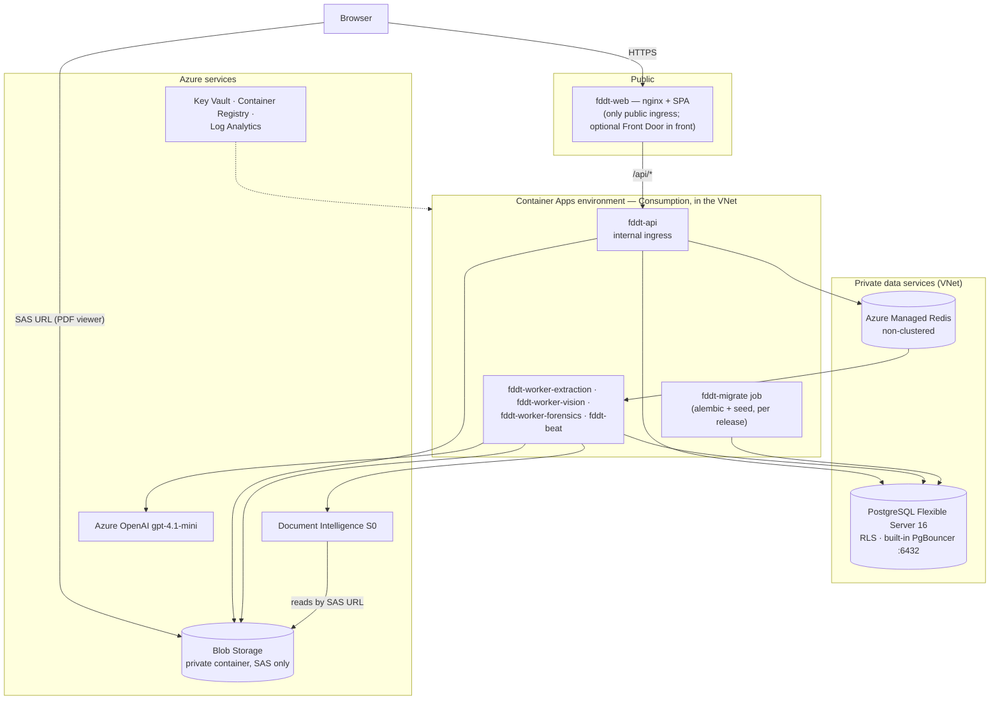

# Production deployment (Azure)

> **Status:** this is the deployment plan and runbook. Per the project rules no infrastructure-as-code or
> CI/CD is committed yet — the repository ships the two container images (`backend/Dockerfile`,
> `frontend/Dockerfile` + `nginx.conf.template`) and everything below is done with the Azure CLI or
> portal. Prices are **list prices in USD for UAE North, retrieved 2026-10-03** from the
> [Azure Retail Prices API](https://prices.azure.com/api/retail/prices); they exclude VAT and any
> EA/CSP discount. Re-check them in the [pricing calculator](https://azure.microsoft.com/pricing/calculator/)
> before quoting.
>
> **To deploy, follow [azure-production-runbook.md](azure-production-runbook.md)**, the complete
> copy-paste runbook (network/IP/port plan, NSGs, DNS, YAML for every app, autoscaling, alerts, release and
> rollback). Section 4 below is the condensed version of it.

## 1. Target architecture



| Component | Azure service | Why |
|---|---|---|
| SPA + reverse proxy | Container App `fddt-web` (frontend image), **public** ingress | One origin for the SPA and `/api`, so no CORS is needed; nginx caps request bodies (`UPLOAD_BODY_LIMIT` / `BULK_UPLOAD_BODY_LIMIT`, at least the largest per-company limit) |
| API | Container App `fddt-api` (backend image), **internal** ingress only | Never exposed directly; reached only through `fddt-web` |
| Workers | Container Apps `fddt-worker-extraction`, `-vision`, `-forensics` (backend image), no ingress | One per queue so each scales on its own ([processing-queues.md](../processing-queues.md)) |
| Scheduler | Container App `fddt-beat`, no ingress, **min = max = 1** | Beat plus a one-slot worker for `housekeeping_queue`: per-minute queue metrics, stuck-document recovery every 5 minutes, nightly usage reconciliation. Two beats would run every job twice |
| Migrations | Container Apps **job** `fddt-migrate` (manual trigger) | Runs `alembic upgrade head` + `seed.py` once per release, as the database owner — not on every API start |
| Database | Azure Database for PostgreSQL **Flexible Server 16**, private access (VNet) | Row-Level Security, roles without superuser/BYPASSRLS (verified to work without superuser); built-in PgBouncer on General Purpose tiers |
| Broker / limiter / fair-share | **Azure Managed Redis**, *Non-Clustered* policy | Azure Cache for Redis no longer accepts new customers (since 2026-04-01) and retires 2028-09-30 |
| Files | Storage account (Standard LRS/ZRS, hot), one **private** container | Originals (write-once), signature crops, report PDFs; accessed only through short-lived SAS URLs |
| OCR | Document Intelligence **S0** | `prebuilt-layout` |
| LLM | Azure OpenAI / Foundry, **gpt-4.1-mini** deployment | Classification, extraction, visual review, signatures, issuer match |
| Secrets | Key Vault, referenced as Container Apps secrets | No secret in images or the repo |
| Images | Container Registry (Basic) | Backend and frontend images |
| Observability | Log Analytics workspace (Container Apps logs) + Azure Monitor alerts | `queue_alert`, failed documents, database metrics |
| Edge (optional, not used by default) | Front Door Standard | Global edge, caching of static assets, managed certificate. Container Apps ingress already provides TLS and a free managed certificate, and sign-in throttling is built into the app, so this is optional. WAF custom rules work on Standard; the managed OWASP rule sets need **Front Door Premium** ($330/month base) |

### Region and data residency

- **UAE North** is used for everything that *stores* data (Storage, PostgreSQL, Redis, Document
  Intelligence processing). The documents are mostly UAE/Saudi.
- **Azure OpenAI gpt-4.1-mini is only offered as a *Global* deployment in UAE North** (no regional or
  Data Zone SKU there). With a Global deployment, prompts — the OCR text and page images — may be
  **processed in any Azure region**; data at rest stays in the resource's region. If the client's data
  classification forbids that, use a region/model combination that offers a regional deployment, or
  have the client accept Global processing in writing. (In West Europe, a Data Zone EU deployment costs
  10 % more: $0.44 / $1.76 per 1M tokens.)
- Review the Azure OpenAI data-handling and abuse-monitoring terms against the client's policy; request
  modified abuse monitoring if required.

## 2. Service tiers

Three sizes. All three use the same images and the same configuration keys — only replica counts, CPU and
SKUs differ, so moving between them is a scaling change, not a redeployment.

| | **S — Pilot** | **M — Production** | **L — Scale** |
|---|---|---|---|
| Volume (2-page documents/month) | ≈ 3,000 | ≈ 20,000 | ≈ 100,000 |
| Companies | 1–3 | up to ~20 | 20+ |
| `fddt-web` | 1 × 0.25 vCPU / 0.5 GiB | 2 × 0.25 / 0.5 (max 4) | 2 × 0.25 / 0.5 (max 6) |
| `fddt-api` | 1 × 0.5 / 1 (max 2) | **1** × 1 / 2 (HTTP autoscale to 4) | 3 × 1 / 2 (max 6) |
| `fddt-worker-extraction` | 1 × 0.5 / 1 | 1 × 1 / 2 | 2 × 1 / 2 |
| `fddt-worker-vision` | 1 × 0.5 / 1 | 1 × 1 / 2 | 4 × 1 / 2 |
| `fddt-worker-forensics` | **0**–2 × 1 / 2 (scale to zero) | **0**–4 × 2 / 4 (scale to zero) | 1–10 × 2 / 4 |
| `fddt-beat` (beat + housekeeping worker) | 1 × 0.5 / 1 | 1 × 0.5 / 1 | 1 × 0.5 / 1 |
| PostgreSQL | Burstable **B2s** (2 vCore, 4 GiB), 64 GB, no HA, direct connections | General Purpose **D2ds_v5** (2 vCore, 8 GiB), 128 GB, **no HA at launch**, built-in PgBouncer | General Purpose **D4ds_v5** (4 vCore, 16 GiB), 512 GB, zone-redundant HA, built-in PgBouncer |
| Redis | Managed Redis **B0**, no HA | Managed Redis **B0**, **no HA** | Managed Redis **B3**, HA |
| Azure OpenAI gpt-4.1-mini Global Standard TPM (target; no quota is requested, the deployment uses the subscription's free capacity) | 100k | 150k | 500k |
| Availability | single zone, no failover | single zone (99.9 % database SLA; a zone failure means a restore, ~1 hour); 2 web replicas | zone-redundant database + Redis (99.99 %) |

Notes on sizing:

- **High availability (HA) on tier M is a client decision.** Without it the database is one server in one
  zone: Azure restarts it after a crash, and a whole-zone outage means a point-in-time restore (about an
  hour). Turning HA on later is one command and roughly doubles the database cost (+$176/month):
  `az postgres flexible-server update -g $RG -n $PG --high-availability ZoneRedundant`. Record the decision
  with the client.
- **Redis without HA is safe** because Redis holds no durable data, and the stuck-document job
  ([processing-queues.md](../processing-queues.md#design)) re-queues any document whose tasks were lost
  when Redis restarted. Tier L keeps HA so that a Redis restart doesn't pause a busy platform for minutes.
- **Forensics memory:** pages are rendered at 200 DPI in memory; give each forensics *process* ~2 GiB
  (`start-worker.sh` runs one prefork process per vCPU of the container's limit).
- **Forensics scales to zero** (tiers S/M): KEDA starts a replica as soon as a forensics task waits, and
  stops it after ~5 idle minutes. The first document after a quiet period waits ~30–60 s longer for its
  forensic checks. This works because the every-minute platform jobs run on their own
  `housekeeping_queue` in the beat container, so nothing else wakes the forensics workers.
- **Vision/extraction** pools are I/O-bound threads; their real ceiling is the Azure OpenAI quota.
  Throughput ≈ (TPM cap) ÷ ~32k tokens *reserved* per 2-page document — e.g. 80k TPM ≈ 2.5 documents/min,
  400k TPM ≈ 12/min. No quota is requested: the deployment uses the subscription's free capacity, which is then the ceiling
  ([processing-queues.md](../processing-queues.md#azure-rate-limits)). They keep one replica each (no
  scale-to-zero), so OCR of a new document starts at once; more replicas than the quota can feed don't help.
- **The beat container** runs beat plus a one-slot worker for `housekeeping_queue` (queue metrics every
  minute, stuck-document recovery every 5 minutes, nightly usage reconciliation). Always exactly one.

## 3. Costs

### Unit prices used (UAE North, USD, list)

| Service | Meter | Price |
|---|---|---|
| Container Apps (Consumption) | vCPU active / idle | $0.000024 / $0.000003 per vCPU-second (≈ $63.07 / $7.88 per vCPU-month) |
| | Memory (**same rate active or idle**: there is no idle discount on memory) | $0.000003 per GiB-second (≈ $7.88 per GiB-month) |
| | Free grant per subscription per month | 180,000 vCPU-s + 360,000 GiB-s + 2M requests (≈ $5.40) |
| | Environment management (only if environment private endpoint or planned maintenance is enabled) | $0.143/hour (≈ $104/month) — **not used** in this design |
| PostgreSQL Flexible Server | Burstable B2s | $0.079/hour |
| | General Purpose Ddsv5 | $0.1085 per vCore-hour (D2ds_v5 $0.217, D4ds_v5 $0.434); 1-year reserved $571 per vCore-year (≈ 40 % less), 3-year $1,141 per vCore (≈ 60 % less) |
| | Storage / backup storage beyond the free 100 % | $0.138 / $0.105 per GB-month (HA doubles compute **and** storage) |
| Azure Managed Redis (Balanced) | B0 / B3 per instance | $0.0726 / $0.09295 per hour (HA = 2 instances). *The UAE North AMR meters look inconsistent (B1 is listed above B3; West Europe lists B0 at $0.019) — confirm in the calculator; the figures here are the higher, conservative ones* |
| Blob Storage | Hot LRS data / writes / reads | $0.0203 per GB-month / $0.06 per 10k / $0.0048 per 10k |
| Document Intelligence S0 | Layout (pre-built) pages | **$10 per 1,000 pages**; commitment tiers from 20k pages for $190/month (overage $9.50/1k) and 100k pages for $900/month ($9/1k) |
| | Font-style add-on (`styleFont`, requested on every page: `AZURE_DOCUMENT_INTELLIGENCE_STYLE_FONT=true`) | **≈ $6 per 1,000 pages — to confirm** on the Document Intelligence pricing page (add-on capabilities). It feeds the font consistency check on scanned pages |
| Azure OpenAI gpt-4.1-mini (Global) | Input / cached input / output | **$0.40 / $0.10 / $1.60 per 1M tokens**; Batch API half price (not usable for this interactive pipeline) |
| Container Registry | Basic | $0.1666/day (≈ $5/month) |
| Key Vault | Standard operations | $0.0396 per 10,000 |
| Log Analytics | Analytics Logs ingestion (first 5 GB/month free) | $3.29/GB |
| Azure Monitor alerts | Log alert at 5-minute frequency | $1.50/month each |
| Front Door Standard (optional, not in the estimate) | Base fee + requests/data | $35/month + usage |
| NAT Gateway (optional, not in the estimate) | Gateway + static IP + data | ≈ $33/month + $0.045/GB |
| Azure Bastion Standard (on demand only, not in the estimate) | Per hour while it exists | ≈ $0.29/hour (≈ $210/month if left running) |
| Bandwidth | Internet egress | First 100 GB/month free, then $0.075–0.12/GB |

### AI cost per document (measured)

Token use is taken from the app's own measurements of real calls (`fddt:llm_usage:*`, 12 English +
Arabic sample documents):

| Call | Per | Real input tokens | Real output tokens |
|---|---|---:|---:|
| Classification + extraction | document | 2,105 | 889 |
| Visual review (2 runs) | page | 2 × 2,904 | 2 × 177 |
| Signature/stamp detection | document (~3 calls) | 3 × 1,418 | 3 × 84 |
| Issuer semantic match | document, only if fuzzy match fails (assumed always) | 400 | 126 |
| Signature comparison | on demand only | 1,055 | 47 |

| Document size | Azure OpenAI | Document Intelligence layout | Font add-on (to confirm) | **AI cost per document** |
|---|---:|---:|---:|---:|
| 1 page | $0.0076 | $0.0100 | $0.006 | **$0.024** |
| 2 pages | $0.0105 | $0.0200 | $0.012 | **$0.043** |
| 3 pages | $0.0134 | $0.0300 | $0.018 | **$0.061** |
| 5 pages | $0.0192 | $0.0500 | $0.030 | **$0.099** |

Document Intelligence (per page) is the larger part; Azure OpenAI is ~1 cent per document. Without the font
add-on (`AZURE_DOCUMENT_INTELLIGENCE_STYLE_FONT=false`) a 2-page document costs $0.031, but scanned pages then
get no font consistency check (fonts on scans are left to the visual review).

### Monthly estimate per tier (2-page documents)

| | **S — Pilot** | **M — Production** | **L — Scale** |
|---|---:|---:|---:|
| Container Apps (range: see below) | $75–130 | $180–300 | $730–1,180 |
| PostgreSQL | $67 | $176 (no HA) | $775 (HA) |
| Managed Redis | $53 | $53 (no HA) | $136 (HA) |
| Blob Storage | $1 | $4 | $19 |
| Container Registry, Key Vault | $6 | $9 | $21 |
| Log Analytics + alerts | $10 | $10–15 | $25–60 |
| **Infrastructure** | **≈ $210–265** | **≈ $430–555** | **≈ $1,705–2,190** |
| Document Intelligence layout | $60 | $400 | $2,000 |
| Document Intelligence font add-on (to confirm) | $36 | $240 | $1,200 |
| Azure OpenAI | $32 | $210 | $1,051 |
| **AI (usage-based)** | **≈ $128** | **≈ $850** | **≈ $4,251** |
| **Total per month** | **≈ $340–395** | **≈ $1,280–1,405** | **≈ $5,955–6,440** |
| Per document | ≈ $0.11–0.13 | ≈ $0.064–0.070 | ≈ $0.060–0.064 |

The previous design (always-active billing, HA on M, 2 forensics + 2 API replicas always on, Front Door,
30 GB of logs) estimated infrastructure at $369 / $1,283 / $2,636. The changes above cut it by 28–43 % /
57–66 % / 17–35 %. The AI line grew only because the font add-on is now counted.

How the figures were computed (730 h/month):

- **Container Apps, low end:** replicas sitting at their minimum with no work are billed the **idle** vCPU
  rate (Azure applies it automatically when a replica uses < 0.01 vCPU and serves no requests; a Celery worker
  waiting on Redis normally qualifies). Activity assumed: web/API active 30 % of the month (working hours),
  extraction/vision active 15 % (M) / 60 % (L) of the time, forensics billed only while it has work (scale to
  zero; tier L ~1 replica on average), beat idle. **Memory is always billed in full.**
- **Container Apps, high end:** the same, but web, API, extraction, vision and beat billed at the active rate
  all month (in case Azure does not treat the idle workers as idle).
- **Logs:** the app's own log volume is small (a few lines per task, one metrics line per queue per minute),
  so S/M most likely stay within the free 5 GB/month; the workspace gets a 1 GB/day cap as a guard. Alerts
  ~$8/month.
- Blob assumes ~0.5 MB per document retained plus ~4 writes and ~40 reads per document.
- Not included: VAT, support plans, Defender for Cloud, Front Door, NAT Gateway, Bastion, egress beyond
  100 GB, signature comparisons, staging (a staging copy of tier S, paused when unused, costs well under tier S).
- **Check it after the first month** in Cost Management (filter by tag `app=fddt`), and adjust the
  replica sizes to what the apps really use.

### Cost levers

**Already applied in this design**

| Lever | Effect |
|---|---|
| Idle billing + forensics scale-to-zero (S/M), housekeeping jobs on their own queue | Most of the Container Apps saving |
| `fddt-api` minimum 1 replica on M (autoscale to 4); rolling updates still cause no downtime | ≈ −$25–80/month |
| PostgreSQL and Redis without HA on M at launch | −$176 and −$53/month (re-enable when the client needs 99.99 %) |
| Sign-in throttling in the app (Redis) instead of a Front Door WAF | −$35+/month |
| Logs kept in the normal (Analytics) tier but small, with a 1 GB/day cap. *Basic Logs* are not used: the alert rules read the same table, and Basic tables can't drive them | −$60–200/month vs. the old estimate |
| NAT Gateway only if someone must allow-list our outbound IP; Bastion created only for admin sessions, then deleted | Avoids $33 and $210/month |

**Later, once usage is known**

- **PostgreSQL 1-year reservation** after 1–2 months on a stable size: ≈ 40 % off compute (M without HA:
  −$63/month; L: −$254). It is a commitment, paid even if you resize or delete.
- **Document Intelligence commitment tier** once volume is steady: at 200k pages/month (tier L), the
  100k-page commitment ($900) + 100k overage at $9/1k = $1,800 instead of $2,000.
- **Font add-on:** confirm its price. If the font consistency check on scanned pages is not worth it, set
  `AZURE_DOCUMENT_INTELLIGENCE_STYLE_FONT=false` (−$12 per 1,000 two-page documents).
- **Right-size extraction/vision** after a few weeks of real metrics: 0.5 vCPU / 1 GiB each saves
  ≈ $8–40/month per app.
- **Azure savings plan for compute**: check whether it covers Container Apps consumption in the client's
  agreement (≈ 15 % off).
- **Staging:** stop its PostgreSQL server (`az postgres flexible-server stop`; not billed for compute while
  stopped, up to 7 days at a time) and scale its apps to zero when unused.
- Keep pages per document honest: the cost scales with pages, and every page is OCR'd and reviewed twice.

## 4. Deployment steps

All commands are Azure CLI (bash). Replace `<…>` placeholders. Run them in this order the first time; later
releases only repeat steps 10 and 12.

### 4.1 Prerequisites and naming

```bash
az login
az extension add --name containerapp --upgrade
az provider register --namespace Microsoft.App
az provider register --namespace Microsoft.OperationalInsights

RG=rg-fddt-prod
LOC=uaenorth
PREFIX=fddtprod                    # lowercase, globally unique where needed
az group create -n $RG -l $LOC
```

### 4.2 Logging

```bash
az monitor log-analytics workspace create -g $RG -n $PREFIX-logs -l $LOC --retention-time 30
LA_ID=$(az monitor log-analytics workspace show -g $RG -n $PREFIX-logs --query customerId -o tsv)
LA_KEY=$(az monitor log-analytics workspace get-shared-keys -g $RG -n $PREFIX-logs --query primarySharedKey -o tsv)
```

### 4.3 Network

```bash
az network vnet create -g $RG -n $PREFIX-vnet -l $LOC --address-prefixes 10.20.0.0/16
# Container Apps (workload-profiles environment needs a /27 or larger, delegated)
az network vnet subnet create -g $RG --vnet-name $PREFIX-vnet -n aca --address-prefixes 10.20.0.0/23 \
  --delegations Microsoft.App/environments
# PostgreSQL private access (delegated)
az network vnet subnet create -g $RG --vnet-name $PREFIX-vnet -n pg --address-prefixes 10.20.2.0/24 \
  --delegations Microsoft.DBforPostgreSQL/flexibleServers
# Private endpoints (Redis)
az network vnet subnet create -g $RG --vnet-name $PREFIX-vnet -n pe --address-prefixes 10.20.3.0/24
```

### 4.4 Container registry and images

```bash
az acr create -g $RG -n ${PREFIX}acr --sku Basic
az acr build -r ${PREFIX}acr -t fddt-backend:<version> ./backend
az acr build -r ${PREFIX}acr -t fddt-web:<version> ./frontend
```

The frontend image is built with the default `VITE_API_BASE_URL=/api`; nginx proxies `/api/*` to the API.

### 4.5 PostgreSQL

```bash
az postgres flexible-server create -g $RG -n $PREFIX-pg -l $LOC --version 16 \
  --tier GeneralPurpose --sku-name Standard_D2ds_v5 --storage-size 128 \
  --vnet $PREFIX-vnet --subnet pg --private-dns-zone $PREFIX-pg.private.postgres.database.azure.com \
  --admin-user fddtowner --admin-password '<OWNER_PASSWORD>' --backup-retention 35
# Tier S instead: --tier Burstable --sku-name Standard_B2s --storage-size 64
# Tier L (or M once the client wants 99.99 %): add --high-availability ZoneRedundant

az postgres flexible-server db create -g $RG -s $PREFIX-pg -d fddt
# Built-in PgBouncer (General Purpose / Memory Optimized only — NOT available on Burstable)
az postgres flexible-server parameter set -g $RG -s $PREFIX-pg -n pgbouncer.enabled --value true
az postgres flexible-server parameter set -g $RG -s $PREFIX-pg -n metrics.pgbouncer_diagnostics --value on
```

- The admin login (`fddtowner`) is the **owner** role the migrations run as. It has CREATEROLE through
  `azure_pg_admin` but is not a superuser — exactly what the migrations need (they create `fddt_app` and
  `fddt_platform` themselves, without BYPASSRLS).
- TLS is enforced by default (`require_secure_transport = on`); always add `?sslmode=require` to
  `DATABASE_URL`. The app keeps that query string when it derives the two app-role URLs and the pooler
  URL from it.
- Built-in PgBouncer: port **6432**, transaction pooling (the default), `default_pool_size` 50 per
  user/database. The app sets the tenant only transaction-locally, so it is safe behind transaction
  pooling (`tests/test_pgbouncer_rls.py`). It authenticates against the database, so no `userlist.txt` is
  used in production.

### 4.6 Redis

```bash
az redisenterprise create -g $RG -n $PREFIX-redis -l $LOC --sku Balanced_B0 \
  --clustering-policy NoCluster --high-availability Disabled \
  --public-network-access Disabled --access-keys-authentication Enabled
# Tier L: --sku Balanced_B3 --high-availability Enabled
az network private-endpoint create -g $RG -n $PREFIX-redis-pe --vnet-name $PREFIX-vnet --subnet pe \
  --private-connection-resource-id $(az redisenterprise show -g $RG -n $PREFIX-redis --query id -o tsv) \
  --group-id redisEnterprise --connection-name redis
REDIS_KEY=$(az redisenterprise database list-keys -g $RG --cluster-name $PREFIX-redis --query primaryKey -o tsv)
```

(The `az redisenterprise` command group manages Azure Managed Redis; flags vary between CLI versions.
`NoCluster` exists in the current API, but some CLI versions only accept `OSSCluster` / `EnterpriseCluster` —
in that case create the cache in the **portal** and pick *Non-Clustered*. **The clustering policy cannot be
changed after the database is created** — choose it correctly the first time.) Requirements for Celery:

- **Clustering policy *Non-Clustered***. Celery's Redis transport and the fair-share priority lists use
  multi-key commands across `<queue>`, `<queue>:1…9`; the default *OSS* policy needs a cluster-aware
  client, and *Enterprise* can reject cross-slot multi-key commands.
- Only database **0** exists — point **both** Celery URLs at `/0`
  (`rediss://:<KEY>@<name>.<region>.redis.azure.net:10000/0?ssl_cert_reqs=required`; port 10000, TLS). Result keys are prefixed, so
  sharing the database is safe.
- Add a private DNS zone link for the private endpoint (`privatelink.redis.azure.net`) so the apps resolve
  it inside the VNet.

### 4.7 Storage

```bash
az storage account create -g $RG -n ${PREFIX}files -l $LOC --sku Standard_ZRS --kind StorageV2 \
  --min-tls-version TLS1_2 --allow-blob-public-access false --https-only true
az storage container create --account-name ${PREFIX}files -n documents --auth-mode login   # private
az storage cors add --account-name ${PREFIX}files --services b --methods GET HEAD OPTIONS \
  --origins https://<your-app-domain> --allowed-headers '*' --exposed-headers '*' --max-age 3600
```

- The account **must keep its public endpoint reachable**: the browser fetches each PDF directly by its
  short-lived SAS URL (the case viewer), and Document Intelligence fetches the file by SAS URL too. Access
  is protected by the SAS signature, and anonymous blob access is disabled. Locking the account to private
  endpoints would require code changes (stream files through the API; send bytes to Document Intelligence).
- The CORS rule lets the viewer read PDFs from the web app's origin; add the Front Door hostname too if used.
- Consider a lifecycle rule moving blobs older than e.g. 180 days to *Cool* (cheaper storage; the files are
  immutable).

### 4.8 Document Intelligence and Azure OpenAI

```bash
az cognitiveservices account create -g $RG -n $PREFIX-docintel -l $LOC --kind FormRecognizer --sku S0 \
  --custom-domain $PREFIX-docintel
az cognitiveservices account create -g $RG -n $PREFIX-openai -l $LOC --kind AIServices --sku S0 \
  --custom-domain $PREFIX-openai
az cognitiveservices account deployment create -g $RG -n $PREFIX-openai --deployment-name gpt-4.1-mini \
  --model-name gpt-4.1-mini --model-version 2025-04-14 --model-format OpenAI \
  --sku-name GlobalStandard --sku-capacity <free>      # thousands of TPM: the subscription's free capacity (runbook step 10)
```

- The deployment name must contain `gpt-4.1` (or `gpt-4o`, …) — the app checks it is vision-capable.
- Set the app's caps to **80 %** of the granted quota: `AZURE_OPENAI_MAX_TOKENS_PER_MINUTE` = 0.8 × TPM,
  `AZURE_OPENAI_MAX_REQUESTS_PER_MINUTE` = 0.8 × RPM (read both from the portal or the
  `x-ratelimit-limit-*` response headers). Document Intelligence S0 allows 15 requests/s; keep
  `AZURE_DOCUMENT_INTELLIGENCE_MAX_CALLS_PER_SECOND=10`.
- After the first real traffic, run `python -m scripts.calibrate_llm_tokens` once against the production
  deployment (costs a few cents) to confirm the token reservations.

### 4.9 Key Vault and secrets

```bash
az keyvault create -g $RG -n $PREFIX-kv -l $LOC --enable-rbac-authorization true
for s in jwt-secret owner-db-url app-db-password platform-db-password redis-url storage-conn \
         docintel-key openai-key seed-admin-password; do
  az keyvault secret set --vault-name $PREFIX-kv -n $s --value '<value>'
done
```

| Secret | Value |
|---|---|
| `jwt-secret` | `python -c "import secrets; print(secrets.token_urlsafe(48))"` |
| `owner-db-url` | `postgresql+psycopg2://fddtowner:<OWNER_PASSWORD>@<pg-host>:5432/fddt?sslmode=require` |
| `app-db-password` / `platform-db-password` | Two long random passwords (they become the passwords of `fddt_app` / `fddt_platform`) |
| `redis-url` | `rediss://:<REDIS_KEY>@<redis-host>:10000/0?ssl_cert_reqs=required` (Celery refuses a `rediss://` URL without `ssl_cert_reqs`; URL-encode the key) |
| `storage-conn` | The storage account connection string (the code signs SAS URLs with the account key) |
| `docintel-key`, `openai-key` | Resource keys |
| `seed-admin-password` | The first platform admin's password |

URL-encode special characters inside passwords that are embedded in URLs.

### 4.10 Container Apps environment, identity and shared configuration

```bash
az containerapp env create -g $RG -n $PREFIX-env -l $LOC \
  --infrastructure-subnet-resource-id $(az network vnet subnet show -g $RG --vnet-name $PREFIX-vnet -n aca --query id -o tsv) \
  --logs-workspace-id $LA_ID --logs-workspace-key $LA_KEY --enable-workload-profiles
```

Every backend app uses one **user-assigned managed identity** with *AcrPull* on the registry and *Key Vault
Secrets User* on the vault. Secrets are referenced as
`--secrets jwt=keyvaultref:https://$PREFIX-kv.vault.azure.net/secrets/jwt-secret,identityref:<identity-id> …`
and mapped into environment variables with `secretref:`.

**Backend environment (identical for API, workers, beat and the migration job):**

| Variable | Value |
|---|---|
| `ENVIRONMENT` | `production` |
| `DATABASE_URL` | `secretref:owner-db-url` |
| `DATABASE_APP_PASSWORD` / `DATABASE_PLATFORM_PASSWORD` | `secretref:app-db-password` / `secretref:platform-db-password` |
| `DATABASE_POOLER_HOST` / `DATABASE_POOLER_PORT` | `<pg-host>` / `6432` (tiers M/L). Tier S (Burstable): leave unset and set `DB_POOL_SIZE=3`, `DB_MAX_OVERFLOW=5` |
| `CELERY_BROKER_URL`, `CELERY_RESULT_BACKEND` | both `secretref:redis-url` |
| `JWT_SECRET_KEY` | `secretref:jwt-secret` |
| `AZURE_STORAGE_CONNECTION_STRING`, `AZURE_STORAGE_CONTAINER_NAME` | `secretref:storage-conn`, `documents` |
| `AZURE_DOCUMENT_INTELLIGENCE_ENDPOINT` / `_KEY` | `https://$PREFIX-docintel.cognitiveservices.azure.com/` / `secretref:docintel-key` |
| `AZURE_OPENAI_ENDPOINT` / `_KEY` / `_DEPLOYMENT_NAME` | `https://$PREFIX-openai.openai.azure.com/` / `secretref:openai-key` / `gpt-4.1-mini` |
| `AZURE_OPENAI_MAX_REQUESTS_PER_MINUTE` / `_MAX_TOKENS_PER_MINUTE` | 80 % of the deployment's RPM / TPM |
| `AZURE_DOCUMENT_INTELLIGENCE_MAX_CALLS_PER_SECOND` | `10` |
| `DEFAULT_MAX_FILE_SIZE_MB` / `DEFAULT_MAX_ZIP_SIZE_MB` | `10` / `300` (limits for new companies; each company's own are set under Platform › Companies) |
| `QUEUE_ALERT_OLDEST_WAITING_SECONDS` | `300` |
| `EXTRACTION_WORKER_CONCURRENCY` / `VISION_WORKER_CONCURRENCY` | `4` / `4` (per replica) |
| `FORENSICS_WORKER_CONCURRENCY` | `0` (one process per vCPU of the container) |
| `SEED_ADMIN_EMAIL` / `SEED_ADMIN_PASSWORD` | the first platform admin / `secretref:seed-admin-password` — **migration job only** |

Full reference: [environment-variables.md](environment-variables.md).

### 4.11 Database migration job (every release, before the apps)

```bash
az containerapp job create -g $RG -n $PREFIX-migrate --environment $PREFIX-env \
  --trigger-type Manual --replica-timeout 1800 --replica-retry-limit 0 \
  --image ${PREFIX}acr.azurecr.io/fddt-backend:<version> --cpu 0.5 --memory 1Gi \
  --command sh --args "-c" "alembic upgrade head && python seed.py" \
  --env-vars <the backend variables above> ...
az containerapp job start -g $RG -n $PREFIX-migrate
az containerapp job execution list -g $RG -n $PREFIX-migrate -o table     # wait for Succeeded
```

- **Take a database backup/point-in-time marker before migrating** (Flexible Server keeps automatic
  backups; note the time so a PITR restore target is known).
- `seed.py` creates the platform admin and **resets that account's password to `SEED_ADMIN_PASSWORD` on
  every run**. Remove `&& python seed.py` from the job after the first release (or keep the variable at
  the real password).
- Do **not** use `start-api.sh` as the API command in production: it migrates and re-seeds on every start,
  and several API replicas would race.

### 4.12 Applications

```bash
IMG=${PREFIX}acr.azurecr.io/fddt-backend:<version>
# API — internal ingress only
az containerapp create -g $RG -n fddt-api --environment $PREFIX-env --image $IMG \
  --ingress internal --target-port 8000 --cpu 1 --memory 2Gi --min-replicas 2 --max-replicas 4 \
  --command uvicorn --args app.main:app --host 0.0.0.0 --port 8000 --workers 2 --proxy-headers --forwarded-allow-ips '*' \
  --env-vars <backend variables>
# Workers — no ingress
az containerapp create -g $RG -n fddt-worker-extraction --environment $PREFIX-env --image $IMG \
  --cpu 1 --memory 2Gi --min-replicas 1 --max-replicas 1 --command sh --args start-worker.sh extraction --env-vars <…>
az containerapp create -g $RG -n fddt-worker-vision --environment $PREFIX-env --image $IMG \
  --cpu 1 --memory 2Gi --min-replicas 1 --max-replicas 1 --command sh --args start-worker.sh vision --env-vars <…>
az containerapp create -g $RG -n fddt-worker-forensics --environment $PREFIX-env --image $IMG \
  --cpu 2 --memory 4Gi --min-replicas 0 --max-replicas 4 --command sh --args start-worker.sh forensics --env-vars <…>
# (scale-to-zero needs the KEDA Redis rules on forensics_queue — see the runbook, step 15.2)
# Beat — exactly one
az containerapp create -g $RG -n fddt-beat --environment $PREFIX-env --image $IMG \
  --cpu 0.5 --memory 1Gi --min-replicas 1 --max-replicas 1 --command sh --args start-beat.sh --env-vars <…>
# Web — the only public app
az containerapp create -g $RG -n fddt-web --environment $PREFIX-env \
  --image ${PREFIX}acr.azurecr.io/fddt-web:<version> --ingress external --target-port 80 \
  --cpu 0.25 --memory 0.5Gi --min-replicas 2 --max-replicas 3 \
  --env-vars API_UPSTREAM=https://fddt-api.internal.<environment-default-domain>
```

(Add `--registry-server`, `--registry-identity` and `--user-assigned` for the managed identity on each
command; the replica counts above are tier M — take them from section 2. The CLI parses `--host`-style
tokens inside `--args` as its own flags, so in practice create the apps from YAML as the
[runbook](azure-production-runbook.md#step-14--api-fddt-api) does.)

- `API_UPSTREAM` is the API's **internal FQDN** (`az containerapp show -n fddt-api --query
  properties.configuration.ingress.fqdn`). nginx strips `/api`, forwards to it, and refuses bodies over
  `UPLOAD_BODY_LIMIT` (default **11m**) — or, for `/api/bulk-uploads` (streamed, unbuffered),
  `BULK_UPLOAD_BODY_LIMIT` (default **301m**) — before they reach Uvicorn. Upload limits are per company,
  so these two must be at least the **largest** per-company limit granted (plus ~1 MB of multipart overhead
  for single files): when a platform admin gives a company 20 MB / 500 MB, redeploy `fddt-web` with
  `--env-vars UPLOAD_BODY_LIMIT=21m BULK_UPLOAD_BODY_LIMIT=501m`.
- Workers need no probes beyond the default; give the API a liveness probe on `GET /health`.
- Rolling update order for a release: build images → run `fddt-migrate` → update `fddt-api` → update the
  workers and beat → update `fddt-web`. Migrations are additive within a release, so old workers keep
  working during the roll.
- **Restart the workers whenever their code changes** (a new revision does this).

### 4.13 Domain and TLS

```bash
az containerapp hostname add -g $RG -n fddt-web --hostname app.<client-domain>
az containerapp hostname bind -g $RG -n fddt-web --hostname app.<client-domain> \
  --environment $PREFIX-env --validation-method CNAME     # free managed certificate
```

Or put Front Door Standard in front (managed certificate on Front Door, origin = `fddt-web`) and restrict
`fddt-web` ingress to the Front Door service tag. Add the final origin to the Blob CORS rule (4.7).

### 4.14 First login and smoke test

1. Sign in as the seeded platform admin; change nothing else until the checks below pass.
2. **Platform › Companies** → create the client company (it receives the 38 template rules and 30/60
   thresholds; its issuer registry is empty). **Platform › Users** → create its reviewers and users.
3. As a company user, upload one sample PDF; confirm it reaches a risk tier, the PDF renders in the case
   viewer (Blob CORS works) and **Platform › Processing queues** shows all three queues with consumers.
4. Upload an image and a password-protected PDF — both must be refused with their specific messages.
5. Generate a report as a reviewer and open it.
6. As the company's Reviewer L2, load the company's real **issuer registry** (until then almost every
   document flags `issuer.not_in_registry`).

## 5. Operations

### Monitoring and alerts

| Alert | Query / metric | Suggested threshold |
|---|---|---|
| Queue backlog | `ContainerAppConsoleLogs_CL \| where Log_s has "queue_alert"` | any row in 5 min (the app logs it when the oldest waiting task > 300 s) |
| Worker errors | `ContainerAppConsoleLogs_CL \| where ContainerAppName_s startswith "fddt-worker" and Log_s has_any ("ERROR", "Traceback")` | > 5 in 15 min |
| Database permission errors | `… Log_s has "permission denied"` | any (a write needs a grant the app role lacks) |
| Azure throttling | `… Log_s has "429"` | > 10 in 15 min — raise TPM or lower the caps |
| Stuck documents re-queued | `… Log_s has "stuck_documents_requeued"` | any — Redis lost queued tasks (restart/outage); the documents were queued again automatically |
| Sign-in lockouts | `… Log_s has "login_lockout"` | > 10 in 15 min (password guessing) |
| Failed documents | `audit_log` events `document_processing_failed` / `*_failed` (query through the platform audit log) | review daily |
| PostgreSQL | CPU > 80 %, storage > 80 %, `client_connections_waiting` (PgBouncer) > 0 for 5 min | |
| Redis | Used memory > 70 %, server load > 80 % | |
| API | `fddt-api` 5xx rate, replica restarts | |

`queue_metrics {json}` lines (one per queue per minute) can be charted directly in Log Analytics
(`parse_json(extract("queue_metrics (.*)", 1, Log_s))`).

### Backups and disaster recovery

| Data | Protection | Restore |
|---|---|---|
| PostgreSQL | Automatic backups, 35-day point-in-time restore; zone-redundant HA (L; M once enabled) fails over automatically; without HA a zone outage means a restore | PITR to a new server, repoint `DATABASE_URL` / pooler host |
| Blob Storage | ZRS; enable **soft delete** (14 days) and **versioning** for defence in depth (the app never deletes or overwrites) | Undelete / previous version |
| Redis | Holds only queued tasks, fair-share counters, sign-in throttle and rate-limiter windows | A lost broker loses queued tasks; the stuck-document job queues the affected documents again within ~15 minutes (checks of documents whose extraction had already finished are not re-run) |
| Configuration | Key Vault (soft delete + purge protection on) and the image tags | Redeploy |

Recovery objectives with tier M as designed: RPO ≈ 5 minutes (PostgreSQL log backups), RTO ≈ 1 hour
(restore + repoint), excluding in-flight pipeline tasks.

### Routine tasks

- **Secret rotation:** rotate storage/Document Intelligence/OpenAI keys with the two-key pattern; rotating
  `JWT_SECRET_KEY` signs everyone out. To rotate `fddt_app` / `fddt_platform`, `ALTER ROLE … PASSWORD`
  as the owner, then update the Key Vault secrets and restart the apps.
- **Usage reconciliation** runs nightly (02:00 UTC); **Billing & usage** feeds client invoicing.
- **Re-calibrate token reservations** (`scripts.calibrate_llm_tokens`) after any model, prompt or render
  change; re-check the 80 % caps after any quota change.
- **Schema docs:** regenerate `docs/database/*.md` with `docs/tools/gen_db_docs.py` after each migration.

## 6. Go-live checklist

**Must do**
- [ ] `JWT_SECRET_KEY`, both app-role passwords, the owner password and `SEED_ADMIN_PASSWORD` are long random
  values in Key Vault; nothing secret is in an image or the repo.
- [ ] The migration job ran (`alembic upgrade head` → head `c9e3a1b5d7f4` or later) and the seed step was
  removed or pinned to the real password.
- [ ] `DATABASE_URL` ends in `?sslmode=require`; tiers M/L connect through the built-in PgBouncer (6432).
- [ ] Redis is Non-Clustered and both Celery URLs use `/0` over `rediss://`.
- [ ] gpt-4.1-mini Global Standard deployment uses the free capacity (no quota request); the app caps at 80 % of it.
- [ ] Exactly one `fddt-beat` replica (beat + the `housekeeping_queue` worker).
- [ ] HA decision for PostgreSQL and Redis recorded with the client (tier M launches without HA).
- [ ] Blob container private, anonymous access off, CORS limited to the app origin, soft delete on.
- [ ] Only `fddt-web` has public ingress.
- [ ] Alerts from section 5 created and routed to an on-call address.
- [ ] Data-residency decision for the Global Azure OpenAI deployment recorded with the client.
- [ ] The client's issuer registry loaded; risk weights reviewed with the client.
- [ ] A full browser walkthrough of every role (submitter, Reviewer L1, Reviewer L2, platform admin).

**Known gaps to accept or schedule** (from [azure-migration-notes.md](azure-migration-notes.md))
- No forgot-password flow (users change their own password; admins reset others), tokens in `localStorage`.
  Sign-in throttling exists (per address and per IP).
- No malware scan and no page-count limit on uploads (type, size, corruption and password are checked).
- No automatic retry of a failed Azure call. (Documents whose queued tasks were lost are re-queued by the
  stuck-document job.)
- Keys and connection strings, not managed identity, for Storage / Document Intelligence / OpenAI.

## Sources

- Azure Retail Prices API — `https://prices.azure.com/api/retail/prices` (UAE North and West Europe,
  retrieved 2026-10-03)
- [Billing in Azure Container Apps](https://learn.microsoft.com/azure/container-apps/billing)
- [PgBouncer in Azure Database for PostgreSQL Flexible Server](https://learn.microsoft.com/azure/postgresql/connectivity/concepts-pgbouncer)
- [Azure Cache for Redis retirement FAQ](https://learn.microsoft.com/azure/azure-cache-for-redis/retirement-faq)
- [Azure Managed Redis architecture (clustering policies)](https://learn.microsoft.com/azure/redis/architecture)
- [Azure Managed Redis pricing](https://azure.microsoft.com/pricing/details/managed-redis/)
- [Azure Front Door pricing](https://learn.microsoft.com/azure/frontdoor/understanding-pricing)
