# FDDT User Manual

**Fraud Document Detection Tool** — a guide for submitters, reviewers and platform administrators.

This manual describes the application **as implemented** (see `docs/README.md` for the technical
documentation this is derived from). It covers what each of the four roles can do, how a case moves
from upload to decision, how to read the automated checks and the risk score, and — deliberately —
what the tool does **not** do, so nobody relies on it for more than it promises.

> **One deployment, several companies.** The application serves several client companies at once. Every
> user belongs to exactly one company and only ever sees that company's cases, documents, settings and
> audit log. The platform operator's own staff (platform admins) sit outside every company.
>
> *Screenshots were captured before multi-company support was added; some labels (for example "Admin") are
> older than the text, but the screens work as described here.*

## Who this is for

| Role | Can do |
|---|---|
| **User** (submitter) | Submit a case with supporting documents, track its status, see the reviewer's decision. Never sees the risk score, tier or triggered reasons — only a neutral "In review" flag — so the checks that catch fraud are never exposed to the person submitting the documents. |
| **Reviewer L1** | Everything a user can do, plus: the full review queue and dashboard, every case's automated findings and risk score, approve / reject / escalate, audit history, and exporting the per-case forensic report. Once a case is escalated to L2, a Reviewer L1 can still open and read it but can no longer approve, reject or re-escalate it. |
| **Reviewer L2** | Everything a Reviewer L1 can do, plus: approve or reject cases that have been escalated to L2, and manage **your company's** Issuer Registry and Risk Rules (Settings). |
| **Platform Admin** | Belongs to no company. Creates companies and every user account, edits the default rule set new companies start from, sees billing & usage per company and the processing-queue monitor. Can **read** any company's cases, audit log and settings for support — every such view is recorded in a platform-only log — but can never approve, reject, escalate, upload, create cases or export reports. |

Every rule above is enforced by the backend on every request, not just hidden in the interface — reaching
a screen you're not permitted to use still returns "access required" or a 404, never data. A case or
document of another company simply does not exist for you (404).

## Signing in

Go to the application URL and sign in with the email and password a platform admin created for you
(there is no self-service sign-up, and no password-reset link — if you're locked out, ask the platform
operator). The top bar shows your company and role. Sessions are a plain bearer token (8 hours) with no
server-side logout. If your company is suspended, sign-in stops working for everyone in it.

### Changing your password

Every user can change their own password: click the **key icon** in the top bar (on a small screen, open
the menu and choose **Change password**), enter your current password, then the new one twice (8–128
characters, different from the current one). The change is recorded in the audit log (never the password).
It needs your current password — if you have forgotten it, a platform admin resets it for you (Settings →
Users → Reset password). Sessions already signed in stay valid until they expire.

> The sign-in screen also shows a "Trust this device" checkbox and a "Sign in with SAML / Okta SSO"
> button. Neither does anything: the checkbox isn't wired to the login form (authentication doesn't have
> a device-trust concept to back it), and the SSO button is disabled. Treat the screen as plain
> email/password sign-in only — the badges and extra controls are decorative UI that hasn't been wired up
> or removed yet.

## Submitting a case (User)

1. Open **New Case**.
2. Choose the case type: *School / educational document*, *Vendor invoice*, *Commercial invoice*,
   *Procurement documentation*, *Quotation*, *Travel / accommodation reimbursement*, or *Other*.
3. Attach the supporting document(s) — the original invoice, receipt, quotation, evidence of payment,
   etc. **Only PDF files are accepted, each within your company's size limit** (10 MB unless your company has a different limit; the upload screen shows the limit that applies to you). If you have a photo or scan as an image, save
   or scan it to PDF first. A file is refused immediately, with the reason shown next to it, if it is:
   - not a PDF (for example a JPEG, PNG or Word file, even if renamed to `.pdf`);
   - empty, or larger than your company's limit (the message shows the file's size and the limit);
   - **password-protected** — remove the password and upload it again (the system never asks for
     document passwords);
   - corrupted or cut off (for example a partly downloaded file).
4. Upload. Each file uploads independently with its own progress bar; if one fails you can fix it and
   retry without losing the others, remove the rejected file by clicking its `[X]` icon to proceed with
   the remaining documents, or click **Reset form** to clear the intake form and start fresh.
5. **Optional — set a reference signature:** for an uploaded document, you can draw a box around a
   signature or stamp so the system compares it against the one on other documents. Skip this and no
   signature comparison runs for that document.
6. The case now moves into the automated pipeline, and you're taken to its detail page.

Attach every document of a case in this one submission — there is no "add a document" button on an
existing case.

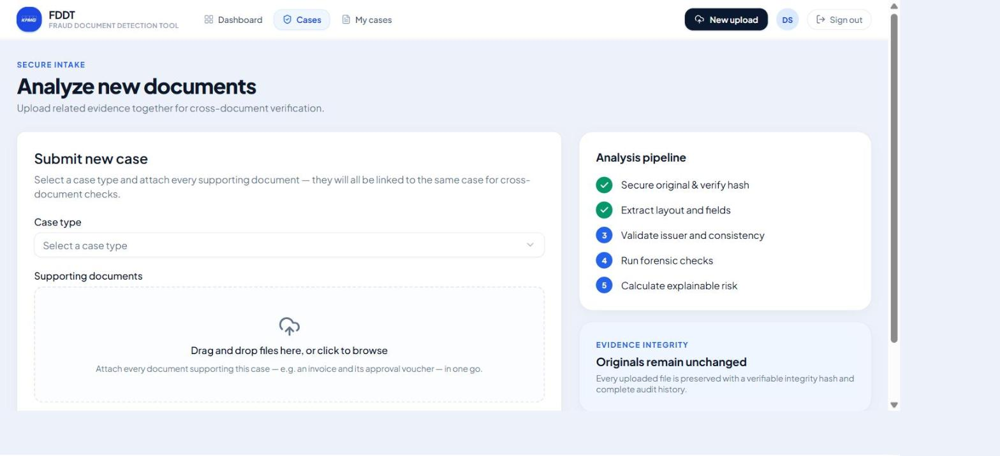
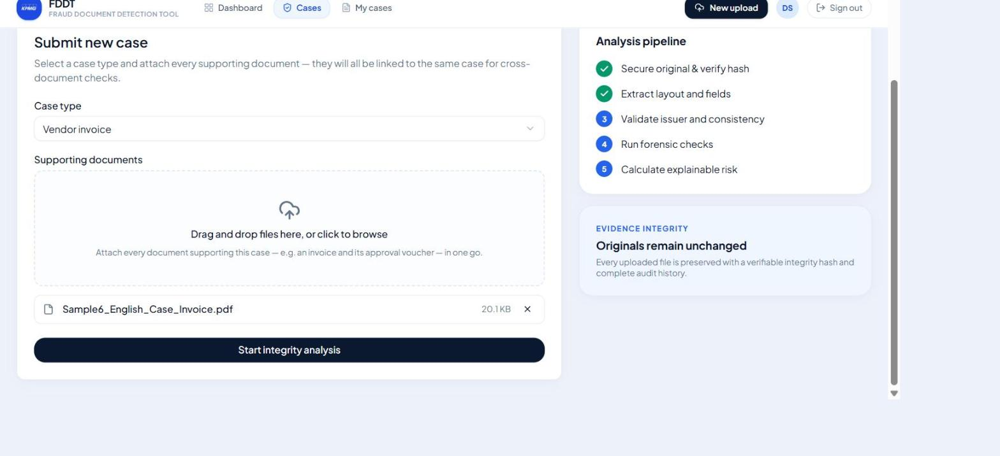
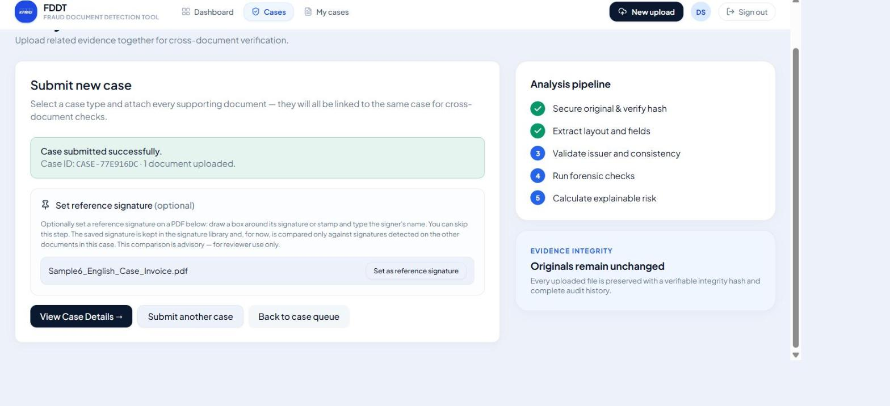

## Submitting many cases at once (bulk upload)

From **New case**, choose **Bulk upload (zip of cases)**.

1. Make one zip file with **one folder per case**, each holding that case's PDFs directly (no
   subfolders). The folder name becomes the case's reference label; it doesn't have to be unique.
2. Pick the case type. It applies to every case in the zip.
3. Drop the zip (within your company's zip and file limits, shown on the screen; 300 MB and 10 MB per PDF
   by default) and select **Upload and create cases**.

You land on the bulk upload summary. Every case folder is listed straight away, and problems found
without opening the files (a subfolder inside a case folder, an empty folder, an empty or oversized
file) are shown immediately. The cases are then created one by one, and each shows its own progress:
**Queued → Processing → Done**. You don't have to wait for the whole zip; open any finished case
while the rest are still running. A bad file (corrupted, password-protected, not a PDF) is rejected on its
own with the reason and the rest of its case goes ahead. A case is only *Not created* if none of its files
could be accepted.

## Tracking your cases (User)

**My Cases** lists everything you've submitted, filterable by *Under review*, *Cleared* or
*Action required*, with search. You'll see the outcome (approved / rejected, with the reviewer's reason
when rejected) but not the risk detail behind it — that's intentional (see below).

Opening one of your cases shows its documents, their extracted fields, and an activity timeline, but:
- No risk score, tier or list of triggered findings.
- No reviewer decision controls beyond a read-only history of what happened.

This is deliberate: if a submitter could see exactly which signals fired, a bad actor could learn what to
avoid next time.

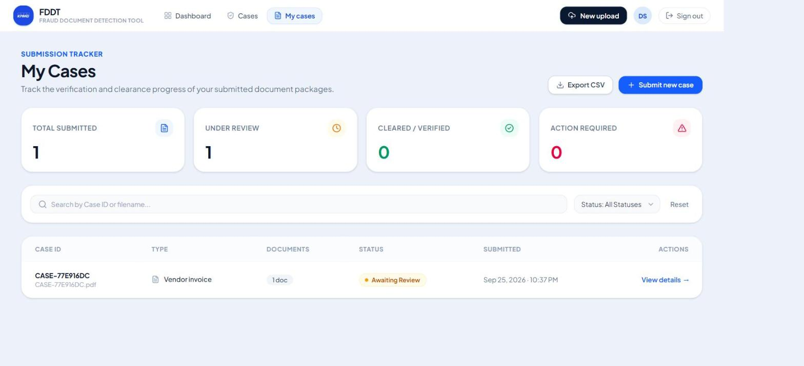
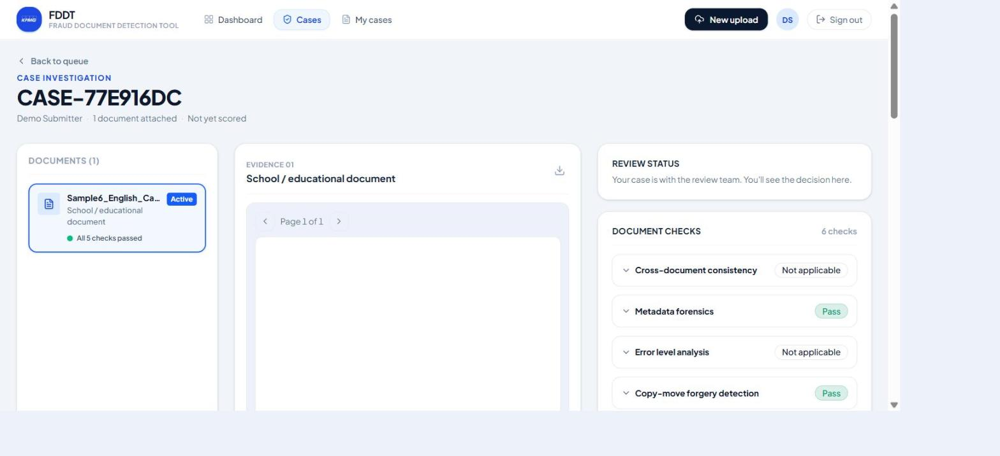

## The review queue & dashboard (Reviewers)

**Review Queue** (also the home page, `/cases`) is the master case list: counts of open / awaiting review
/ cleared / escalated cases, and a table of cases with their type, status, risk flag, escalation badge,
document count and submitter. Search and the status / type / flag filters run instantly in your browser.

- **Reviewer L1** sees two tabs: **My queue** (the cases you can act on — the default) and **Escalated to
  L2 · view only** (cases handed to L2; you can open them to follow what happened, but not act on them).
- **Reviewer L2** sees **All cases** (the default — open L2 cases always sort to the top) and
  **Escalated queue (L2)** (only escalated cases).
- **Platform admins** pick one company at a time (company picker at the top) and see that company's
  list read-only.

> **"Escalated" is a reviewer tier, not a status.** An escalated case can be `submitted`,
> `pending_manual_review`, or already decided — escalation means the case now belongs to the Reviewer L2
> tier; it doesn't change what state the case is in.

**Dashboard** is an at-a-glance operational summary computed entirely from the same case list: counts by
risk flag, a risk-distribution panel, your top five open cases that you can act on (escalated first, then highest score, then
newest), and a summary strip (total cases, documents analyzed, escalated, cleared). It is **not** an
organisation-wide compliance/MIS report — there's no fraud-rate trend, average-resolution-time metric, or
export here; that class of reporting is out of scope for this build (see *Known limitations*).

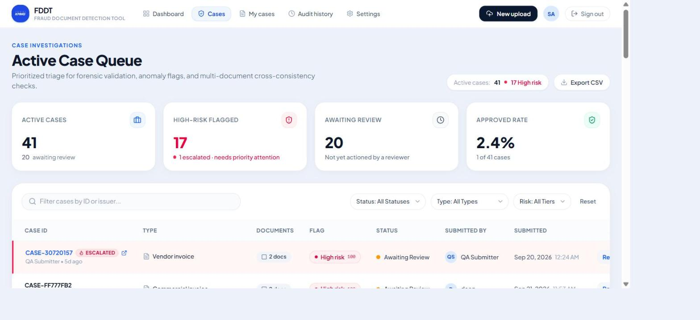
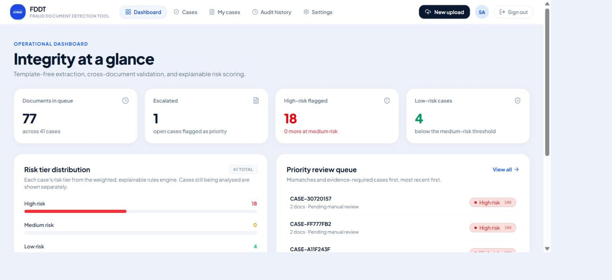

## Working a case: the case detail page

Opening a case (`/cases/:caseId`) shows everything about it in three panels plus a timeline:

- **Left — Documents:** every file in the case, its type and processing status. Click one to inspect it.
- **Middle — Document viewer & checks:** the selected PDF with live overlays drawn on top of it showing
  exactly where a check found something; the document's extracted core fields (issuer, reference number,
  date, amounts — issuer is the only one marked **"(uncertain)"** when the model wasn't confident); and one
  expandable card per automated check, plus a cross-document card and the signature comparison card if
  applicable.
- **Right — Risk & decision:** the score, tier, and every triggered reason in plain language; the
  approve/reject/escalate controls; and (reviewers only) the button to export a forensic report. A
  platform admin sees an amber **"Support view — read-only"** banner instead of any controls.
- **Bottom — Activity timeline:** the case's full audit trail, newest first — every automated check result
  and every human action, in order.

The page **polls automatically every 5 seconds** while the pipeline is still running, so you don't need to
refresh — findings and the risk score simply appear as each check finishes.

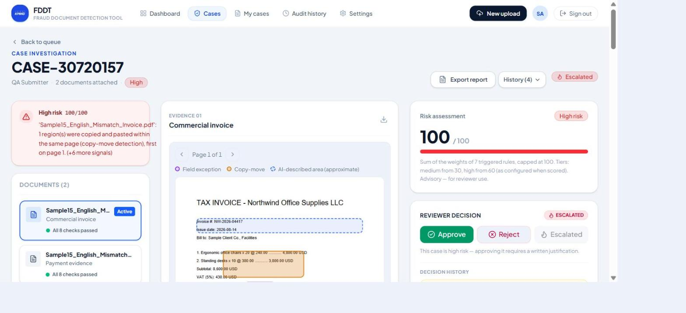
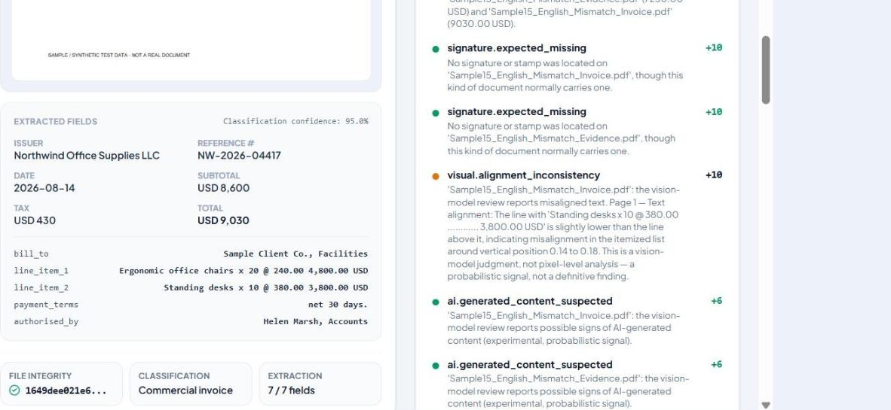
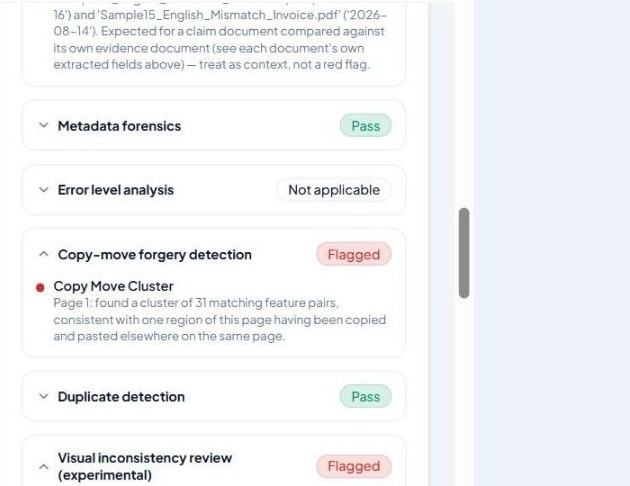

## Understanding the automated checks

Every uploaded document goes through the same generic pipeline regardless of its type — there's no
separate logic per document type, so a school certificate and a vendor invoice get exactly the same
scrutiny. In plain language, here's what each check looks for and how far to trust it:

| Check | What it looks for | How much to trust it |
|---|---|---|
| **Extraction & classification** | Reads the document (OCR, including printed Arabic), classifies its type, and pulls out issuer, date, amounts, reference number and any other identifiable fields — without a per-type template. | Low-confidence fields are marked; the case still goes to manual review either way. |
| **Field validation** | Rule-based checks on the extracted data: is the date in the future, do the line items add up (each column of a multi-column table on its own; installments and total rows not counted twice), do the tax and the printed rate agree, are the dates in order (dated → printed → PDF made), does a TAX INVOICE show a TRN, is a "Scanned with CamScanner" line on a file with no scan, several invoices in one file (each checked on its own; two for the same month flagged), does the stamp name the issuer. | Deterministic and reliable — it's arithmetic and date logic, not a model judgment. |
| **Issuer verification** | Fuzzy-matches the extracted issuer name against the known-issuer registry (vendors, schools, tax IDs the organisation has already vetted). | Matches on **name only** — there's no letterhead/logo comparison, and a legitimate new issuer will simply not be in the registry yet. |
| **Cross-document consistency** | Once a case has 2+ documents, compares shared fields (amount, date, vendor) pairwise across them and flags mismatches. | Deterministic comparison of extracted values; only as good as the extraction behind it. |
| **Metadata forensics** *(PDF only)* | Inspects the PDF's own internal structure: a modify date long after the create date, editing-software fingerprints (e.g., Photoshop) in the tool history, stripped metadata, multiple incremental-save markers. | A strong, mostly-deterministic signal, but presence of an edit marker doesn't by itself prove fraud — legitimate re-saves happen. |
| **Font consistency** | Text set in a different font from the text around it, a number with mixed character sizes, or text in a second embedded copy of a font the page already uses (text typed in during a later edit). On scans, an estimate from OCR. | Exact on a PDF's text layer; an estimate on scans, scored only when several words agree. |
| **Deleted / replaced content (ghost text)** | On a scan converted to editable text: faint traces of the original text left in the scanned background with no text on top (deleted) or running past the text (shortened). Shows an enhanced image of the trace and, for a deleted block, a vision model's guess at what it was. | Strong when it fires; the guess is only a hint — the trace is usually too faint to read. Not applicable to plain scans or born-digital files. |
| **Error Level Analysis (ELA)** | Looks for recompression differences that can indicate a pasted-in or edited region of an image. | **A signal, not a verdict.** Weak against a printed-and-rescanned tamper, and can false-positive on a legitimately recompressed scan — weighted lightly in scoring for this reason. |
| **Copy-move detection** | Looks for a region duplicated within the same image (e.g., a copied stamp or number). | Classical computer-vision matching — solid at finding literal copy-paste, not a semantic read of what changed. |
| **Duplicate / near-duplicate detection** | Perceptual-hashes every uploaded page and compares it against everything your company ever uploaded, including other cases; a match is then compared on invoice number, date, amount and student. | Reliable for catching the same file resubmitted. A page that only shares the layout (same template, other values) is shown for review, not scored. It never compares against another company's documents. |
| **Visual review & AI-generated-content assessment** | An AI vision pass describing visual inconsistencies as a secondary check, plus one experimental question about whether the image looks AI-generated. | **Explicitly experimental** — real-world accuracy on scanned business documents is unproven. Treated as one weak signal among many, never a standalone verdict. |
| **Signature / stamp detection & comparison** | Locates a signature/stamp region on the page (and flags a stamp that is typed text and drawn lines in the file rather than an image of a real stamp), and — only if a reference signature was set — gives an advisory visual comparison ("visually consistent with reference on file") against it. | **Presence/placement confirmation for a human, not an identity match.** This is a known weak point; the wording deliberately never says "verified". |

You will not see a single automated "fraud / not fraud" verdict anywhere in the product — every finding
above feeds the risk score as one input among several, and a human always makes the final call.

## Understanding the risk score

Every case is scored by a **transparent, weighted rules engine** — not a black-box model. Every point in
the score traces back to a named rule and a plain-English reason a reviewer can read.

- Each rule that fires adds its configured weight; the total is capped at 100.
- The score maps to a tier: **Low** (0–29 by default), **Medium** (30–59), **High** (60–100) — your
  company's Reviewer L2s can retune these thresholds under Settings.
- Next to the score you'll see every **triggered reason** in plain language (e.g. *"Issuer name 'X' did
  not match any known vendor in the registry"*), not just a number.
- **Every scored case goes to the reviewer queue.** Nothing auto-approves, regardless of score — a low
  score means "no rules fired," not "cleared."
- A case can re-score itself while you're looking at it (for example, when a signature comparison
  finishes after you opened the case) — a small delay before the numbers settle is expected.
- **When a rule's weight is later retuned, past cases keep the score they were originally given** — the
  rule versions and thresholds active at scoring time are frozen with that case forever, so tuning the
  engine never silently rewrites history.

## Making a decision: approve / reject / escalate

From the case detail page, a reviewer can do the following. On a case escalated to L2, only a Reviewer L2
can; a Reviewer L1 sees a read-only panel explaining that the case is with L2, and the backend refuses the
actions too. Platform admins can never act on a case.

- **Approve.** Disabled until every automated check has finished and the case has a risk assessment (a
  list of what's still pending is shown). Approving a **low-risk** case is a single click. Approving
  anything **medium or high** opens a confirmation showing the score and every triggered reason, and
  requires a **written justification of at least 10 characters** — you may have verified something the
  system couldn't, but that reasoning is recorded with the decision and shown in the audit history.
- **Reject.** Always requires a reason. It's stored, shown in the audit trail, and visible to the
  submitter.
- **Escalate.** Requires a reason. This hands the case to the **Reviewer L2** tier — it does **not**
  change the case's status. Escalation is one-way: there is no "send back to L1". A Reviewer L2 resolves
  the case with the ordinary Approve / Reject. From then on, Reviewer L1s see the case
  read-only.

Once a case is approved or rejected, the decision panel becomes read-only.

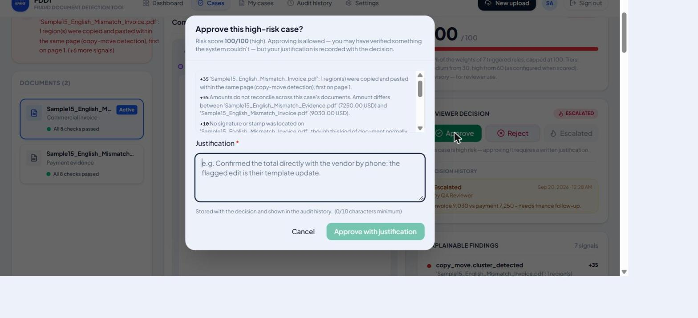

## Audit history

**Audit History** (`/audit-history`, reviewers only) is a searchable, filterable read of your company's
**append-only** audit log — every automated check result and every human action, across every case of the
company, written in plain sentences. Nothing in this log is ever edited or deleted; a case's own timeline
(on its detail page) is the same log filtered to that case. Platform admins can read a company's log (and
a separate platform-level log); their own support views are recorded only in the platform log.

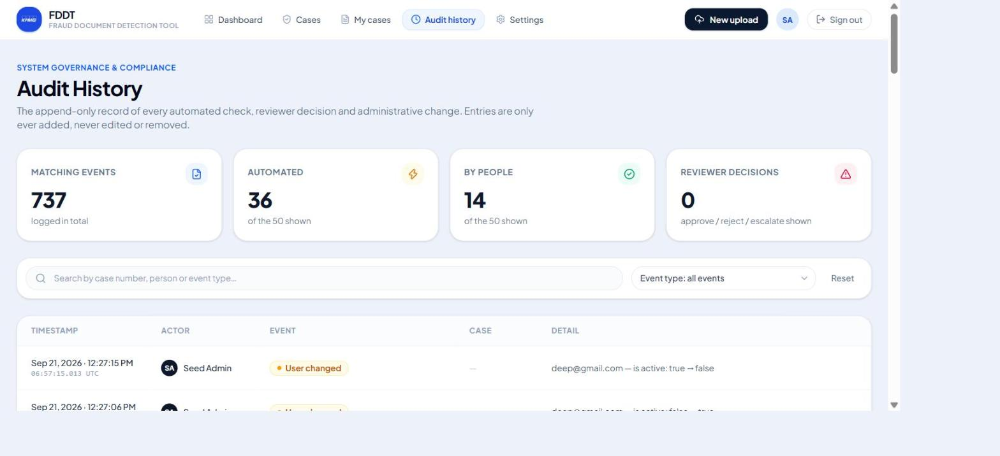

## Exporting the forensic report

From a case's detail page, a reviewer can generate a standalone PDF report — **Export report** —
built to be understood by someone who has never used the application. It contains:

1. Case details (number, type, status, submitter, documents, decision).
2. Executive summary (score, tier, decision, pointers to the sections below).
3. Every triggered risk reason, with severity and the exact region on the page it refers to.
4. The complete checklist — every check on every document, plus the cross-document and signature results.
5. Exceptions — everything that did **not** pass, spelled out concretely.
6. Limitations & assumptions — what the report is (a system-assisted analysis to support human review,
   not a certified forensic opinion), which checks are deterministic versus model judgment, and which
   checks actually ran.
7. The full audit trail (oldest first; later events beyond the first 150 are counted, not dropped).
8. An appendix: extracted fields with confidence, each original file's SHA-256 with live tamper-evidence
   verification, and technical parameters of each check.
9. One annotated page per flagged document page, with every finding highlighted and a legend.

Generating a report takes a few seconds and never re-runs a check or changes the score — it's a frozen,
point-in-time snapshot. Every generation is kept; earlier reports for the same case remain downloadable,
and two reports for the same case can legitimately show different numbers if the case was re-scored
in between.

## Administration: issuer registry (Reviewer L2)

**Settings → Issuer Registry** maintains **your company's** list of known vendors, schools and other
issuers (name, Arabic name, tax ID, type, active/inactive) that the issuer-verification check matches
against. A new company starts with an empty registry — until it is filled in, almost every document will
be flagged "issuer not in registry". Deactivating an issuer keeps its history — rows are never deleted,
only marked inactive.

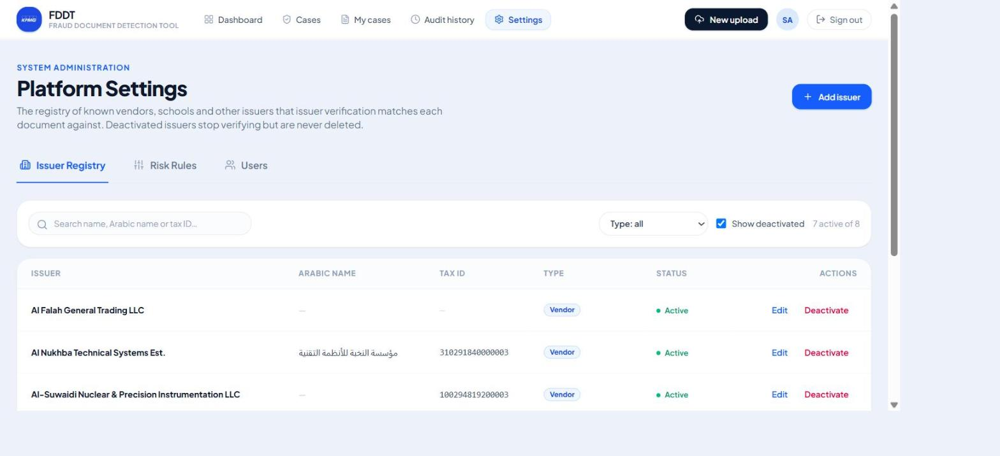

## Administration: risk rules & thresholds (Reviewer L2)

**Settings → Risk Rules** lets you view and tune **your company's** scoring engine without a redeploy
(every company starts from the platform's default rule set and then owns its copy):

- Adjust a rule's **weight**, **severity** or **active** flag. This **inserts a new version** — the old
  one is kept, and every case already scored keeps the version that was active when it was scored.
- View each rule's change history.
- Adjust the **Low / Medium / High thresholds** (default 30 / 60).
- Add a new rule from the catalog of match types the engine understands — you pick a condition and its
  parameters from a guided list; nobody hand-writes rule logic, and a combination the engine can't
  evaluate is rejected outright.

Changes apply to your company's cases scored **from that point on**. They are never applied
retroactively, and never affect another company.

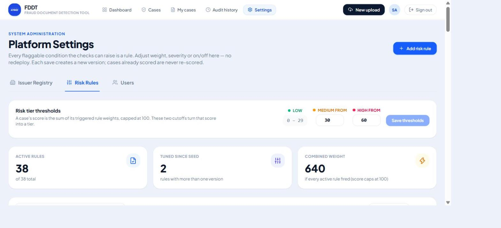

## Platform administration (Platform Admin)

The **Platform** area is visible only to platform admins:

- **Companies** — set each company's **upload limits** with **Edit** (max file size and max zip size in MB, 10 MB / 300 MB by default; takes effect on the company's next upload, and every change is recorded in the platform audit log with the old and new values); create a company (it receives the default rule set and thresholds; its issuer registry
  starts empty), rename it, or suspend / reactivate it. Suspending blocks sign-in for all its users.
- **Users** — create and manage every account; there's no self-service sign-up and companies cannot manage
  their own users. Each account gets a company and a role (User, Reviewer L1, Reviewer L2), or is a
  Platform Admin with no company. Moving a user to another company signs them out. A platform admin cannot
  change their own role or deactivate their own account.
- **Rule templates** — the default rules every **new** company starts from. Editing them never changes an
  existing company's rules.
- **Billing & usage** — per company: cases created, documents uploaded, files stored and storage used, for
  this month, last month, the last 30 days, this year, all time or a custom range; **Reconcile now**
  recounts from the source data.
- **Processing queues** — live view of the three processing queues (waiting, running, oldest waiting
  task, waits, rate-limiter activity, outstanding work per company).

For support, a platform admin can also open any company's case list, cases, audit log and settings
(choosing the company at the top of the page). These views are **read-only** and every one is recorded in
the platform-only audit log; the company's users don't see those records. A platform admin may change a
company's issuer registry or risk rules on its behalf — such a change is recorded in that company's own
audit log.

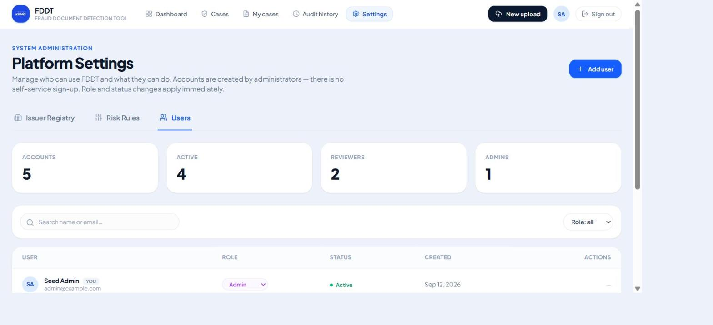

## Case statuses & flags — quick reference

| What you see | Meaning |
|---|---|
| **Analyzing** | The automated pipeline is still running (`submitted` / `under_automated_review`). |
| **Awaiting Review** | The pipeline finished; the case is in the reviewer queue (`pending_manual_review`). |
| **Approved** | A reviewer approved it. |
| **Rejected** | A reviewer rejected it, with a recorded reason. |
| **Escalated · L2** (badge, not a status) | A reviewer handed it to the Reviewer L2 tier; it keeps whatever status it already had. |
| **Low / Medium / High** (flag, reviewers only) | The risk tier from the scoring engine. A submitter sees only a neutral "In review" instead. |

## Known limitations — what this tool does not do

Being direct about this is part of using the tool responsibly:

- **No signature is ever "verified."** Signature/stamp checks confirm presence and placement, and give an
  advisory visual comparison at best — never a reliable identity match.
- **AI-generated-content detection is experimental.** It's one weak signal inside the visual review, not
  a proven detector, and its real-world accuracy on scanned business documents hasn't been validated.
- **ELA is a signal, not a verdict** — weak against print-and-rescan tampering, and can flag a
  legitimately recompressed scan.
- **Only PDFs (within the company's size limit, not password-protected) can be uploaded**, because every forensic check works
  on the PDF itself. There is no page-count limit and no virus scan.
- **A failed check contributes nothing to the score, silently.** If a check errors out, the case still
  scores — the failure is visible in the audit log and the check's own card, but no rule fires because
  of it.
- **The absence of a flagged finding does not guarantee a document is genuine.**
- Not built in this version: notifications/email, SLA tracking and deadlines, organisation-wide
  MIS/compliance reporting, letterhead/logo matching, cross-case signature-library
  matching, integration with an external ticketing platform (ServiceNow, Jira, etc.), password reset, and
  company-managed user accounts.
- **The interface is English-only.** Documents may be in English or printed/typed Arabic; **handwritten
  Arabic is not reliably read.** Only extracted Arabic field values render right-to-left — the application
  itself is not translated.

## Glossary

| Term | Meaning |
|---|---|
| **Company** | One client organisation (tenant). Its users, cases, settings and audit log are invisible to every other company. |
| **Case** | One submission, grouping one or more related documents (e.g., an invoice plus its payment evidence) under one `case_number` (`CASE-XXXXXXXX`). |
| **Document** | One uploaded PDF within a case. |
| **Tier** | Low / Medium / High — the risk-score band that drives the case flag and whether approval needs a justification. |
| **Triggered reason** | One rule that fired on a case, shown as a plain-language sentence with its severity and weight. |
| **Tier (L1 / L2) / Escalated** | Which reviewer tier owns a case. Every case starts at L1; escalating moves it to L2 for good — not a status. |
| **Pipeline** | The set of automated Celery jobs (OCR, classification, extraction, validation, forensics, scoring) that run on every uploaded document. |
| **Audit log** | The append-only record of every automated result and human action, never edited or deleted. |
